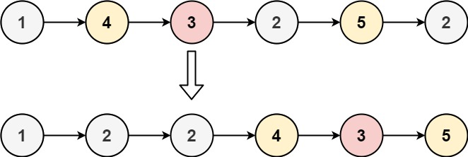

## 分隔链表
<!--START_SECTION:badge-->

[](../../../README.md#中等)
[](../../../README.md#leetcode)
[](../../../README.md#链表)
<!--END_SECTION:badge-->
<!--info
tags: [链表]
source: LeetCode
level: 中等
number: '0086'
name: 分隔链表
companies: []
-->

<summary><b>问题描述</b></summary>

- 快排链表的核心操作;

```txt
给你一个链表的头节点 head 和一个特定值 x , 请你对链表进行分隔, 使得所有 小于 x 的节点都出现在 大于或等于 x 的节点之前.

你应当 保留 两个分区中每个节点的初始相对位置.

示例 1:
    输入: head = [1,4,3,2,5,2], x = 3
    输出: [1,2,2,4,3,5]
示例 2:
    输入: head = [2,1], x = 2
    输出: [1,2]

提示:
    链表中节点的数目在范围 [0, 200] 内
    -100 <= Node.val <= 100
    -200 <= x <= 200

来源: 力扣 (LeetCode)
链接: https://leetcode-cn.com/problems/partition-list
著作权归领扣网络所有. 商业转载请联系官方授权, 非商业转载请注明出处.
```

<div align="center"></div>


<summary><b>思路</b></summary>

- 新建两个链表, 分别保存小于 x 和大于等于 x 的, 最后拼接;


<details><summary><b>Python3</b></summary>

**python**
```python
# Definition for singly-linked list.
# class ListNode:
#     def __init__(self, val=0, next=None):
#         self.val = val
#         self.next = next
class Solution:
    def partition(self, head: ListNode, x: int) -> ListNode:
        """"""
        # l/r 会进行移动, lo/hi 为头节点
        l = lo = ListNode(0)
        r = hi = ListNode(0)

        while head:
            if head.val < x:  # 小于 x 的拼到 lo
                l.next = head
                l = l.next
            else:  # 大于等于 x 的拼到 hi
                r.next = head
                r = r.next

            head = head.next

        # 因为不能保证最后遍历的节点在 hi 中, 所以必须加上这一步, 切断循坏
        r.next = None  # 关键步骤
        l.next = hi.next

        return lo.next
```

</details>


<!--START_SECTION:relate_problem-->
---

### 相关主题

<details><summary><b>链表</b></summary>

> [[中等, LeetCode] 两数相加 🔥](LeetCode_0002_中等_两数相加.md)  
> [[中等, LeetCode] 删除链表的倒数第N个结点 🔥](../../2022/01/LeetCode_0019_中等_删除链表的倒数第N个结点.md)  
> [[中等, LeetCode] 重排链表 🔥](../../2022/06/LeetCode_0143_中等_重排链表.md)  
> [[中等, 剑指Offer] 复杂链表的复制 (深拷贝) 🔥](../12/剑指Offer_3500_中等_复杂链表的复制(深拷贝).md)  
> [[中等, 牛客] 划分链表](../../2022/01/牛客_0023_中等_划分链表.md)  
> [[中等, 牛客] 删除有序链表中重复的元素-I](../../2022/01/牛客_0025_中等_删除有序链表中重复的元素-I.md)  
> [[中等, 牛客] 删除有序链表中重复的元素-II](../../2022/01/牛客_0024_中等_删除有序链表中重复的元素-II.md)  
> [[中等, 牛客] 重排链表](../../2022/01/牛客_0002_中等_重排链表.md)  
> [[中等, 牛客] 链表中的节点每k个一组翻转](../../2022/03/牛客_0050_中等_链表中的节点每k个一组翻转.md)  
> [[中等, 牛客] 链表内指定区间反转](../../2022/01/牛客_0021_中等_链表内指定区间反转.md)  
> [[中等, 牛客] 链表相加(二)](../../2022/03/牛客_0040_中等_链表相加(二).md)  
  > 
> [[困难, LeetCode] K个一组翻转链表 🔥](../../2022/02/LeetCode_0025_困难_K个一组翻转链表.md)  
> [[困难, LeetCode] 合并K个升序链表 🔥](../../2022/10/LeetCode_0023_困难_合并K个升序链表.md)  
  > 
> [[简单, LeetCode] 反转链表 🔥](../../2022/10/LeetCode_0206_简单_反转链表.md)  
> [[简单, LeetCode] 合并两个有序链表 🔥](LeetCode_0021_简单_合并两个有序链表.md)  
> [[简单, LeetCode] 链表的中间结点](../../2022/06/LeetCode_0876_简单_链表的中间结点.md)  
> [[简单, 剑指Offer] 两个链表的第一个公共节点](../../2022/01/剑指Offer_5200_简单_两个链表的第一个公共节点.md)  
> [[简单, 剑指Offer] 从尾到头打印链表](../11/剑指Offer_0600_简单_从尾到头打印链表.md)  
> [[简单, 剑指Offer] 删除链表的节点](../11/剑指Offer_1800_简单_删除链表的节点.md)  
> [[简单, 剑指Offer] 反转链表 🔥](../11/剑指Offer_2400_简单_反转链表.md)  
> [[简单, 剑指Offer] 合并两个排序的链表](../11/剑指Offer_2500_简单_合并两个排序的链表.md)  
> [[简单, 剑指Offer] 链表中倒数第k个节点](../11/剑指Offer_2200_简单_链表中倒数第k个节点.md)  
> [[简单, 牛客] 两个链表的第一个公共结点 🔥](../../2022/03/牛客_0066_简单_两个链表的第一个公共结点.md)  
> [[简单, 牛客] 判断一个链表是否为回文结构](../../2022/04/牛客_0096_简单_判断一个链表是否为回文结构.md)  
> [[简单, 牛客] 判断链表中是否有环](../../2022/01/牛客_0004_简单_判断链表中是否有环.md)  
> [[简单, 牛客] 单链表的排序 🔥](../../2022/03/牛客_0070_简单_单链表的排序.md)  
> [[简单, 牛客] 反转链表](../../2022/03/牛客_0078_简单_反转链表.md)  
> [[简单, 牛客] 合并两个排序的链表](../../2022/02/牛客_0033_简单_合并两个排序的链表.md)  
> [[简单, 牛客] 链表中环的入口结点](../../2022/01/牛客_0003_简单_链表中环的入口结点.md)  
  > 

</details>
<!--END_SECTION:relate_problem-->
