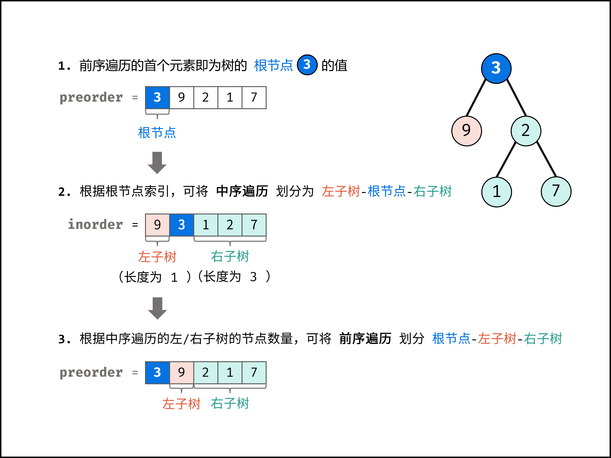

## 重建二叉树
<!--START_SECTION:badge-->

[](../../../README.md#中等)
[](../../../README.md#剑指offer)
[](../../../README.md#二叉树树)
[](../../../README.md#分治)
[](../../../README.md#经典)
<!--END_SECTION:badge-->
<!--info
tags: [二叉树, 分治, 经典]
source: 剑指Offer
level: 中等
number: '0700'
name: 重建二叉树
companies: []
-->

<summary><b>问题简述</b></summary>

```txt
给出二叉树前序遍历和中序遍历的结果, 重建该二叉树并返回其根节点.
```

<details><summary><b>详细描述</b></summary>

```txt
输入某二叉树的前序遍历和中序遍历的结果, 请构建该二叉树并返回其根节点.
假设输入的前序遍历和中序遍历的结果中都不含重复的数字.

示例 1:
    Input: preorder = [3,9,20,15,7], inorder = [9,3,15,20,7]
    Output: [3,9,20,null,null,15,7]
示例 2:
    Input: preorder = [-1], inorder = [-1]
    Output: [-1]

来源: 力扣 (LeetCode)
链接: https://leetcode-cn.com/problems/zhong-jian-er-cha-shu-lcof
著作权归领扣网络所有. 商业转载请联系官方授权, 非商业转载请注明出处.
```

<!-- <div align="center"></div> -->

</details>


<summary><b>思路</b></summary>

- 前序遍历, 节点按照 `[ 根节点 | 左子树 | 右子树 ]` 的顺序输出.
- 中序遍历, 节点按照 `[ 左子树 | 根节点 | 右子树 ]` 的顺序输出.
- 可知:
    - 前序遍历的首元素为根节点 node 的值.
    - 在中序遍历的结果中搜索根节点的索引 , 可将**中序遍历**划分为 `[ 左子树 | 根节点 | 右子树 ]` .
    - 根据中序遍历中的左 (右) 子树的节点数量, 可将**前序遍历**划分为 `[ 根节点 | 左子树 | 右子树 ]` .

<div align="center"></div>


<details><summary><b>Python</b></summary>

```python
# Definition for a binary tree node.
# class TreeNode:
#     def __init__(self, x):
#         self.val = x
#         self.left = None
#         self.right = None

class Solution:
    def buildTree(self, preorder: List[int], inorder: List[int]) -> TreeNode:
        if len(preorder) < 1 or len(inorder) < 1:  # 两个都判断一下
            return None

        # 建立根节点
        root_val = preorder[0]
        root = TreeNode(root_val)
        root_idx = inorder.index(root_val)  # 找到根节点在中序遍历的位置

        # 截取左子树的 preorder 和 inorder, 递归建立左子树
        inorder_left = inorder[:root_idx]
        preorder_left = preorder[1: len(inorder_left) + 1]
        root.left = self.buildTree(preorder_left, inorder_left)
        # 截取右子树的 preorder 和 inorder, 递归建立右子树
        inorder_right = inorder[root_idx + 1:]
        preorder_right = preorder[-len(inorder_right):]
        root.right = self.buildTree(preorder_right, inorder_right)
        return root
```

- 更常见的写法会使用一个字典来保存每个节点在中序遍历中的位置, 取代`root_idx = inorder.index(root_val)` 这一步,
- 但是这样做就必须每次从最初的 preorder 和 inorder 中截取左右子树的片段, 代码会变得比较复杂, 传递的参数比较多, 故没有采用这种写法;

</details>


<!--START_SECTION:relate_note-->
---

### 算法笔记

> 🌧️ _暂无主题相关的笔记_


<details><summary><b>其他算法笔记</b></summary>

- [二分查找相关](../../../../notes/_archives/2025/10/二分查找备忘.md)  
- [从递归到递推 (动态规划)](../../../../notes/_archives/2022/10/从暴力递归到动态规划.md)  
- [树形递归技巧](../../../../notes/_archives/2022/10/树形递归技巧.md)  
- [滑动窗口模板](../../../../notes/_archives/2022/10/滑动窗口模板.md)  
- [链表操作备忘](../../../../notes/_archives/2022/10/链表模板.md)  

</details>
<!--END_SECTION:relate_note-->


<!--START_SECTION:relate_problem-->
---

### 相关问题


<details><summary><b>二叉树/树 (47)</b></summary>

> [[中等, LeetCode] 二叉树的完全性检验 🔥](../../2022/03/LeetCode_0958_中等_二叉树的完全性检验.md)  
> [[中等, LeetCode] 从叶结点开始的最小字符串](../../2022/07/LeetCode_0988_中等_从叶结点开始的最小字符串.md)  
> [[中等, LeetCode] 求根节点到叶节点数字之和](../../2022/07/LeetCode_0129_中等_求根节点到叶节点数字之和.md)  
> [[中等, LeetCode] 路径总和II](../../2022/06/LeetCode_0113_中等_路径总和II.md)  
> [[中等, LeetCode] 路径总和III](../../2022/06/LeetCode_0437_中等_路径总和III.md)  
> [[中等, LeetCode] 验证二叉搜索树](../../2022/03/LeetCode_0098_中等_验证二叉搜索树.md)  
> [[中等, 剑指Offer] 二叉搜索树与双向链表 🔥](../12/剑指Offer_3600_中等_二叉搜索树与双向链表.md)  
> [[中等, 剑指Offer] 二叉搜索树的后序遍历序列](../12/剑指Offer_3300_中等_二叉搜索树的后序遍历序列.md)  
> [[中等, 剑指Offer] 二叉树中和为某一值的路径](../12/剑指Offer_3400_中等_二叉树中和为某一值的路径.md)  
> [[中等, 剑指Offer] 树的子结构](剑指Offer_2600_中等_树的子结构.md)  
> [[中等, 牛客] 二叉搜索树与双向链表](../../2022/03/牛客_0064_中等_二叉搜索树与双向链表.md)  
> [[中等, 牛客] 二叉搜索树的第k个节点](../../2022/03/牛客_0081_中等_二叉搜索树的第k个节点.md)  
> [[中等, 牛客] 二叉树中和为某一值的路径(二)](../../2022/01/牛客_0008_中等_二叉树中和为某一值的路径(二).md)  
> [[中等, 牛客] 二叉树根节点到叶子节点的所有路径和](../../2022/01/牛客_0005_中等_二叉树根节点到叶子节点的所有路径和.md)  
> [[中等, 牛客] 在二叉树中找到两个节点的最近公共祖先](../../2022/04/牛客_0102_中等_在二叉树中找到两个节点的最近公共祖先.md)  
> [[中等, 牛客] 完全二叉树结点数](../../2022/04/牛客_0084_中等_完全二叉树结点数.md)  
> [[中等, 牛客] 找到搜索二叉树中两个错误的节点](../../2022/03/牛客_0058_中等_找到搜索二叉树中两个错误的节点.md)  
> [[中等, 牛客] 把二叉树打印成多行 🔥](../../2022/03/牛客_0080_中等_把二叉树打印成多行.md)  
> [[中等, 牛客] 按之字形顺序打印二叉树](../../2022/01/牛客_0014_中等_按之字形顺序打印二叉树.md)  
> [[中等, 牛客] 求二叉树的层序遍历](../../2022/01/牛客_0015_中等_求二叉树的层序遍历.md)  
> [[中等, 牛客] 重建二叉树](../../2022/01/牛客_0012_中等_重建二叉树.md)  
  > 
> [[困难, 剑指Offer] 序列化二叉树](../12/剑指Offer_3700_困难_序列化二叉树.md)  
> [[困难, 牛客] 二叉树中的最大路径和](../../2022/01/牛客_0006_困难_二叉树中的最大路径和.md)  
> [[困难, 牛客] 序列化二叉树](../../2022/05/牛客_0123_困难_序列化二叉树.md)  
  > 
> [[简单, LeetCode] 二叉树的所有路径](../../2022/07/LeetCode_0257_简单_二叉树的所有路径.md)  
> [[简单, LeetCode] 二叉树的最大深度 🔥](../../2022/07/LeetCode_0104_简单_二叉树的最大深度.md)  
> [[简单, LeetCode] 二叉树的最小深度](../../2022/07/LeetCode_0111_简单_二叉树的最小深度.md)  
> [[简单, LeetCode] 平衡二叉树 🔥](../../2022/09/LeetCode_0110_简单_平衡二叉树.md)  
> [[简单, LeetCode] 路径总和](../../2022/06/LeetCode_0112_简单_路径总和.md)  
> [[简单, 剑指Offer] 二叉搜索树的最近公共祖先 🔥](../../2022/01/剑指Offer_6801_简单_二叉搜索树的最近公共祖先.md)  
> [[简单, 剑指Offer] 二叉搜索树的第k大节点](../../2022/01/剑指Offer_5400_简单_二叉搜索树的第k大节点.md)  
> [[简单, 剑指Offer] 二叉树的最近公共祖先](../../2022/01/剑指Offer_6802_简单_二叉树的最近公共祖先.md)  
> [[简单, 剑指Offer] 二叉树的镜像](剑指Offer_2700_简单_二叉树的镜像.md)  
> [[简单, 剑指Offer] 判断是否为平衡二叉树](../../2022/01/剑指Offer_5502_简单_判断是否为平衡二叉树.md)  
> [[简单, 剑指Offer] 对称的二叉树](剑指Offer_2800_简单_对称的二叉树.md)  
> [[简单, 剑指Offer] 层序遍历二叉树](剑指Offer_3201_简单_层序遍历二叉树.md)  
> [[简单, 剑指Offer] 层序遍历二叉树](剑指Offer_3202_简单_层序遍历二叉树.md)  
> [[简单, 剑指Offer] 层序遍历二叉树 (之字形遍历)](剑指Offer_3203_简单_层序遍历二叉树(之字形遍历).md)  
> [[简单, 剑指Offer] 求二叉树的深度](../../2022/01/剑指Offer_5501_简单_求二叉树的深度.md)  
> [[简单, 牛客] 二叉树中和为某一值的路径(一)](../../2022/01/牛客_0009_简单_二叉树中和为某一值的路径(一).md)  
> [[简单, 牛客] 二叉树的最大深度](../../2022/01/牛客_0013_简单_二叉树的最大深度.md)  
> [[简单, 牛客] 二叉树的镜像](../../2022/03/牛客_0072_简单_二叉树的镜像.md)  
> [[简单, 牛客] 判断t1树中是否有与t2树完全相同的子树](../../2022/04/牛客_0098_简单_判断t1树中是否有与t2树完全相同的子树.md)  
> [[简单, 牛客] 判断是不是平衡二叉树](../../2022/03/牛客_0062_简单_判断是不是平衡二叉树.md)  
> [[简单, 牛客] 合并二叉树](../../2022/05/牛客_0117_简单_合并二叉树.md)  
> [[简单, 牛客] 对称的二叉树](../../2022/01/牛客_0016_简单_对称的二叉树.md)  
> [[简单, 牛客] 将升序数组转化为平衡二叉搜索树](../../2022/01/牛客_0011_简单_将升序数组转化为平衡二叉搜索树.md)  
  > 

</details>

<details><summary><b>分治 (3)</b></summary>

> [[中等, 剑指Offer2] 数组中的第K大的数字](../../2022/09/剑指Offer2_076_中等_数组中的第K大的数字.md)  
  > 
> [[困难, 剑指Offer] 数组中的逆序对 🔥](../../2022/01/剑指Offer_5100_困难_数组中的逆序对.md)  
  > 
> [[简单, 剑指Offer] 数组中出现次数超过一半的数字 (摩尔投票) 🔥](../12/剑指Offer_3900_简单_数组中出现次数超过一半的数字(摩尔投票).md)  
  > 

</details>

<details><summary><b>经典 (37)</b></summary>

> [[中等, LeetCode] 下一个排列 🔥](../../2022/10/LeetCode_0031_中等_下一个排列.md)  
> [[中等, LeetCode] 二叉树的完全性检验 🔥](../../2022/03/LeetCode_0958_中等_二叉树的完全性检验.md)  
> [[中等, LeetCode] 最长递增子序列 🔥](../../2022/06/LeetCode_0300_中等_最长递增子序列.md)  
> [[中等, LeetCode] 编辑距离 🔥](../../2022/06/LeetCode_0072_中等_编辑距离.md)  
> [[中等, 剑指Offer2] 整数除法 🔥](../../2022/09/剑指Offer2_001_中等_整数除法.md)  
> [[中等, 剑指Offer] 丑数 🔥](../12/剑指Offer_4900_中等_丑数.md)  
> [[中等, 剑指Offer] 二叉搜索树与双向链表 🔥](../12/剑指Offer_3600_中等_二叉搜索树与双向链表.md)  
> [[中等, 剑指Offer] 圆圈中最后剩下的数字 (约瑟夫环问题) 🔥](../../2022/01/剑指Offer_6200_中等_圆圈中最后剩下的数字(约瑟夫环问题).md)  
> [[中等, 剑指Offer] 复杂链表的复制 (深拷贝) 🔥](../12/剑指Offer_3500_中等_复杂链表的复制(深拷贝).md)  
> [[中等, 剑指Offer] 字符串的排列 (全排列) 🔥](../12/剑指Offer_3800_中等_字符串的排列(全排列).md)  
> [[中等, 剑指Offer] 把字符串转换成整数 🔥](../../2022/01/剑指Offer_6700_中等_把字符串转换成整数.md)  
> [[中等, 剑指Offer] 数值的整数次方 (快速幂) 🔥](剑指Offer_1600_中等_数值的整数次方(快速幂).md)  
> [[中等, 剑指Offer] 栈的压入、弹出序列 🔥](剑指Offer_3100_中等_栈的压入、弹出序列.md)  
> [[中等, 剑指Offer] 顺时针打印矩阵 (3种思路4个写法) 🔥](剑指Offer_2900_中等_顺时针打印矩阵(3种思路4个写法).md)  
> [[中等, 牛客] 01背包 🔥](../../2022/05/牛客_0145_中等_01背包.md)  
> [[中等, 牛客] 丢棋子问题 (鹰蛋问题) 🔥](../../2022/04/牛客_0087_中等_丢棋子问题(鹰蛋问题).md)  
> [[中等, 牛客] 字符串的排列 🔥](../../2022/05/牛客_0121_中等_字符串的排列.md)  
> [[中等, 牛客] 寻找峰值 🔥](../../2022/04/牛客_0107_中等_寻找峰值.md)  
> [[中等, 牛客] 岛屿数量 🔥](../../2022/04/牛客_0109_中等_岛屿数量.md)  
> [[中等, 牛客] 把字符串转换成整数(atoi) 🔥](../../2022/04/牛客_0100_中等_把字符串转换成整数(atoi).md)  
> [[中等, 牛客] 数组中只出现一次的两个数字 🔥](../../2022/03/牛客_0075_中等_数组中只出现一次的两个数字.md)  
> [[中等, 牛客] 最长公共子序列(二) 🔥](../../2022/04/牛客_0092_中等_最长公共子序列(二).md)  
> [[中等, 牛客] 栈和排序 🔥](../../2022/05/牛客_0115_中等_栈和排序.md)  
> [[中等, 牛客] 汉诺塔问题 🔥](../../2022/03/牛客_0067_中等_汉诺塔问题.md)  
  > 
> [[困难, 剑指Offer] 数组中的逆序对 🔥](../../2022/01/剑指Offer_5100_困难_数组中的逆序对.md)  
> [[困难, 牛客] 接雨水问题 🔥](../../2022/05/牛客_0128_困难_接雨水问题.md)  
> [[困难, 牛客] 设计LFU缓存结构 🔥](../../2022/04/牛客_0094_困难_设计LFU缓存结构.md)  
> [[困难, 牛客] 设计LRU缓存结构 🔥](../../2022/04/牛客_0093_困难_设计LRU缓存结构.md)  
  > 
> [[简单, LeetCode] 二叉树的最大深度 🔥](../../2022/07/LeetCode_0104_简单_二叉树的最大深度.md)  
> [[简单, LeetCode] 反转链表 🔥](../../2022/10/LeetCode_0206_简单_反转链表.md)  
> [[简单, 剑指Offer] 二叉搜索树的最近公共祖先 🔥](../../2022/01/剑指Offer_6801_简单_二叉搜索树的最近公共祖先.md)  
> [[简单, 剑指Offer] 反转链表 🔥](剑指Offer_2400_简单_反转链表.md)  
> [[简单, 剑指Offer] 数组中出现次数超过一半的数字 (摩尔投票) 🔥](../12/剑指Offer_3900_简单_数组中出现次数超过一半的数字(摩尔投票).md)  
> [[简单, 剑指Offer] 最小的k个数 (partition操作) 🔥](../12/剑指Offer_4000_简单_最小的k个数(partition操作).md)  
> [[简单, 牛客] 二进制中1的个数 🔥](../../2022/05/牛客_0120_简单_二进制中1的个数.md)  
> [[简单, 牛客] 单链表的排序 🔥](../../2022/03/牛客_0070_简单_单链表的排序.md)  
> [[简单, 牛客] 求平方根 🔥](../../2022/02/牛客_0032_简单_求平方根.md)  
  > 

</details>
<!--END_SECTION:relate_problem-->
