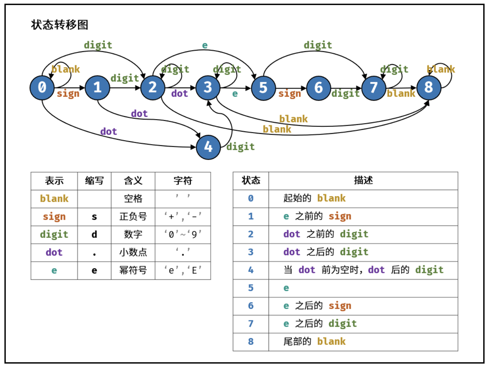

## 表示数值的字符串
<!--START_SECTION:badge-->

[](../../../README.md#中等)
[](../../../README.md#剑指offer)
[](../../../README.md#字符串)
[](../../../README.md#有限状态自动机)
<!--END_SECTION:badge-->
<!--info
tags: [字符串, 有限状态自动机]
source: 剑指Offer
level: 中等
number: '2000'
name: 表示数值的字符串
companies: []
-->

<summary><b>问题简述</b></summary>

```txt
请实现一个函数用来判断字符串是否表示数值 (包括整数和小数).
```

<details><summary><b>详细描述</b></summary>

```txt
请实现一个函数用来判断字符串是否表示数值 (包括整数和小数).

数值 (按顺序) 可以分成以下几个部分:

    1. 若干空格
    2. 一个 小数 或者 整数
    3. (可选) 一个 'e' 或 'E', 后面跟着一个 整数
    4. 若干空格

小数 (按顺序) 可以分成以下几个部分:
    1. (可选) 一个符号字符 ('+' 或 '-')
    2. 下述格式之一:
        1. 至少一位数字, 后面跟着一个点 '.'
        2. 至少一位数字, 后面跟着一个点 '.', 后面再跟着至少一位数字
        3. 一个点 '.', 后面跟着至少一位数字

整数 (按顺序) 可以分成以下几个部分:
    1. (可选) 一个符号字符 ('+' 或 '-')
    2. 至少一位数字

部分数值列举如下:
    ["+100", "5e2", "-123", "3.1416", "-1E-16", "0123"]
部分非数值列举如下:
    ["12e", "1a3.14", "1.2.3", "+-5", "12e+5.4"]

示例 1:
    输入: s = "0"
    输出: true
示例 2:
    输入: s = "e"
    输出: false
示例 3:
    输入: s = "."
    输出: false
示例 4:
    输入: s = ".1  "
    输出: true

提示:
    1 <= s.length <= 20
    s 仅含英文字母 (大写和小写), 数字 (0-9), 加号 '+', 减号 '-', 空格 ' ' 或者点 '.'.

来源: 力扣 (LeetCode)
链接: https://leetcode-cn.com/problems/biao-shi-shu-zhi-de-zi-fu-chuan-lcof
著作权归领扣网络所有. 商业转载请联系官方授权, 非商业转载请注明出处.
```

</details>

<!-- <div align="center"></div> -->

<summary><b>思路: 有限状态自动机</b></summary>

<div align="center"></div>

- 其中合法的结束状态有: 2, 3, 7, 8

> [表示数值的字符串 (有限状态自动机, 清晰图解) - Krahets](https://leetcode-cn.com/problems/biao-shi-shu-zhi-de-zi-fu-chuan-lcof/solution/mian-shi-ti-20-biao-shi-shu-zhi-de-zi-fu-chuan-y-2/)

<details><summary><b>Python</b></summary>

```python
class Solution:
    def isNumber(self, s: str) -> bool:
        # '.'
        # ' '
        # 's': sign
        # 'd': digit
        # 'e': e/E
        states = [
            {' ': 0, 's': 1, 'd': 2, '.': 4},   # 0. start 'blank'
            {'d': 2, '.': 4},                   # 1. 'sign' before 'e'
            {'d': 2, '.': 3, 'e': 5, ' ': 8},   # 2. 'digit' before 'dot'
            {'d': 3, 'e': 5, ' ': 8},           # 3. 'digit' after 'dot'
            {'d': 3},                           # 4. 'digit' after 'dot' ('blank' before 'dot')
            {'s': 6, 'd': 7},                   # 5. 'e'
            {'d': 7},                           # 6. 'sign' after 'e'
            {'d': 7, ' ': 8},                   # 7. 'digit' after 'e'
            {' ': 8}                            # 8. end with 'blank'
        ]

        p = 0  # 开始状态 0
        for c in s:
            if '0' <= c <= '9':
                t = 'd'  # digit
            elif c in "+-":
                t = 's'  # sign
            elif c in "eE":
                t = 'e'  # e or E
            elif c in ". ":
                t = c  # dot, blank
            else:
                t = '?'  # unknown

            if t not in states[p]:
                return False

            p = states[p][t]

        return p in (2, 3, 7, 8)
```

</details>


<!--START_SECTION:relate_note-->
---

### 算法笔记

> 🌧️ _暂无主题相关的笔记_


<details><summary><b>其他算法笔记</b></summary>

- [从递归到递推 (动态规划)](../../../../notes/_archives/2022/10/从暴力递归到动态规划.md)  
- [树形递归技巧](../../../../notes/_archives/2022/10/树形递归技巧.md)  
- [滑动窗口模板](../../../../notes/_archives/2022/10/滑动窗口模板.md)  
- [链表常用操作备忘](../../../../notes/_archives/2022/10/链表模板.md)  

</details>
<!--END_SECTION:relate_note-->


<!--START_SECTION:relate_problem-->
---

### 相关问题


<details><summary><b>字符串 (16)</b></summary>

> [[中等, LeetCode] 电话号码的字母组合 🔥](../../2022/10/LeetCode_0017_中等_电话号码的字母组合.md)  
> [[中等, 剑指Offer] 把字符串转换成整数 🔥](../../2022/01/剑指Offer_6700_中等_把字符串转换成整数.md)  
> [[中等, 牛客] 大数乘法](../../2022/01/牛客_0010_中等_大数乘法.md)  
> [[中等, 牛客] 大数加法](../../2022/01/牛客_0001_中等_大数加法.md)  
> [[中等, 牛客] 把字符串转换成整数(atoi) 🔥](../../2022/04/牛客_0100_中等_把字符串转换成整数(atoi).md)  
> [[中等, 牛客] 比较版本号](../../2022/04/牛客_0104_中等_比较版本号.md)  
> [[中等, 牛客] 验证IP地址](../../2022/05/牛客_0113_中等_验证IP地址.md)  
  > 
> [[困难, 剑指Offer] 正则表达式匹配](剑指Offer_1900_困难_正则表达式匹配.md)  
  > 
> [[简单, LeetCode] 亲密字符串](LeetCode_0859_简单_亲密字符串.md)  
> [[简单, LeetCode] 字符串中的单词数](../../2022/07/LeetCode_0434_简单_字符串中的单词数.md)  
> [[简单, 剑指Offer] 左旋转字符串](../../2022/01/剑指Offer_5802_简单_左旋转字符串.md)  
> [[简单, 剑指Offer] 替换空格](剑指Offer_0500_简单_替换空格.md)  
> [[简单, 牛客] 压缩字符串(一)](../../2022/04/牛客_0101_简单_压缩字符串(一).md)  
> [[简单, 牛客] 反转字符串](../../2022/04/牛客_0103_简单_反转字符串.md)  
> [[简单, 牛客] 旋转字符串](../../2022/05/牛客_0114_简单_旋转字符串.md)  
> [[简单, 牛客] 最长公共前缀](../../2022/03/牛客_0055_简单_最长公共前缀.md)  
  > 

</details>
<!--END_SECTION:relate_problem-->
