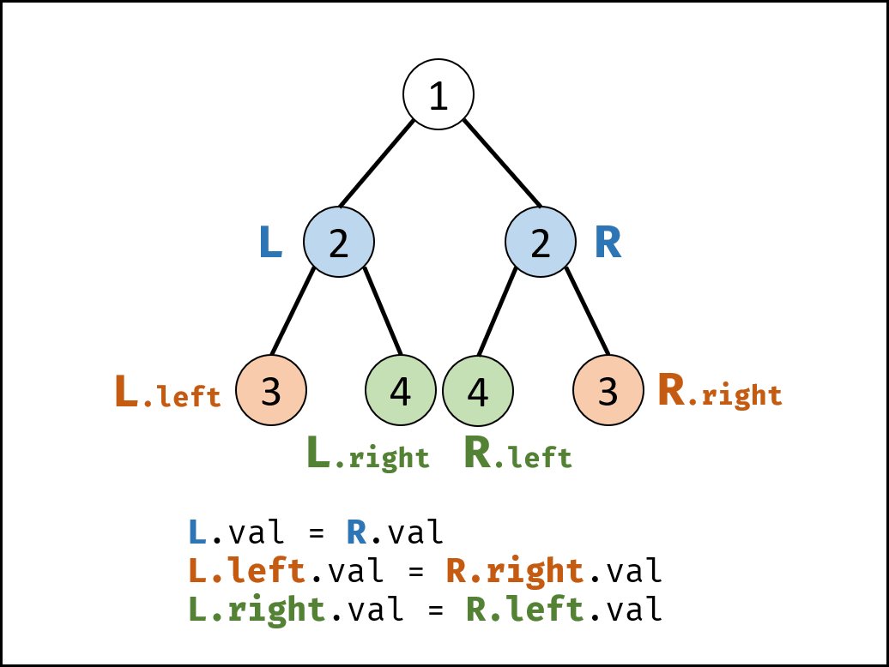

## 对称的二叉树
<!--START_SECTION:badge-->

[](../../../README.md#简单)
[](../../../README.md#剑指offer)
[](../../../README.md#二叉树树)
[](../../../README.md#递归)
<!--END_SECTION:badge-->
<!--info
tags: [二叉树, 递归]
source: 剑指Offer
level: 简单
number: '2800'
name: 对称的二叉树
companies: []
-->

<summary><b>问题简述</b></summary>

```txt
判断一棵二叉树是不是对称的.
```
> [剑指 Offer 28. 对称的二叉树 - 力扣 (LeetCode) ](https://leetcode-cn.com/problems/dui-cheng-de-er-cha-shu-lcof/)

<details><summary><b>详细描述</b></summary>

```txt
请实现一个函数, 用来判断一棵二叉树是不是对称的. 如果一棵二叉树和它的镜像一样, 那么它是对称的.

例如, 二叉树 [1,2,2,3,4,4,3] 是对称的.

    1
   / \
  2   2
 / \ / \
3  4 4  3

但是下面这个 [1,2,2,null,3,null,3] 则不是镜像对称的:

    1
   / \
  2   2
   \   \
   3    3


示例 1:
    输入: root = [1,2,2,3,4,4,3]
    输出: true
示例 2:
    输入: root = [1,2,2,null,3,null,3]
    输出: false


限制:
    0 <= 节点个数 <= 1000

来源: 力扣 (LeetCode)
链接: https://leetcode-cn.com/problems/dui-cheng-de-er-cha-shu-lcof
著作权归领扣网络所有. 商业转载请联系官方授权, 非商业转载请注明出处.
```

<!-- <div align="center"></div> -->

</details>


<summary><b>思路</b></summary>

- 想象一左一右两条路线, 沿途比较路线上的节点, 如果一路相等, 同时达到叶子, 说明这两条路线是相同的;
- "对称" 则要求这两条路线必须从根节点的左右子节点开始; 且沿途左路线往左的时候, 右路线必须往右, 来满足对称;
- 递归的中止条件必须考虑全面;

<div align="center"></div>

> [对称的二叉树 (递归, 清晰图解) ](https://leetcode-cn.com/problems/dui-cheng-de-er-cha-shu-lcof/solution/mian-shi-ti-28-dui-cheng-de-er-cha-shu-di-gui-qing/)

<details><summary><b>Python</b></summary>

```python
# Definition for a binary tree node.
# class TreeNode:
#     def __init__(self, x):
#         self.val = x
#         self.left = None
#         self.right = None

class Solution:
    def isSymmetric(self, root: TreeNode) -> bool:
        if not root: return True  # 空树返回 True

        def dfs(l, r):
            """"""
            # 如果能同时达到叶子节点, 说明这两条路线是对称的
            if l is None and r is None: return True
            elif not r or not l: return False

            # 递归判断
            return l.val == r.val and dfs(l.left, r.right) and dfs(l.right, r.left)

        return dfs(root.left, root.right)

```

</details>

<details><summary><b>C++</b></summary>

```cpp
/**
 * Definition for a binary tree node.
 * struct TreeNode {
 *     int val;
 *     TreeNode *left;
 *     TreeNode *right;
 *     TreeNode(int x): val(x), left(NULL), right(NULL) {}
 * };
 */
class Solution {
public:
    bool isSymmetric(TreeNode* root) {
        if (root == nullptr)
            return true;

        return dfs(root->left, root->right);
    }

    bool dfs(TreeNode* l, TreeNode* r) {  // 注意, 出了根节点外, l 和 r 并不是同一节点的左右子树, 理解这一点很重要
        if (l == nullptr && r == nullptr)
            return true;
        if (l == nullptr || r == nullptr)
            return false;

        if (l->val == r->val) {
            return dfs(l->left, r->right) && dfs(l->right, r->left);
        } else {
            return false;
        }

    }
};
```

</details>


<!--START_SECTION:relate_note-->
---

### 算法笔记

> 🌧️ _暂无主题相关的笔记_


<details><summary><b>其他算法笔记</b></summary>

- [二分查找相关](../../../../notes/_archives/2025/10/二分查找备忘.md)  
- [从递归到递推 (动态规划)](../../../../notes/_archives/2022/10/从暴力递归到动态规划.md)  
- [树形递归技巧](../../../../notes/_archives/2022/10/树形递归技巧.md)  
- [滑动窗口模板](../../../../notes/_archives/2022/10/滑动窗口模板.md)  
- [链表操作备忘](../../../../notes/_archives/2022/10/链表模板.md)  

</details>
<!--END_SECTION:relate_note-->


<!--START_SECTION:relate_problem-->
---

### 相关问题


<details><summary><b>二叉树/树 (47)</b></summary>

> [[中等, LeetCode] 二叉树的完全性检验 🔥](../../2022/03/LeetCode_0958_中等_二叉树的完全性检验.md)  
> [[中等, LeetCode] 从叶结点开始的最小字符串](../../2022/07/LeetCode_0988_中等_从叶结点开始的最小字符串.md)  
> [[中等, LeetCode] 求根节点到叶节点数字之和](../../2022/07/LeetCode_0129_中等_求根节点到叶节点数字之和.md)  
> [[中等, LeetCode] 路径总和II](../../2022/06/LeetCode_0113_中等_路径总和II.md)  
> [[中等, LeetCode] 路径总和III](../../2022/06/LeetCode_0437_中等_路径总和III.md)  
> [[中等, LeetCode] 验证二叉搜索树](../../2022/03/LeetCode_0098_中等_验证二叉搜索树.md)  
> [[中等, 剑指Offer] 二叉搜索树与双向链表 🔥](../12/剑指Offer_3600_中等_二叉搜索树与双向链表.md)  
> [[中等, 剑指Offer] 二叉搜索树的后序遍历序列](../12/剑指Offer_3300_中等_二叉搜索树的后序遍历序列.md)  
> [[中等, 剑指Offer] 二叉树中和为某一值的路径](../12/剑指Offer_3400_中等_二叉树中和为某一值的路径.md)  
> [[中等, 剑指Offer] 树的子结构](剑指Offer_2600_中等_树的子结构.md)  
> [[中等, 剑指Offer] 重建二叉树 🔥](剑指Offer_0700_中等_重建二叉树.md)  
> [[中等, 牛客] 二叉搜索树与双向链表](../../2022/03/牛客_0064_中等_二叉搜索树与双向链表.md)  
> [[中等, 牛客] 二叉搜索树的第k个节点](../../2022/03/牛客_0081_中等_二叉搜索树的第k个节点.md)  
> [[中等, 牛客] 二叉树中和为某一值的路径(二)](../../2022/01/牛客_0008_中等_二叉树中和为某一值的路径(二).md)  
> [[中等, 牛客] 二叉树根节点到叶子节点的所有路径和](../../2022/01/牛客_0005_中等_二叉树根节点到叶子节点的所有路径和.md)  
> [[中等, 牛客] 在二叉树中找到两个节点的最近公共祖先](../../2022/04/牛客_0102_中等_在二叉树中找到两个节点的最近公共祖先.md)  
> [[中等, 牛客] 完全二叉树结点数](../../2022/04/牛客_0084_中等_完全二叉树结点数.md)  
> [[中等, 牛客] 找到搜索二叉树中两个错误的节点](../../2022/03/牛客_0058_中等_找到搜索二叉树中两个错误的节点.md)  
> [[中等, 牛客] 把二叉树打印成多行 🔥](../../2022/03/牛客_0080_中等_把二叉树打印成多行.md)  
> [[中等, 牛客] 按之字形顺序打印二叉树](../../2022/01/牛客_0014_中等_按之字形顺序打印二叉树.md)  
> [[中等, 牛客] 求二叉树的层序遍历](../../2022/01/牛客_0015_中等_求二叉树的层序遍历.md)  
> [[中等, 牛客] 重建二叉树](../../2022/01/牛客_0012_中等_重建二叉树.md)  
  > 
> [[困难, 剑指Offer] 序列化二叉树](../12/剑指Offer_3700_困难_序列化二叉树.md)  
> [[困难, 牛客] 二叉树中的最大路径和](../../2022/01/牛客_0006_困难_二叉树中的最大路径和.md)  
> [[困难, 牛客] 序列化二叉树](../../2022/05/牛客_0123_困难_序列化二叉树.md)  
  > 
> [[简单, LeetCode] 二叉树的所有路径](../../2022/07/LeetCode_0257_简单_二叉树的所有路径.md)  
> [[简单, LeetCode] 二叉树的最大深度 🔥](../../2022/07/LeetCode_0104_简单_二叉树的最大深度.md)  
> [[简单, LeetCode] 二叉树的最小深度](../../2022/07/LeetCode_0111_简单_二叉树的最小深度.md)  
> [[简单, LeetCode] 平衡二叉树 🔥](../../2022/09/LeetCode_0110_简单_平衡二叉树.md)  
> [[简单, LeetCode] 路径总和](../../2022/06/LeetCode_0112_简单_路径总和.md)  
> [[简单, 剑指Offer] 二叉搜索树的最近公共祖先 🔥](../../2022/01/剑指Offer_6801_简单_二叉搜索树的最近公共祖先.md)  
> [[简单, 剑指Offer] 二叉搜索树的第k大节点](../../2022/01/剑指Offer_5400_简单_二叉搜索树的第k大节点.md)  
> [[简单, 剑指Offer] 二叉树的最近公共祖先](../../2022/01/剑指Offer_6802_简单_二叉树的最近公共祖先.md)  
> [[简单, 剑指Offer] 二叉树的镜像](剑指Offer_2700_简单_二叉树的镜像.md)  
> [[简单, 剑指Offer] 判断是否为平衡二叉树](../../2022/01/剑指Offer_5502_简单_判断是否为平衡二叉树.md)  
> [[简单, 剑指Offer] 层序遍历二叉树](剑指Offer_3201_简单_层序遍历二叉树.md)  
> [[简单, 剑指Offer] 层序遍历二叉树](剑指Offer_3202_简单_层序遍历二叉树.md)  
> [[简单, 剑指Offer] 层序遍历二叉树 (之字形遍历)](剑指Offer_3203_简单_层序遍历二叉树(之字形遍历).md)  
> [[简单, 剑指Offer] 求二叉树的深度](../../2022/01/剑指Offer_5501_简单_求二叉树的深度.md)  
> [[简单, 牛客] 二叉树中和为某一值的路径(一)](../../2022/01/牛客_0009_简单_二叉树中和为某一值的路径(一).md)  
> [[简单, 牛客] 二叉树的最大深度](../../2022/01/牛客_0013_简单_二叉树的最大深度.md)  
> [[简单, 牛客] 二叉树的镜像](../../2022/03/牛客_0072_简单_二叉树的镜像.md)  
> [[简单, 牛客] 判断t1树中是否有与t2树完全相同的子树](../../2022/04/牛客_0098_简单_判断t1树中是否有与t2树完全相同的子树.md)  
> [[简单, 牛客] 判断是不是平衡二叉树](../../2022/03/牛客_0062_简单_判断是不是平衡二叉树.md)  
> [[简单, 牛客] 合并二叉树](../../2022/05/牛客_0117_简单_合并二叉树.md)  
> [[简单, 牛客] 对称的二叉树](../../2022/01/牛客_0016_简单_对称的二叉树.md)  
> [[简单, 牛客] 将升序数组转化为平衡二叉搜索树](../../2022/01/牛客_0011_简单_将升序数组转化为平衡二叉搜索树.md)  
  > 

</details>

<details><summary><b>递归 (25)</b></summary>

> [[中等, LeetCode] 全排列 🔥](../../2022/10/LeetCode_0046_中等_全排列.md)  
> [[中等, LeetCode] 全排列II 🔥](../../2022/10/LeetCode_0047_中等_全排列II.md)  
> [[中等, LeetCode] 分割回文串](../../2025/11/LeetCode_0131_中等_分割回文串.md)  
> [[中等, LeetCode] 子集](../../2025/11/LeetCode_0078_中等_子集.md)  
> [[中等, LeetCode] 组合](../../2025/11/LeetCode_0077_中等_组合.md)  
> [[中等, LeetCode] 组合总和 II 🔥](../../2022/10/LeetCode_0040_中等_组合总和II.md)  
> [[中等, LeetCode] 组合总和 III](../../2025/11/LeetCode_0216_中等_组合总和III.md)  
> [[中等, LeetCode] 组合总和 🔥](../../2022/10/LeetCode_0039_中等_组合总和.md)  
> [[中等, 剑指Offer] 二叉搜索树与双向链表 🔥](../12/剑指Offer_3600_中等_二叉搜索树与双向链表.md)  
> [[中等, 剑指Offer] 数值的整数次方 (快速幂) 🔥](剑指Offer_1600_中等_数值的整数次方(快速幂).md)  
> [[中等, 剑指Offer] 树的子结构](剑指Offer_2600_中等_树的子结构.md)  
> [[中等, 剑指Offer] 求1~n的和](../../2022/01/剑指Offer_6400_中等_求1~n的和.md)  
> [[中等, 牛客] 加起来和为目标值的组合(二)](../../2022/03/牛客_0046_中等_加起来和为目标值的组合(二).md)  
> [[中等, 牛客] 括号生成](../../2022/02/牛客_0026_中等_括号生成.md)  
> [[中等, 牛客] 有重复项数字的全排列](../../2022/03/牛客_0042_中等_有重复项数字的全排列.md)  
> [[中等, 牛客] 汉诺塔问题 🔥](../../2022/03/牛客_0067_中等_汉诺塔问题.md)  
> [[中等, 牛客] 没有重复项数字的全排列](../../2022/03/牛客_0043_中等_没有重复项数字的全排列.md)  
> [[中等, 牛客] 集合的所有子集(一)](../../2022/02/牛客_0027_中等_集合的所有子集(一).md)  
  > 
> [[困难, LeetCode] 51](../../2025/11/LeetCode_N 皇后_困难_51.md)  
> [[困难, 剑指Offer] 正则表达式匹配](剑指Offer_1900_困难_正则表达式匹配.md)  
> [[困难, 牛客] N皇后问题](../../2022/03/牛客_0039_困难_N皇后问题.md)  
> [[困难, 牛客] 数独](../../2022/03/牛客_0047_困难_数独.md)  
  > 
> [[简单, LeetCode] 二叉树的最大深度 🔥](../../2022/07/LeetCode_0104_简单_二叉树的最大深度.md)  
> [[简单, 剑指Offer] 二叉树的镜像](剑指Offer_2700_简单_二叉树的镜像.md)  
> [[简单, 剑指Offer] 从尾到头打印链表](剑指Offer_0600_简单_从尾到头打印链表.md)  
  > 

</details>
<!--END_SECTION:relate_problem-->
