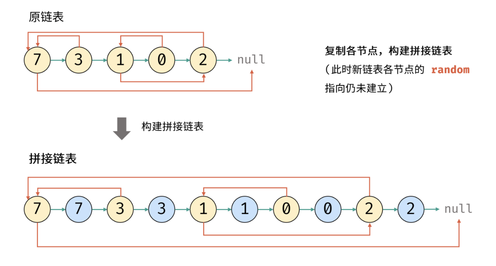

## 复杂链表的复制 (深拷贝)
<!--START_SECTION:badge-->

[](../../../README.md#中等)
[](../../../README.md#剑指offer)
[](../../../README.md#哈希表hash)
[](../../../README.md#经典)
[](../../../README.md#链表)
<!--END_SECTION:badge-->
<!--info
tags: [链表, 哈希表, 经典]
source: 剑指Offer
level: 中等
number: '3500'
name: 复杂链表的复制 (深拷贝)
companies: []
-->

<summary><b>问题简述</b></summary>

```txt
复制带随机指针的链表, 返回复制后链表的头结点;
```

<details><summary><b>详细描述</b></summary>

**注意**: 本题的输入输出带有迷惑性, 它们并不是实际的输入和输出, 而是链表的数组展现;

```txt
给你一个长度为 n 的链表, 每个节点包含一个额外增加的随机指针 random , 该指针可以指向链表中的任何节点或空节点.

构造这个链表的 深拷贝. 深拷贝应该正好由 n 个 全新 节点组成, 其中每个新节点的值都设为其对应的原节点的值. 新节点的 next 指针和 random 指针也都应指向复制链表中的新节点, 并使原链表和复制链表中的这些指针能够表示相同的链表状态. 复制链表中的指针都不应指向原链表中的节点 .

例如, 如果原链表中有 X 和 Y 两个节点, 其中 X.random --> Y . 那么在复制链表中对应的两个节点 x 和 y , 同样有 x.random --> y .

返回复制链表的头节点.

用一个由 n 个节点组成的链表来表示输入/输出中的链表. 每个节点用一个 [val, random_index] 表示:

val: 一个表示 Node.val 的整数.
random_index: 随机指针指向的节点索引 (范围从 0 到 n-1); 如果不指向任何节点, 则为  null .
你的代码 只 接受原链表的头节点 head 作为传入参数.

示例 1:
    输入: head = [[7,null],[13,0],[11,4],[10,2],[1,0]]
    输出: [[7,null],[13,0],[11,4],[10,2],[1,0]]
示例 2:
    输入: head = [[1,1],[2,1]]
    输出: [[1,1],[2,1]]
示例 3:
    输入: head = [[3,null],[3,0],[3,null]]
    输出: [[3,null],[3,0],[3,null]]
示例 4:
    输入: head = []
    输出: []
    解释: 给定的链表为空 (空指针), 因此返回 null.

提示:
    -10000 <= Node.val <= 10000
    Node.random 为空 (null) 或指向链表中的节点.
    节点数目不超过 1000 .

来源: 力扣 (LeetCode)
链接: https://leetcode-cn.com/problems/fu-za-lian-biao-de-fu-zhi-lcof
著作权归领扣网络所有. 商业转载请联系官方授权, 非商业转载请注明出处.
```

</details>

<!-- <div align="center"></div> -->

<summary><b>思路1: 哈希表</b></summary>

- 先看下普通链表的复制:

    <details><summary><b>普通链表的复制</b></summary>

    ```python
        class Solution:
            def copyList(self, head: 'Node') -> 'Node':
                cur = head
                ret = pre = Node(0)  # 伪头结点
                while cur:
                    node = Node(cur.val) # 复制节点 cur
                    pre.next = node      # 新链表的 前驱节点 -> 当前节点
                    # pre.random = '???' # 新链表的 「 前驱节点 -> 当前节点 」 无法确定
                    cur = cur.next       # 遍历下一节点
                    pre = node           # 保存当前新节点
                return ret.next
    ```

    </details>

- 首先要理解本题的难点:
    - 复制当前节点的时候, 随机指针指向的节点可能还没有创建;
    - 即使你先按普通链表先把节点都创建出来, 由于链表无法随机访问的性质, 你也不知道随机节点在哪个位置;
- 解决方法是利用哈希表 (写法1):
    - 第一次遍历时, 记录每个节点对应的复制节点;
    - 第二次遍历时, 根据原链表的指向从哈希表中提取对应的节点, 建立指向关系;
- 本题还有一种递归的写法 (写法2):
    - 同样用一个哈希表保存

<details><summary><b>Python: 迭代 (写法1) </b></summary>

```python
"""
# Definition for a Node.
class Node:
    def __init__(self, x: int, next: 'Node' = None, random: 'Node' = None):
        self.val = int(x)
        self.next = next
        self.random = random
"""

class Solution:
    def copyRandomList(self, head: 'Node') -> 'Node':
        if not head: return None  # 使用伪头结点, 可以省去这行

        dp = dict()

        # 第一次遍历, 生成复制节点, 并记录到哈希表
        p = head
        while p:
            dp[p] = Node(p.val)
            p = p.next

        # 写法1: 使用伪头结点, 可以省去对 head 为 None 的判断
        cur = head
        ret = pre = Node(0)  # 伪头结点
        while cur:
            pre.next = dp[cur]  # 这里可以不用 get, 因为一定存在
            pre.next.random = dp.get(cur.random)  # get 方法在 key 不存在时, 默认返回 None
            cur = cur.next
            pre = pre.next

        return ret.next

        # 写法2: 相比使用伪头结点
        # cur = head
        # while cur:
        #     dp[cur].next = dp.get(cur.next)
        #     dp[cur].random = dp.get(cur.random)
        #     cur = cur.next

        # return dp[head]
```

</details>


<details><summary><b>Python: 递归 (写法2) </b></summary>

- 【不推荐】虽然代码量会少一点, 但是不好理解;

```python
"""
# Definition for a Node.
class Node:
    def __init__(self, x: int, next: 'Node' = None, random: 'Node' = None):
        self.val = int(x)
        self.next = next
        self.random = random
"""

class Solution:
    def copyRandomList(self, head: 'Node') -> 'Node':
        if not head: return None

        dp = dict()

        def dfs(p):
            if not p: return None

            if p not in dp:
                dp[p] = Node(p.val)
                dp[p].next = dfs(p.next)
                dp[p].random = dfs(p.random)

            return dp[p]

        return dfs(head)
```

</details>


<summary><b>思路2: 复制+拆分</b></summary>

<div align="center"></div>

> 详见: [复杂链表的复制 (哈希表 / 拼接与拆分, 清晰图解) ](https://leetcode-cn.com/problems/fu-za-lian-biao-de-fu-zhi-lcof/solution/jian-zhi-offer-35-fu-za-lian-biao-de-fu-zhi-ha-xi-/)

- 注意这个方法需要遍历三次:
    - 第一次复制节点
    - 第二次设置随机节点
    - 第三次拆分
- 因为随机节点指向任意, 所以必须先设置完所有随机节点后才能拆分;

<details><summary><b>Python</b></summary>

```python
"""
# Definition for a Node.
class Node:
    def __init__(self, x: int, next: 'Node' = None, random: 'Node' = None):
        self.val = int(x)
        self.next = next
        self.random = random
"""

"""
# Definition for a Node.
class Node:
    def __init__(self, x: int, next: 'Node' = None, random: 'Node' = None):
        self.val = int(x)
        self.next = next
        self.random = random
"""

class Solution:
    def copyRandomList(self, head: 'Node') -> 'Node':
        if not head: return None

        # 复制节点
        cur = head
        while cur:
            nod = Node(cur.val)  # 创建节点
            cur.next, nod.next = nod, cur.next  # 接入新节点
            cur = nod.next  # 遍历下一个节点

        # 设置随机节点, 因为随机节点指向任意, 所以必须先设置随机节点后才能断开
        cur = head
        while cur:
            if cur.random:
                cur.next.random = cur.random.next
            cur = cur.next.next

        # 拆分节点
        cur = head
        ret = nxt = head.next
        while nxt.next:
            # 开始拆分
            cur.next = cur.next.next
            nxt.next = nxt.next.next

            # 下一组
            cur = cur.next
            nxt = nxt.next

        return ret
```

</details>


<!--START_SECTION:relate_note-->
---

### 算法笔记

- [链表操作备忘](../../../../notes/_archives/2022/10/链表模板.md)  

<details><summary><b>其他算法笔记</b></summary>

- [从递归到递推 (动态规划)](../../../../notes/_archives/2022/10/从暴力递归到动态规划.md)  
- [树形递归技巧](../../../../notes/_archives/2022/10/树形递归技巧.md)  
- [滑动窗口模板](../../../../notes/_archives/2022/10/滑动窗口模板.md)  

</details>
<!--END_SECTION:relate_note-->


<!--START_SECTION:relate_problem-->
---

### 相关问题


<details><summary><b>哈希表(Hash) (11)</b></summary>

> [[中等, LeetCode] 字母异位词分组 🔥](../../2022/10/LeetCode_0049_中等_字母异位词分组.md)  
> [[中等, LeetCode] 重复的DNA序列](../../2022/07/LeetCode_0187_中等_重复的DNA序列.md)  
> [[中等, 剑指Offer] 最长不含重复字符的子字符串](剑指Offer_4800_中等_最长不含重复字符的子字符串.md)  
> [[中等, 牛客] 和为K的连续子数组](../../2022/05/牛客_0125_中等_和为K的连续子数组.md)  
  > 
> [[困难, 牛客] 数组中的最长连续子序列](../../2022/04/牛客_0095_困难_数组中的最长连续子序列.md)  
  > 
> [[简单, LeetCode] 两数之和 🔥](../10/LeetCode_0001_简单_两数之和.md)  
> [[简单, 剑指Offer] 数组中重复的数字](../11/剑指Offer_0300_简单_数组中重复的数字.md)  
> [[简单, 剑指Offer] 第一个只出现一次的字符](剑指Offer_5000_简单_第一个只出现一次的字符.md)  
> [[简单, 牛客] 两数之和](../../2022/03/牛客_0061_简单_两数之和.md)  
> [[简单, 牛客] 第一个只出现一次的字符](../../2022/02/牛客_0031_简单_第一个只出现一次的字符.md)  
> [[简单, 程序员面试金典] 判定是否互为字符重排](../../2022/09/程序员面试金典_0102_简单_判定是否互为字符重排.md)  
  > 

</details>

<details><summary><b>经典 (37)</b></summary>

> [[中等, LeetCode] 下一个排列 🔥](../../2022/10/LeetCode_0031_中等_下一个排列.md)  
> [[中等, LeetCode] 二叉树的完全性检验 🔥](../../2022/03/LeetCode_0958_中等_二叉树的完全性检验.md)  
> [[中等, LeetCode] 最长递增子序列 🔥](../../2022/06/LeetCode_0300_中等_最长递增子序列.md)  
> [[中等, 剑指Offer2] 整数除法 🔥](../../2022/09/剑指Offer2_001_中等_整数除法.md)  
> [[中等, 剑指Offer] 丑数 🔥](剑指Offer_4900_中等_丑数.md)  
> [[中等, 剑指Offer] 二叉搜索树与双向链表 🔥](剑指Offer_3600_中等_二叉搜索树与双向链表.md)  
> [[中等, 剑指Offer] 圆圈中最后剩下的数字 (约瑟夫环问题) 🔥](../../2022/01/剑指Offer_6200_中等_圆圈中最后剩下的数字(约瑟夫环问题).md)  
> [[中等, 剑指Offer] 字符串的排列 (全排列) 🔥](剑指Offer_3800_中等_字符串的排列(全排列).md)  
> [[中等, 剑指Offer] 把字符串转换成整数 🔥](../../2022/01/剑指Offer_6700_中等_把字符串转换成整数.md)  
> [[中等, 剑指Offer] 数值的整数次方 (快速幂) 🔥](../11/剑指Offer_1600_中等_数值的整数次方(快速幂).md)  
> [[中等, 剑指Offer] 栈的压入、弹出序列 🔥](../11/剑指Offer_3100_中等_栈的压入、弹出序列.md)  
> [[中等, 剑指Offer] 重建二叉树 🔥](../11/剑指Offer_0700_中等_重建二叉树.md)  
> [[中等, 剑指Offer] 顺时针打印矩阵 (3种思路4个写法) 🔥](../11/剑指Offer_2900_中等_顺时针打印矩阵(3种思路4个写法).md)  
> [[中等, 牛客] 01背包 🔥](../../2022/05/牛客_0145_中等_01背包.md)  
> [[中等, 牛客] 丢棋子问题 (鹰蛋问题) 🔥](../../2022/04/牛客_0087_中等_丢棋子问题(鹰蛋问题).md)  
> [[中等, 牛客] 字符串的排列 🔥](../../2022/05/牛客_0121_中等_字符串的排列.md)  
> [[中等, 牛客] 寻找峰值 🔥](../../2022/04/牛客_0107_中等_寻找峰值.md)  
> [[中等, 牛客] 岛屿数量 🔥](../../2022/04/牛客_0109_中等_岛屿数量.md)  
> [[中等, 牛客] 把字符串转换成整数(atoi) 🔥](../../2022/04/牛客_0100_中等_把字符串转换成整数(atoi).md)  
> [[中等, 牛客] 数组中只出现一次的两个数字 🔥](../../2022/03/牛客_0075_中等_数组中只出现一次的两个数字.md)  
> [[中等, 牛客] 最长公共子序列(二) 🔥](../../2022/04/牛客_0092_中等_最长公共子序列(二).md)  
> [[中等, 牛客] 栈和排序 🔥](../../2022/05/牛客_0115_中等_栈和排序.md)  
> [[中等, 牛客] 汉诺塔问题 🔥](../../2022/03/牛客_0067_中等_汉诺塔问题.md)  
  > 
> [[困难, LeetCode] 编辑距离 🔥](../../2022/06/LeetCode_0072_困难_编辑距离.md)  
> [[困难, 剑指Offer] 数组中的逆序对 🔥](../../2022/01/剑指Offer_5100_困难_数组中的逆序对.md)  
> [[困难, 牛客] 接雨水问题 🔥](../../2022/05/牛客_0128_困难_接雨水问题.md)  
> [[困难, 牛客] 设计LFU缓存结构 🔥](../../2022/04/牛客_0094_困难_设计LFU缓存结构.md)  
> [[困难, 牛客] 设计LRU缓存结构 🔥](../../2022/04/牛客_0093_困难_设计LRU缓存结构.md)  
  > 
> [[简单, LeetCode] 二叉树的最大深度 🔥](../../2022/07/LeetCode_0104_简单_二叉树的最大深度.md)  
> [[简单, LeetCode] 反转链表 🔥](../../2022/10/LeetCode_0206_简单_反转链表.md)  
> [[简单, 剑指Offer] 二叉搜索树的最近公共祖先 🔥](../../2022/01/剑指Offer_6801_简单_二叉搜索树的最近公共祖先.md)  
> [[简单, 剑指Offer] 反转链表 🔥](../11/剑指Offer_2400_简单_反转链表.md)  
> [[简单, 剑指Offer] 数组中出现次数超过一半的数字 (摩尔投票) 🔥](剑指Offer_3900_简单_数组中出现次数超过一半的数字(摩尔投票).md)  
> [[简单, 剑指Offer] 最小的k个数 (partition操作) 🔥](剑指Offer_4000_简单_最小的k个数(partition操作).md)  
> [[简单, 牛客] 二进制中1的个数 🔥](../../2022/05/牛客_0120_简单_二进制中1的个数.md)  
> [[简单, 牛客] 单链表的排序 🔥](../../2022/03/牛客_0070_简单_单链表的排序.md)  
> [[简单, 牛客] 求平方根 🔥](../../2022/02/牛客_0032_简单_求平方根.md)  
  > 

</details>

<details><summary><b>链表 (30)</b></summary>

> [[中等, LeetCode] 两数相加 🔥](../10/LeetCode_0002_中等_两数相加.md)  
> [[中等, LeetCode] 分隔链表](../10/LeetCode_0086_中等_分隔链表.md)  
> [[中等, LeetCode] 删除链表中的节点](../../2025/10/LeetCode_0237_中等_删除链表中的节点.md)  
> [[中等, LeetCode] 删除链表的倒数第N个结点 🔥](../../2022/01/LeetCode_0019_中等_删除链表的倒数第N个结点.md)  
> [[中等, LeetCode] 重排链表 🔥](../../2022/06/LeetCode_0143_中等_重排链表.md)  
> [[中等, 牛客] 划分链表](../../2022/01/牛客_0023_中等_划分链表.md)  
> [[中等, 牛客] 删除有序链表中重复的元素-I](../../2022/01/牛客_0025_中等_删除有序链表中重复的元素-I.md)  
> [[中等, 牛客] 删除有序链表中重复的元素-II](../../2022/01/牛客_0024_中等_删除有序链表中重复的元素-II.md)  
> [[中等, 牛客] 重排链表](../../2022/01/牛客_0002_中等_重排链表.md)  
> [[中等, 牛客] 链表中的节点每k个一组翻转](../../2022/03/牛客_0050_中等_链表中的节点每k个一组翻转.md)  
> [[中等, 牛客] 链表内指定区间反转](../../2022/01/牛客_0021_中等_链表内指定区间反转.md)  
> [[中等, 牛客] 链表相加(二)](../../2022/03/牛客_0040_中等_链表相加(二).md)  
  > 
> [[困难, LeetCode] K个一组翻转链表 🔥](../../2022/02/LeetCode_0025_困难_K个一组翻转链表.md)  
> [[困难, LeetCode] 合并K个升序链表 🔥](../../2022/10/LeetCode_0023_困难_合并K个升序链表.md)  
  > 
> [[简单, LeetCode] 反转链表 🔥](../../2022/10/LeetCode_0206_简单_反转链表.md)  
> [[简单, LeetCode] 合并两个有序链表 🔥](../10/LeetCode_0021_简单_合并两个有序链表.md)  
> [[简单, LeetCode] 链表的中间结点](../../2022/06/LeetCode_0876_简单_链表的中间结点.md)  
> [[简单, 剑指Offer] 两个链表的第一个公共节点](../../2022/01/剑指Offer_5200_简单_两个链表的第一个公共节点.md)  
> [[简单, 剑指Offer] 从尾到头打印链表](../11/剑指Offer_0600_简单_从尾到头打印链表.md)  
> [[简单, 剑指Offer] 删除链表的节点](../11/剑指Offer_1800_简单_删除链表的节点.md)  
> [[简单, 剑指Offer] 反转链表 🔥](../11/剑指Offer_2400_简单_反转链表.md)  
> [[简单, 剑指Offer] 合并两个排序的链表](../11/剑指Offer_2500_简单_合并两个排序的链表.md)  
> [[简单, 剑指Offer] 链表中倒数第k个节点](../11/剑指Offer_2200_简单_链表中倒数第k个节点.md)  
> [[简单, 牛客] 两个链表的第一个公共结点 🔥](../../2022/03/牛客_0066_简单_两个链表的第一个公共结点.md)  
> [[简单, 牛客] 判断一个链表是否为回文结构](../../2022/04/牛客_0096_简单_判断一个链表是否为回文结构.md)  
> [[简单, 牛客] 判断链表中是否有环](../../2022/01/牛客_0004_简单_判断链表中是否有环.md)  
> [[简单, 牛客] 单链表的排序 🔥](../../2022/03/牛客_0070_简单_单链表的排序.md)  
> [[简单, 牛客] 反转链表](../../2022/03/牛客_0078_简单_反转链表.md)  
> [[简单, 牛客] 合并两个排序的链表](../../2022/02/牛客_0033_简单_合并两个排序的链表.md)  
> [[简单, 牛客] 链表中环的入口结点](../../2022/01/牛客_0003_简单_链表中环的入口结点.md)  
  > 

</details>
<!--END_SECTION:relate_problem-->
