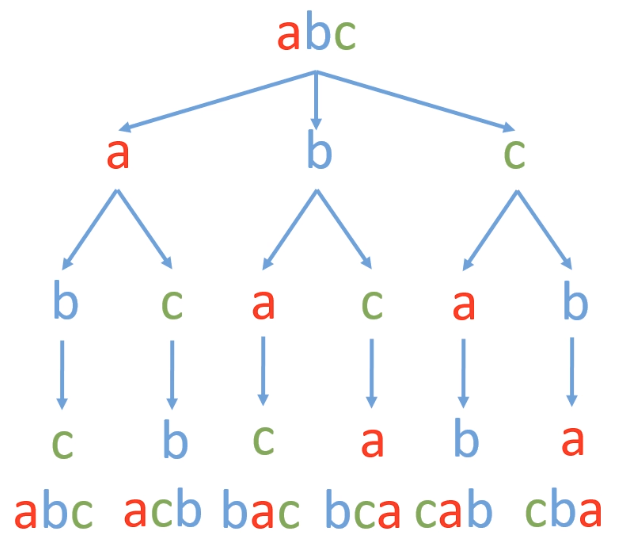

## 字符串的排列 (全排列)
<!--START_SECTION:badge-->

[](../../../README.md#中等)
[](../../../README.md#剑指offer)
[](../../../README.md#深度优先搜索)
[](../../../README.md#经典)
<!--END_SECTION:badge-->
<!--info
tags: [DFS+剪枝, 经典]
source: 剑指Offer
level: 中等
number: '3800'
name: 字符串的排列 (全排列)
companies: []
-->

<summary><b>问题简述</b></summary>

```txt
输入一个字符串, 打印出该字符串中字符的所有排列.
```

<details><summary><b>详细描述</b></summary>

```txt
输入一个字符串, 打印出该字符串中字符的所有排列.

你可以以任意顺序返回这个字符串数组, 但里面不能有重复元素.

示例:
    输入: s = "abc"
    输出: ["abc","acb","bac","bca","cab","cba"]

限制:
    1 <= s 的长度 <= 8

来源: 力扣 (LeetCode)
链接: https://leetcode-cn.com/problems/zi-fu-chuan-de-pai-lie-lcof
著作权归领扣网络所有. 商业转载请联系官方授权, 非商业转载请注明出处.
```

</details>

<!-- <div align="center"></div> -->

<summary><b>思路1: DFS树状遍历+剪枝</b></summary>

- 深度优先求全排列的过程实际上相当于是一个**多叉树的先序遍历过程**;
    - 假设共有 `n` 种状态都不重复, 则:
    - 第一层有 `n` 种选择;
    - 第二层有 `n - 1` 种选择;
    - ...
    - 共有 `n!` 种可能;

    <details><summary><b>图示</b></summary>

    <div align="center"></div>

    </details>

**本题的难点是如何过滤重复的状态**

- **写法1) ** 遍历所有状态, 直接用 `set` 保存结果 (不剪枝):

    <details><summary><b>Python</b></summary>

    ```python
    class Solution:
        def permutation(self, s: str) -> List[str]:

            N = len(s)
            buf = []
            ret = set()
            visited = [False] * N
            def dfs(deep):
                if deep == N:
                    ret.add(''.join(buf))
                    return

                for i in range(N):
                    if not visited[i]:
                        # 标记
                        buf.append(s[i])
                        visited[i] = True
                        # 进入下一层
                        dfs(deep + 1)
                        # 回溯 (撤销标记)
                        buf.pop()  
                        visited[i] = False

            dfs(0)
            return list(ret)
    ```

    </details>

- **写法2) ** 跳过重复字符 (需排序):
    - 其中用于剪枝的代码不太好理解, 其解析详见: [「代码随想录」剑指 Offer 38. 字符串的排列](https://leetcode-cn.com/problems/zi-fu-chuan-de-pai-lie-lcof/solution/dai-ma-sui-xiang-lu-jian-zhi-offer-38-zi-gwt6/)

        ```python
        if not visited[i - 1] and i > 0 and s[i] == s[i - 1]:
            continue
        ```

    <details><summary><b>Python</b></summary>

    ```python
    class Solution:
        def permutation(self, s: str) -> List[str]:

            s = sorted(s)  # 排序, 使相同字符在一起
            N = len(s)
            ret = []  # 保存结果
            buf = []  # 临时结果
            visited = [False] * N  # 记录是否访问
            def dfs(deep):  # 传入递归深度
                if deep == N:
                    ret.append(''.join(buf))
                    return

                for i in range(N):
                    # 剪枝
                    if visited[i - 1] is False and i > 0 and s[i] == s[i - 1]:
                        continue

                    # 下面的代码居然可以 (区别仅在于 visited[i - 1] 的状态),
                    # 但是效率不如上面的, 具体解析可参考: [「代码随想录」剑指 Offer 38. 字符串的排列](https://leetcode-cn.com/problems/zi-fu-chuan-de-pai-lie-lcof/solution/dai-ma-sui-xiang-lu-jian-zhi-offer-38-zi-gwt6/)
                    # if visited[i - 1] is True and i > 0 and s[i] == s[i - 1]:
                    #     continue

                    if not visited[i]:  # 如果当前位置还没访问过
                        # 标记当前位置
                        visited[i] = True
                        buf.append(s[i])
                        # 下一个位置
                        dfs(deep + 1)
                        # 回溯
                        buf.pop()
                        visited[i] = False

            dfs(0)
            return ret
    ```

    </details>

- **写法3) ** 在每一层用一个 `set` 保存已经用过的字符 (不排序):

    <details><summary><b>Python</b></summary>

    ```python
    class Solution:
        def permutation(self, s: str) -> List[str]:

            N = len(s)
            buf = []
            ret = set()
            visited = [False] * N
            def dfs(deep):
                if deep == N:
                    ret.add(''.join(buf))
                    return

                used = set()  # 记录用过的字符
                for i in range(N):
                    if s[i] in used:  # 如果是已经用过的
                        continue

                    if not visited[i]:
                        # 标记
                        used.add(s[i])
                        buf.append(s[i])
                        visited[i] = True
                        # 进入下一层
                        dfs(deep + 1)
                        # 回溯 (撤销标记)
                        buf.pop()  
                        visited[i] = False

            dfs(0)
            return list(ret)
    ```

    </details>

- **写法2) ** 原地交换
    > [剑指 Offer 38. 字符串的排列 (回溯法, 清晰图解) ](https://leetcode-cn.com/problems/zi-fu-chuan-de-pai-lie-lcof/solution/mian-shi-ti-38-zi-fu-chuan-de-pai-lie-hui-su-fa-by/)

    - 这个写法有点像 "下一个排列", 只是没有使用字典序;

    <details><summary><b>Python</b></summary>

    ```python
    class Solution:
        def permutation(self, s: str) -> List[str]:
            N = len(s)
            buf = list(s)
            ret = []

            def dfs(deep):
                if deep == N - 1:
                    ret.append(''.join(buf))   # 添加排列方案
                    return

                used = set()
                for i in range(deep, N):  # 注意遍历范围, 类似选择排序
                    if buf[i] in used:  # 已经用过的状态
                        continue

                    used.add(buf[i])
                    buf[deep], buf[i] = buf[i], buf[deep]  # 交换, 将 buf[i] 固定在第 deep 位
                    dfs(deep + 1)               # 开启固定第 x + 1 位字符
                    buf[deep], buf[i] = buf[i], buf[deep]  # 恢复交换

            dfs(0)
            return ret
    ```

    </details>


<summary><b>思路2: 下一个排列</b></summary>

> [字符串的排列](https://leetcode-cn.com/problems/zi-fu-chuan-de-pai-lie-lcof/solution/zi-fu-chuan-de-pai-lie-by-leetcode-solut-hhvs/)

- 先排序得到最小的字典序结果;
- 循环直到不存在下一个更大的排列;

<details><summary><b>Python</b></summary>

```python
class Solution:
    def permutation(self, s: str) -> List[str]:

        def nextPermutation(nums: List[str]) -> bool:
            i = len(nums) - 2
            while i >= 0 and nums[i] >= nums[i + 1]:
                i -= 1

            if i < 0:
                return False
            else:
                j = len(nums) - 1
                while j >= 0 and nums[i] >= nums[j]:
                    j -= 1
                nums[i], nums[j] = nums[j], nums[i]

            left, right = i + 1, len(nums) - 1
            while left < right:
                nums[left], nums[right] = nums[right], nums[left]
                left += 1
                right -= 1

            return True

        buf = sorted(s)
        ret = [''.join(buf)]
        while nextPermutation(buf):
            ret.append(''.join(buf))

        return ret
```

</details>


<!--START_SECTION:relate_note-->
---

### 算法笔记

> 🌧️ _暂无主题相关的笔记_


<details><summary><b>其他算法笔记</b></summary>

- [从暴力递归到动态规划](../../../../notes/_archives/2022/10/从暴力递归到动态规划.md)  
- [树形递归技巧](../../../../notes/_archives/2022/10/树形递归技巧.md)  
- [滑动窗口模板](../../../../notes/_archives/2022/10/滑动窗口模板.md)  
- [链表常用操作备忘](../../../../notes/_archives/2022/10/链表模板.md)  

</details>
<!--END_SECTION:relate_note-->


<!--START_SECTION:relate_problem-->
---

### 相关问题


<details><summary><b>深度优先搜索 (19)</b></summary>

> [[中等, LeetCode] 括号生成 🔥](../../2022/10/LeetCode_0022_中等_括号生成.md)  
> [[中等, LeetCode] 电话号码的字母组合 🔥](../../2022/10/LeetCode_0017_中等_电话号码的字母组合.md)  
> [[中等, LeetCode] 组合总和 🔥](../../2022/10/LeetCode_0039_中等_组合总和.md)  
> [[中等, LeetCode] 路径总和III](../../2022/06/LeetCode_0437_中等_路径总和III.md)  
> [[中等, 剑指Offer] 二叉树中和为某一值的路径](剑指Offer_3400_中等_二叉树中和为某一值的路径.md)  
> [[中等, 剑指Offer] 打印从1到最大的n位数 (N叉树的遍历)](../11/剑指Offer_1700_中等_打印从1到最大的n位数(N叉树的遍历).md)  
> [[中等, 剑指Offer] 机器人的运动范围](../11/剑指Offer_1300_中等_机器人的运动范围.md)  
> [[中等, 剑指Offer] 矩阵中的路径](../11/剑指Offer_1200_中等_矩阵中的路径.md)  
> [[中等, 牛客] 二叉树中和为某一值的路径(二)](../../2022/01/牛客_0008_中等_二叉树中和为某一值的路径(二).md)  
> [[中等, 牛客] 二叉树根节点到叶子节点的所有路径和](../../2022/01/牛客_0005_中等_二叉树根节点到叶子节点的所有路径和.md)  
> [[中等, 牛客] 字符串的排列 🔥](../../2022/05/牛客_0121_中等_字符串的排列.md)  
> [[中等, 牛客] 实现二叉树先序、中序、后序遍历](../../2022/03/牛客_0045_中等_实现二叉树先序、中序、后序遍历.md)  
> [[中等, 牛客] 岛屿数量 🔥](../../2022/04/牛客_0109_中等_岛屿数量.md)  
> [[中等, 牛客] 数字字符串转化成IP地址](../../2022/01/牛客_0020_中等_数字字符串转化成IP地址.md)  
  > 
> [[困难, 牛客] 多叉树的直径](../../2022/04/牛客_0099_困难_多叉树的直径.md)  
  > 
> [[简单, LeetCode] 二叉树的最小深度](../../2022/07/LeetCode_0111_简单_二叉树的最小深度.md)  
> [[简单, 剑指Offer] 二叉搜索树的第k大节点](../../2022/01/剑指Offer_5400_简单_二叉搜索树的第k大节点.md)  
> [[简单, 剑指Offer] 从尾到头打印链表](../11/剑指Offer_0600_简单_从尾到头打印链表.md)  
> [[简单, 牛客] 二叉树中和为某一值的路径(一)](../../2022/01/牛客_0009_简单_二叉树中和为某一值的路径(一).md)  
  > 

</details>

<details><summary><b>经典 (37)</b></summary>

> [[中等, LeetCode] 下一个排列 🔥](../../2022/10/LeetCode_0031_中等_下一个排列.md)  
> [[中等, LeetCode] 二叉树的完全性检验 🔥](../../2022/03/LeetCode_0958_中等_二叉树的完全性检验.md)  
> [[中等, LeetCode] 最长递增子序列 🔥](../../2022/06/LeetCode_0300_中等_最长递增子序列.md)  
> [[中等, 剑指Offer2] 整数除法 🔥](../../2022/09/剑指Offer2_001_中等_整数除法.md)  
> [[中等, 剑指Offer] 丑数 🔥](剑指Offer_4900_中等_丑数.md)  
> [[中等, 剑指Offer] 二叉搜索树与双向链表 🔥](剑指Offer_3600_中等_二叉搜索树与双向链表.md)  
> [[中等, 剑指Offer] 圆圈中最后剩下的数字 (约瑟夫环问题) 🔥](../../2022/01/剑指Offer_6200_中等_圆圈中最后剩下的数字(约瑟夫环问题).md)  
> [[中等, 剑指Offer] 复杂链表的复制 (深拷贝) 🔥](剑指Offer_3500_中等_复杂链表的复制(深拷贝).md)  
> [[中等, 剑指Offer] 把字符串转换成整数 🔥](../../2022/01/剑指Offer_6700_中等_把字符串转换成整数.md)  
> [[中等, 剑指Offer] 数值的整数次方 (快速幂) 🔥](../11/剑指Offer_1600_中等_数值的整数次方(快速幂).md)  
> [[中等, 剑指Offer] 栈的压入、弹出序列 🔥](../11/剑指Offer_3100_中等_栈的压入、弹出序列.md)  
> [[中等, 剑指Offer] 重建二叉树 🔥](../11/剑指Offer_0700_中等_重建二叉树.md)  
> [[中等, 剑指Offer] 顺时针打印矩阵 (3种思路4个写法) 🔥](../11/剑指Offer_2900_中等_顺时针打印矩阵(3种思路4个写法).md)  
> [[中等, 牛客] 01背包 🔥](../../2022/05/牛客_0145_中等_01背包.md)  
> [[中等, 牛客] 丢棋子问题 (鹰蛋问题) 🔥](../../2022/04/牛客_0087_中等_丢棋子问题(鹰蛋问题).md)  
> [[中等, 牛客] 字符串的排列 🔥](../../2022/05/牛客_0121_中等_字符串的排列.md)  
> [[中等, 牛客] 寻找峰值 🔥](../../2022/04/牛客_0107_中等_寻找峰值.md)  
> [[中等, 牛客] 岛屿数量 🔥](../../2022/04/牛客_0109_中等_岛屿数量.md)  
> [[中等, 牛客] 把字符串转换成整数(atoi) 🔥](../../2022/04/牛客_0100_中等_把字符串转换成整数(atoi).md)  
> [[中等, 牛客] 数组中只出现一次的两个数字 🔥](../../2022/03/牛客_0075_中等_数组中只出现一次的两个数字.md)  
> [[中等, 牛客] 最长公共子序列(二) 🔥](../../2022/04/牛客_0092_中等_最长公共子序列(二).md)  
> [[中等, 牛客] 栈和排序 🔥](../../2022/05/牛客_0115_中等_栈和排序.md)  
> [[中等, 牛客] 汉诺塔问题 🔥](../../2022/03/牛客_0067_中等_汉诺塔问题.md)  
  > 
> [[困难, LeetCode] 编辑距离 🔥](../../2022/06/LeetCode_0072_困难_编辑距离.md)  
> [[困难, 剑指Offer] 数组中的逆序对 🔥](../../2022/01/剑指Offer_5100_困难_数组中的逆序对.md)  
> [[困难, 牛客] 接雨水问题 🔥](../../2022/05/牛客_0128_困难_接雨水问题.md)  
> [[困难, 牛客] 设计LFU缓存结构 🔥](../../2022/04/牛客_0094_困难_设计LFU缓存结构.md)  
> [[困难, 牛客] 设计LRU缓存结构 🔥](../../2022/04/牛客_0093_困难_设计LRU缓存结构.md)  
  > 
> [[简单, LeetCode] 二叉树的最大深度 🔥](../../2022/07/LeetCode_0104_简单_二叉树的最大深度.md)  
> [[简单, LeetCode] 反转链表 🔥](../../2022/10/LeetCode_0206_简单_反转链表.md)  
> [[简单, 剑指Offer] 二叉搜索树的最近公共祖先 🔥](../../2022/01/剑指Offer_6801_简单_二叉搜索树的最近公共祖先.md)  
> [[简单, 剑指Offer] 反转链表 🔥](../11/剑指Offer_2400_简单_反转链表.md)  
> [[简单, 剑指Offer] 数组中出现次数超过一半的数字 (摩尔投票) 🔥](剑指Offer_3900_简单_数组中出现次数超过一半的数字(摩尔投票).md)  
> [[简单, 剑指Offer] 最小的k个数 (partition操作) 🔥](剑指Offer_4000_简单_最小的k个数(partition操作).md)  
> [[简单, 牛客] 二进制中1的个数 🔥](../../2022/05/牛客_0120_简单_二进制中1的个数.md)  
> [[简单, 牛客] 单链表的排序 🔥](../../2022/03/牛客_0070_简单_单链表的排序.md)  
> [[简单, 牛客] 求平方根 🔥](../../2022/02/牛客_0032_简单_求平方根.md)  
  > 

</details>
<!--END_SECTION:relate_problem-->
