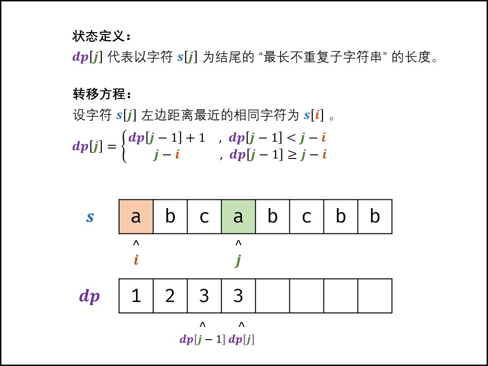

## 最长不含重复字符的子字符串
<!--START_SECTION:badge-->

[](../../../README.md#中等)
[](../../../README.md#剑指offer)
[](../../../README.md#哈希表hash)
[](../../../README.md#双指针)
[](../../../README.md#动态规划)
<!--END_SECTION:badge-->
<!--info
tags: [哈希表, 双指针, 动态规划]
source: 剑指Offer
level: 中等
number: '4800'
name: 最长不含重复字符的子字符串
companies: []
-->

<summary><b>问题简述</b></summary>

```txt
求字符串 s 中的最长不重复子串, 返回其长度;
```

<details><summary><b>详细描述</b></summary>

```txt
请从字符串中找出一个最长的不包含重复字符的子字符串, 计算该最长子字符串的长度.

示例 1:
    输入: "abcabcbb"
    输出: 3
    解释: 因为无重复字符的最长子串是 "abc", 所以其长度为 3.
示例 2:
    输入: "bbbbb"
    输出: 1
    解释: 因为无重复字符的最长子串是 "b", 所以其长度为 1.
示例 3:
    输入: "pwwkew"
    输出: 3
    解释: 因为无重复字符的最长子串是 "wke", 所以其长度为 3.
        请注意, 你的答案必须是 子串 的长度, "pwke" 是一个子序列, 不是子串.

提示:
    s.length <= 40000

来源: 力扣 (LeetCode)
链接: https://leetcode-cn.com/problems/zui-chang-bu-han-zhong-fu-zi-fu-de-zi-zi-fu-chuan-lcof
著作权归领扣网络所有. 商业转载请联系官方授权, 非商业转载请注明出处.
```

</details>

<!-- <div align="center"></div> -->

<summary><b>思路1: 双指针 (推荐) </b></summary>

- 双指针同向遍历每个字符; 同时使用哈希表记录每个字符的最新位置;
- 如果右指针遇到已经出现过的字符, 则将左指针移动到该字符的位置, 更新最大长度;
- 具体细节见代码;

<details><summary><b>Python</b></summary>

```python
class Solution:
    def lengthOfLongestSubstring(self, s: str) -> int:
        if not s: return 0

        c2p = dict()
        lo = -1  # 左指针
        ret = 1
        for hi, c in enumerate(s):  # 遍历右指针
            if c not in c2p or c2p[c] < lo:  # 如果当前字符还没有出现过, 或者出现过但是在左指针的左侧, 可以更新最大长度
                ret = max(ret, hi - lo)
            else:  # 否则更新左指针
                lo = c2p[c]

            c2p[c] = hi  # 更新字符最新位置

        return ret
```

</details>


<summary><b>思路2: 动态规划</b></summary>

> [最长不含重复字符的子字符串 (动态规划 / 双指针 + 哈希表, 清晰图解) ](https://

**状态定义**
leetcode-cn.com/problems/zui-chang-bu-han-zhong-fu-zi-fu-de-zi-zi-fu-chuan-lcof/solution/mian-shi-ti-48-zui-chang-bu-han-zhong-fu-zi-fu-d-9/)
- 记 `dp[i] := 以第 i 个字符为结尾的不含重复字符的子串的最大长度`;

**转移方程**
```
dp[i] = dp[i-1] + 1     if dp[i-1] < i-i
      = i-j             else

其中 j 表示字符 s[i] 上一次出现的位置;
```

- 使用一个 hash 表记录每个字符上一次出现的位置;
- 因为当前状态只与上一个状态有关, 因此可以使用一个变量代替数组 (滚动);

**初始状态**
- `dp[0] = 1`

<!-- <div align="center"></div> -->

<details><summary><b>Python</b></summary>

```python
class Solution:
    def lengthOfLongestSubstring(self, s: str) -> int:
        idx = dict()
        ret = dp = 0
        for i, c in enumerate(s):
            if c not in idx:
                dp = dp + 1
            else:
                j = idx[c]  # 如果 c 已经出现过, 获取其上一个出现的位置
                if dp < i - j:  # 参考双指针思路, 这里相当于上一次出现的位置在左指针之前, 不影响更新长度
                    dp = dp + 1
                else:  # 反之, 在左指针之后
                    dp = i - j

            idx[c] = i  # 更新位置 i
            ret = max(ret, dp)  # 更新最大长度
        return ret
```

</details>


<!--START_SECTION:relate-->
---

### 相关主题

<details><summary><b>哈希表(Hash)</b></summary>

> [[中等, LeetCode] 字母异位词分组 🔥](../../2022/10/LeetCode_0049_中等_字母异位词分组.md)  
> [[中等, LeetCode] 重复的DNA序列](../../2022/07/LeetCode_0187_中等_重复的DNA序列.md)  
> [[中等, 剑指Offer] 复杂链表的复制 (深拷贝) 🔥](剑指Offer_3500_中等_复杂链表的复制(深拷贝).md)  
> [[中等, 牛客] 和为K的连续子数组](../../2022/05/牛客_0125_中等_和为K的连续子数组.md)  
  > 
> [[困难, 牛客] 数组中的最长连续子序列](../../2022/04/牛客_0095_困难_数组中的最长连续子序列.md)  
  > 
> [[简单, LeetCode] 两数之和 🔥](../10/LeetCode_0001_简单_两数之和.md)  
> [[简单, 剑指Offer] 数组中重复的数字](../11/剑指Offer_0300_简单_数组中重复的数字.md)  
> [[简单, 剑指Offer] 第一个只出现一次的字符](剑指Offer_5000_简单_第一个只出现一次的字符.md)  
> [[简单, 牛客] 两数之和](../../2022/03/牛客_0061_简单_两数之和.md)  
> [[简单, 牛客] 第一个只出现一次的字符](../../2022/02/牛客_0031_简单_第一个只出现一次的字符.md)  
> [[简单, 程序员面试金典] 判定是否互为字符重排](../../2022/09/程序员面试金典_0102_简单_判定是否互为字符重排.md)  
  > 

</details>
<details><summary><b>双指针</b></summary>

> [[中等, LeetCode] 三数之和 🔥](../10/LeetCode_0015_中等_三数之和.md)  
> [[中等, LeetCode] 下一个排列 🔥](../../2022/10/LeetCode_0031_中等_下一个排列.md)  
> [[中等, LeetCode] 删除链表的倒数第N个结点 🔥](../../2022/01/LeetCode_0019_中等_删除链表的倒数第N个结点.md)  
> [[中等, LeetCode] 最接近的三数之和](../10/LeetCode_0016_中等_最接近的三数之和.md)  
> [[中等, LeetCode] 最长回文子串 🔥](../10/LeetCode_0005_中等_最长回文子串.md)  
> [[中等, LeetCode] 有效三角形的个数](../10/LeetCode_0611_中等_有效三角形的个数.md)  
> [[中等, LeetCode] 盛最多水的容器 🔥](../10/LeetCode_0011_中等_盛最多水的容器.md)  
> [[中等, 牛客] 三数之和 🔥](../../2022/03/牛客_0054_中等_三数之和.md)  
> [[中等, 牛客] 删除链表的倒数第n个节点](../../2022/03/牛客_0053_中等_删除链表的倒数第n个节点.md)  
> [[中等, 牛客] 合并两个有序的数组](../../2022/01/牛客_0022_中等_合并两个有序的数组.md)  
  > 
> [[困难, LeetCode] 接雨水 🔥](../10/LeetCode_0042_困难_接雨水.md)  
> [[困难, 牛客] 接雨水问题 🔥](../../2022/05/牛客_0128_困难_接雨水问题.md)  
  > 
> [[简单, LeetCode] 两数之和II-输入有序数组](../../2022/07/LeetCode_0167_简单_两数之和II-输入有序数组.md)  
> [[简单, LeetCode] 链表的中间结点](../../2022/06/LeetCode_0876_简单_链表的中间结点.md)  
> [[简单, 剑指Offer] 两个链表的第一个公共节点](../../2022/01/剑指Offer_5200_简单_两个链表的第一个公共节点.md)  
> [[简单, 剑指Offer] 和为s的两个数字](../../2022/01/剑指Offer_5701_简单_和为s的两个数字.md)  
> [[简单, 剑指Offer] 和为s的连续正数序列](../../2022/01/剑指Offer_5702_简单_和为s的连续正数序列.md)  
> [[简单, 剑指Offer] 翻转单词顺序](../../2022/01/剑指Offer_5801_简单_翻转单词顺序.md)  
> [[简单, 剑指Offer] 调整数组顺序使奇数位于偶数前面](../11/剑指Offer_2100_简单_调整数组顺序使奇数位于偶数前面.md)  
> [[简单, 剑指Offer] 链表中倒数第k个节点](../11/剑指Offer_2200_简单_链表中倒数第k个节点.md)  
> [[简单, 牛客] 判断链表中是否有环](../../2022/01/牛客_0004_简单_判断链表中是否有环.md)  
> [[简单, 牛客] 反转字符串](../../2022/04/牛客_0103_简单_反转字符串.md)  
> [[简单, 牛客] 链表中倒数最后k个结点](../../2022/03/牛客_0069_简单_链表中倒数最后k个结点.md)  
> [[简单, 牛客] 链表中环的入口结点](../../2022/01/牛客_0003_简单_链表中环的入口结点.md)  
  > 

</details>
<details><summary><b>动态规划</b></summary>

> [[中等, LeetCode] 一和零](../../2022/06/LeetCode_0474_中等_一和零.md)  
> [[中等, LeetCode] 三角形最小路径和](../../2022/06/LeetCode_0120_中等_三角形最小路径和.md)  
> [[中等, LeetCode] 不同的二叉搜索树](../../2022/03/LeetCode_0096_中等_不同的二叉搜索树.md)  
> [[中等, LeetCode] 乘积最大子数组](../../2022/06/LeetCode_0152_中等_乘积最大子数组.md)  
> [[中等, LeetCode] 买卖股票的最佳时机II 🔥](../../2022/06/LeetCode_0122_中等_买卖股票的最佳时机II.md)  
> [[中等, LeetCode] 完全平方数](../../2022/02/LeetCode_0279_中等_完全平方数.md)  
> [[中等, LeetCode] 打家劫舍](../../2022/06/LeetCode_0198_中等_打家劫舍.md)  
> [[中等, LeetCode] 打家劫舍II](../../2022/06/LeetCode_0213_中等_打家劫舍II.md)  
> [[中等, LeetCode] 整数拆分](LeetCode_0343_中等_整数拆分.md)  
> [[中等, LeetCode] 最小路径和](../../2022/01/LeetCode_0064_中等_最小路径和.md)  
> [[中等, LeetCode] 最长回文子串 🔥](../10/LeetCode_0005_中等_最长回文子串.md)  
> [[中等, LeetCode] 最长递增子序列 🔥](../../2022/06/LeetCode_0300_中等_最长递增子序列.md)  
> [[中等, LeetCode] 解码方法](../../2022/02/LeetCode_0091_中等_解码方法.md)  
> [[中等, LeetCode] 零钱兑换](../../2022/06/LeetCode_0322_中等_零钱兑换.md)  
> [[中等, LeetCode] 零钱兑换II](../../2022/06/LeetCode_0518_中等_零钱兑换II.md)  
> [[中等, 剑指Offer] n个骰子的点数](../../2022/01/剑指Offer_6000_中等_n个骰子的点数.md)  
> [[中等, 剑指Offer] 丑数 🔥](剑指Offer_4900_中等_丑数.md)  
> [[中等, 剑指Offer] 剪绳子 (整数拆分)](../11/剑指Offer_1401_中等_剪绳子(整数拆分).md)  
> [[中等, 剑指Offer] 圆圈中最后剩下的数字 (约瑟夫环问题) 🔥](../../2022/01/剑指Offer_6200_中等_圆圈中最后剩下的数字(约瑟夫环问题).md)  
> [[中等, 剑指Offer] 斐波那契数列-3 (把数字翻译成字符串)](剑指Offer_4600_中等_斐波那契数列-3(把数字翻译成字符串).md)  
> [[中等, 剑指Offer] 礼物的最大价值](剑指Offer_4700_中等_礼物的最大价值.md)  
> [[中等, 牛客] 01背包 🔥](../../2022/05/牛客_0145_中等_01背包.md)  
> [[中等, 牛客] 丑数](../../2022/03/牛客_0079_中等_丑数.md)  
> [[中等, 牛客] 丢棋子问题 (鹰蛋问题) 🔥](../../2022/04/牛客_0087_中等_丢棋子问题(鹰蛋问题).md)  
> [[中等, 牛客] 把数字翻译成字符串](../../2022/05/牛客_0116_中等_把数字翻译成字符串.md)  
> [[中等, 牛客] 最大正方形](../../2022/04/牛客_0108_中等_最大正方形.md)  
> [[中等, 牛客] 最长公共子串](../../2022/05/牛客_0127_中等_最长公共子串.md)  
> [[中等, 牛客] 最长公共子序列(二) 🔥](../../2022/04/牛客_0092_中等_最长公共子序列(二).md)  
> [[中等, 牛客] 最长回文子串](../../2022/01/牛客_0017_中等_最长回文子串.md)  
> [[中等, 牛客] 矩阵的最小路径和](../../2022/03/牛客_0059_中等_矩阵的最小路径和.md)  
> [[中等, 牛客] 连续子数组的最大乘积](../../2022/04/牛客_0083_中等_连续子数组的最大乘积.md)  
  > 
> [[困难, LeetCode] 买卖股票的最佳时机III](../../2022/06/LeetCode_0123_困难_买卖股票的最佳时机III.md)  
> [[困难, LeetCode] 最长有效括号 🔥](../../2022/10/LeetCode_0032_困难_最长有效括号.md)  
> [[困难, LeetCode] 正则表达式匹配 🔥](../../2022/01/LeetCode_0010_困难_正则表达式匹配.md)  
> [[困难, LeetCode] 编辑距离 🔥](../../2022/06/LeetCode_0072_困难_编辑距离.md)  
> [[困难, 剑指Offer] 正则表达式匹配](../11/剑指Offer_1900_困难_正则表达式匹配.md)  
> [[困难, 牛客] 最长上升子序列(三)](../../2022/04/牛客_0091_困难_最长上升子序列(三).md)  
> [[困难, 牛客] 正则表达式匹配](../../2022/05/牛客_0122_困难_正则表达式匹配.md)  
> [[困难, 牛客] 编辑距离(二)](../../2022/02/牛客_0035_困难_编辑距离(二).md)  
> [[困难, 牛客] 通配符匹配](../../2022/03/牛客_0044_困难_通配符匹配.md)  
  > 
> [[简单, LeetCode] 买卖股票的最佳时机](../../2022/06/LeetCode_0121_简单_买卖股票的最佳时机.md)  
> [[简单, LeetCode] 最大子数组和](../../2022/01/LeetCode_0053_简单_最大子数组和.md)  
> [[简单, LeetCode] 爬楼梯](../../2022/01/LeetCode_0070_简单_爬楼梯.md)  
> [[简单, 剑指Offer] 斐波那契数列](../11/剑指Offer_1001_简单_斐波那契数列.md)  
> [[简单, 剑指Offer] 跳台阶](../11/剑指Offer_1002_简单_跳台阶.md)  
> [[简单, 剑指Offer] 连续子数组的最大和](剑指Offer_4200_简单_连续子数组的最大和.md)  
> [[简单, 华为机试] 放苹果](../../2022/05/华为机试_061_简单_放苹果.md)  
> [[简单, 牛客] 兑换零钱(一)](../../2022/05/牛客_0126_简单_兑换零钱(一).md)  
> [[简单, 牛客] 斐波那契数列](../../2022/03/牛客_0065_简单_斐波那契数列.md)  
> [[简单, 牛客] 求路径](../../2022/02/牛客_0034_简单_求路径.md)  
> [[简单, 牛客] 跳台阶](../../2022/03/牛客_0068_简单_跳台阶.md)  
> [[简单, 牛客] 连续子数组的最大和](../../2022/01/牛客_0019_简单_连续子数组的最大和.md)  
  > 

</details>
<!--END_SECTION:relate-->