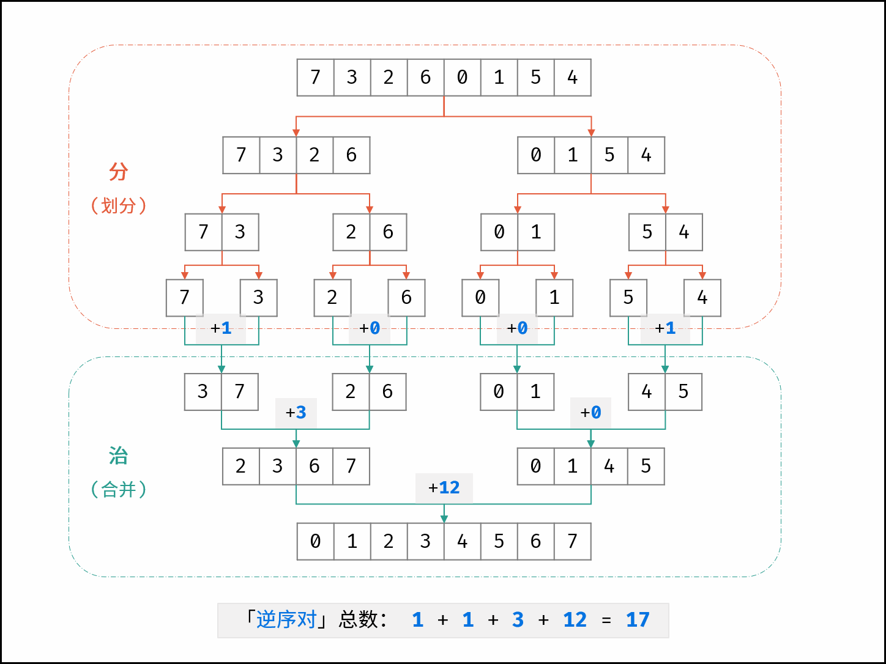

## 数组中的逆序对
<!--START_SECTION:badge-->

[](../../../README.md#困难)
[](../../../README.md#剑指offer)
[](../../../README.md#分治)
[](../../../README.md#线段树树状数组)
[](../../../README.md#经典)
<!--END_SECTION:badge-->
<!--info
tags: [分治, 树状数组, 经典]
source: 剑指Offer
level: 困难
number: '5100'
name: 数组中的逆序对
companies: []
-->

<summary><b>问题简述</b></summary>

```txt
在数组中的两个数字, 如果前一个数字大于后面的数字, 则这两个数字组成一个逆序对.
输入一个数组, 求该数组中的逆序对的总数.
```

<details><summary><b>详细描述</b></summary>

```txt
在数组中的两个数字, 如果前面一个数字大于后面的数字, 则这两个数字组成一个逆序对. 输入一个数组, 求出这个数组中的逆序对的总数.

示例 1:
    输入: [7,5,6,4]
    输出: 5

限制:
    0 <= 数组长度 <= 50000

来源: 力扣 (LeetCode)
链接: https://leetcode-cn.com/problems/shu-zu-zhong-de-ni-xu-dui-lcof
著作权归领扣网络所有. 商业转载请联系官方授权, 非商业转载请注明出处.
```

</details>

<!-- <div align="center"></div> -->

<summary><b>思路1: 利用归并排序</b></summary>

- **归并排序**

    <div align="center"></div>

    > [数组中的逆序对 (归并排序, 清晰图解) ](https://leetcode-cn.com/problems/shu-zu-zhong-de-ni-xu-dui-lcof/solution/jian-zhi-offer-51-shu-zu-zhong-de-ni-xu-pvn2h/)

- **在合并过程中统计逆序对的数量**
    - 归并排序的合并过程: 依次比较两个子数组的首元素, 将其中较小的放置到一个新的数组中;
    - 每当遇到`左子数组当前元素 > 右子数组当前元素`时, 意味着「左子数组当前元素 至 末尾元素」与「右子数组当前元素」构成了若干「逆序对」

- 归并排序需要用到辅助数组, 因此其空间复杂度为 `O(N)`;
    - 辅助数组一般有两种用法, 分别见写法1 和 写法2;

<details><summary><b>Python: 写法1</b></summary>

```python
class Solution:
    def reversePairs(self, nums: List[int]) -> int:

        # 临时数组 for 归并排序: 空间复杂度 O(N)
        tmp = [0] * len(nums)

        def merge(lo, hi):  # 闭区间 [lo, hi]
            if lo >= hi: return 0

            m = (lo + hi) // 2
            ret = merge(lo, m) + merge(m + 1, hi)  # 分治

            # 辅助数组
            tmp[lo: hi + 1] = nums[lo: hi + 1]  # 先复制, 再赋值

            l, r = lo, m + 1  # 左右指针
            for i in range(lo, hi + 1):
                # 必须先判断是否越界
                if l == m + 1:  # 左子数组遍历完毕
                    nums[i] = tmp[r]
                    r += 1
                elif r == hi + 1 or tmp[l] <= tmp[r]:  # 右子数组遍历完毕, 或 tmp[l] <= tmp[r] 时, 即左指针位置小于右指针位置
                    nums[i] = tmp[l]
                    l += 1
                else:  # tmp[l] > tmp[r] 时
                    nums[i] = tmp[r]
                    r += 1
                    ret += m - l + 1  # 累计逆序对数

            return ret

        return merge(0, len(nums) - 1)
```

</details>

<details><summary><b>Python: 写法2</b></summary>

```python
class Solution:
    def reversePairs(self, nums: List[int]) -> int:

        # 临时数组 for 归并排序: 空间复杂度 O(N)
        tmp = [0] * len(nums)

        def merge(lo, hi):  # 闭区间 [lo, hi]
            if lo >= hi: return 0

            m = (lo + hi) // 2
            ret = merge(lo, m) + merge(m + 1, hi)  # 分治

            l, r = lo, m + 1  # 左右指针
            for i in range(lo, hi + 1):
                # 必须先判断是否越界
                if l == m + 1:  # 左子数组遍历完毕
                    tmp[i] = nums[r]
                    r += 1
                elif r == hi + 1 or nums[l] <= nums[r]:  # 右子数组遍历完毕, 或 nums[l] <= nums[r]
                    tmp[i] = nums[l]
                    l += 1
                else:  # nums[l] > nums[r]
                    tmp[i] = nums[r]
                    r += 1
                    ret += m - l + 1  # 累计逆序对数

            # 辅助数组
            nums[lo: hi + 1] = tmp[lo: hi + 1]  # 先赋值, 再覆盖
            return ret

        return merge(0, len(nums) - 1)
```

</details>


<summary><b>思路2: 树状数组</b></summary>

> [数组中的逆序对](https://leetcode-cn.com/problems/shu-zu-zhong-de-ni-xu-dui-lcof/solution/shu-zu-zhong-de-ni-xu-dui-by-leetcode-solution/)

<details><summary><b>Python</b></summary>

```python
class BIT:
    def __init__(self, n):
        self.n = n
        self.tree = [0] * (n + 1)

    @staticmethod
    def lowbit(x):
        return x & (-x)

    def query(self, x):
        ret = 0
        while x > 0:
            ret += self.tree[x]
            x -= BIT.lowbit(x)
        return ret

    def update(self, x):
        while x <= self.n:
            self.tree[x] += 1
            x += BIT.lowbit(x)

class Solution:
    def reversePairs(self, nums: List[int]) -> int:
        n = len(nums)

        # 离散化
        tmp = sorted(nums)
        for i in range(n):
            nums[i] = bisect.bisect_left(tmp, nums[i]) + 1

        # 树状数组统计逆序对
        bit = BIT(n)
        ans = 0
        for i in range(n - 1, -1, -1):
            ans += bit.query(nums[i] - 1)
            bit.update(nums[i])
        return ans

```

</details>


<summary><b>更快的代码</b></summary>

<!-- - 利用归并排序求逆序对的核心是, 在合并两个有序数组时可以快速累计逆序对数, 其实这个过程在快排中也存在; -->

<details><summary><b>Python: 快排? </b></summary>

```python
class Solution:
    def reversePairs(self, nums: List[int]) -> int:
        if len(nums) <= 1: return 0

        more, less = [], []
        count = 0
        center_count = 0
        center = random.choice(nums)
        for i in nums:
            if i > center:
                more.append(i)
            elif i == center:
                center_count += 1
                count += len(more)
            else:
                count += center_count
                count += len(more)
                less.append(i)
        count += self.reversePairs(more) + self.reversePairs(less)
        return count
```

</details>

<details><summary><b>Python: 二分? </b></summary>

```python
class Solution:
    def reversePairs(self, nums: List[int]) -> int:
        tmp = []
        ret = 0
        for num in nums[::-1]:
            cur = bisect_left(tmp, num)
            ret += cur

            tmp[cur:cur] = [num]  # 用这句是 732ms
            # tmp.insert(cur, num)  # 用这句是 1624ms

        return ret
```

</details>


<!--START_SECTION:relate_note-->
---

### 算法笔记

> 🌧️ _暂无主题相关的笔记_


<details><summary><b>其他算法笔记</b></summary>

- [从暴力递归到动态规划](../../../../notes/_archives/2022/10/从暴力递归到动态规划.md)  
- [树形递归技巧](../../../../notes/_archives/2022/10/树形递归技巧.md)  
- [滑动窗口模板](../../../../notes/_archives/2022/10/滑动窗口模板.md)  
- [链表常用操作备忘](../../../../notes/_archives/2022/10/链表模板.md)  

</details>
<!--END_SECTION:relate_note-->


<!--START_SECTION:relate_problem-->
---

### 相关问题


<details><summary><b>分治 (3)</b></summary>

> [[中等, 剑指Offer2] 数组中的第K大的数字](../09/剑指Offer2_076_中等_数组中的第K大的数字.md)  
> [[中等, 剑指Offer] 重建二叉树 🔥](../../2021/11/剑指Offer_0700_中等_重建二叉树.md)  
  > 
> [[简单, 剑指Offer] 数组中出现次数超过一半的数字 (摩尔投票) 🔥](../../2021/12/剑指Offer_3900_简单_数组中出现次数超过一半的数字(摩尔投票).md)  
  > 

</details>

<details><summary><b>经典 (37)</b></summary>

> [[中等, LeetCode] 下一个排列 🔥](../10/LeetCode_0031_中等_下一个排列.md)  
> [[中等, LeetCode] 二叉树的完全性检验 🔥](../03/LeetCode_0958_中等_二叉树的完全性检验.md)  
> [[中等, LeetCode] 最长递增子序列 🔥](../06/LeetCode_0300_中等_最长递增子序列.md)  
> [[中等, 剑指Offer2] 整数除法 🔥](../09/剑指Offer2_001_中等_整数除法.md)  
> [[中等, 剑指Offer] 丑数 🔥](../../2021/12/剑指Offer_4900_中等_丑数.md)  
> [[中等, 剑指Offer] 二叉搜索树与双向链表 🔥](../../2021/12/剑指Offer_3600_中等_二叉搜索树与双向链表.md)  
> [[中等, 剑指Offer] 圆圈中最后剩下的数字 (约瑟夫环问题) 🔥](剑指Offer_6200_中等_圆圈中最后剩下的数字(约瑟夫环问题).md)  
> [[中等, 剑指Offer] 复杂链表的复制 (深拷贝) 🔥](../../2021/12/剑指Offer_3500_中等_复杂链表的复制(深拷贝).md)  
> [[中等, 剑指Offer] 字符串的排列 (全排列) 🔥](../../2021/12/剑指Offer_3800_中等_字符串的排列(全排列).md)  
> [[中等, 剑指Offer] 把字符串转换成整数 🔥](剑指Offer_6700_中等_把字符串转换成整数.md)  
> [[中等, 剑指Offer] 数值的整数次方 (快速幂) 🔥](../../2021/11/剑指Offer_1600_中等_数值的整数次方(快速幂).md)  
> [[中等, 剑指Offer] 栈的压入、弹出序列 🔥](../../2021/11/剑指Offer_3100_中等_栈的压入、弹出序列.md)  
> [[中等, 剑指Offer] 重建二叉树 🔥](../../2021/11/剑指Offer_0700_中等_重建二叉树.md)  
> [[中等, 剑指Offer] 顺时针打印矩阵 (3种思路4个写法) 🔥](../../2021/11/剑指Offer_2900_中等_顺时针打印矩阵(3种思路4个写法).md)  
> [[中等, 牛客] 01背包 🔥](../05/牛客_0145_中等_01背包.md)  
> [[中等, 牛客] 丢棋子问题 (鹰蛋问题) 🔥](../04/牛客_0087_中等_丢棋子问题(鹰蛋问题).md)  
> [[中等, 牛客] 字符串的排列 🔥](../05/牛客_0121_中等_字符串的排列.md)  
> [[中等, 牛客] 寻找峰值 🔥](../04/牛客_0107_中等_寻找峰值.md)  
> [[中等, 牛客] 岛屿数量 🔥](../04/牛客_0109_中等_岛屿数量.md)  
> [[中等, 牛客] 把字符串转换成整数(atoi) 🔥](../04/牛客_0100_中等_把字符串转换成整数(atoi).md)  
> [[中等, 牛客] 数组中只出现一次的两个数字 🔥](../03/牛客_0075_中等_数组中只出现一次的两个数字.md)  
> [[中等, 牛客] 最长公共子序列(二) 🔥](../04/牛客_0092_中等_最长公共子序列(二).md)  
> [[中等, 牛客] 栈和排序 🔥](../05/牛客_0115_中等_栈和排序.md)  
> [[中等, 牛客] 汉诺塔问题 🔥](../03/牛客_0067_中等_汉诺塔问题.md)  
  > 
> [[困难, LeetCode] 编辑距离 🔥](../06/LeetCode_0072_困难_编辑距离.md)  
> [[困难, 牛客] 接雨水问题 🔥](../05/牛客_0128_困难_接雨水问题.md)  
> [[困难, 牛客] 设计LFU缓存结构 🔥](../04/牛客_0094_困难_设计LFU缓存结构.md)  
> [[困难, 牛客] 设计LRU缓存结构 🔥](../04/牛客_0093_困难_设计LRU缓存结构.md)  
  > 
> [[简单, LeetCode] 二叉树的最大深度 🔥](../07/LeetCode_0104_简单_二叉树的最大深度.md)  
> [[简单, LeetCode] 反转链表 🔥](../10/LeetCode_0206_简单_反转链表.md)  
> [[简单, 剑指Offer] 二叉搜索树的最近公共祖先 🔥](剑指Offer_6801_简单_二叉搜索树的最近公共祖先.md)  
> [[简单, 剑指Offer] 反转链表 🔥](../../2021/11/剑指Offer_2400_简单_反转链表.md)  
> [[简单, 剑指Offer] 数组中出现次数超过一半的数字 (摩尔投票) 🔥](../../2021/12/剑指Offer_3900_简单_数组中出现次数超过一半的数字(摩尔投票).md)  
> [[简单, 剑指Offer] 最小的k个数 (partition操作) 🔥](../../2021/12/剑指Offer_4000_简单_最小的k个数(partition操作).md)  
> [[简单, 牛客] 二进制中1的个数 🔥](../05/牛客_0120_简单_二进制中1的个数.md)  
> [[简单, 牛客] 单链表的排序 🔥](../03/牛客_0070_简单_单链表的排序.md)  
> [[简单, 牛客] 求平方根 🔥](../02/牛客_0032_简单_求平方根.md)  
  > 

</details>
<!--END_SECTION:relate_problem-->
