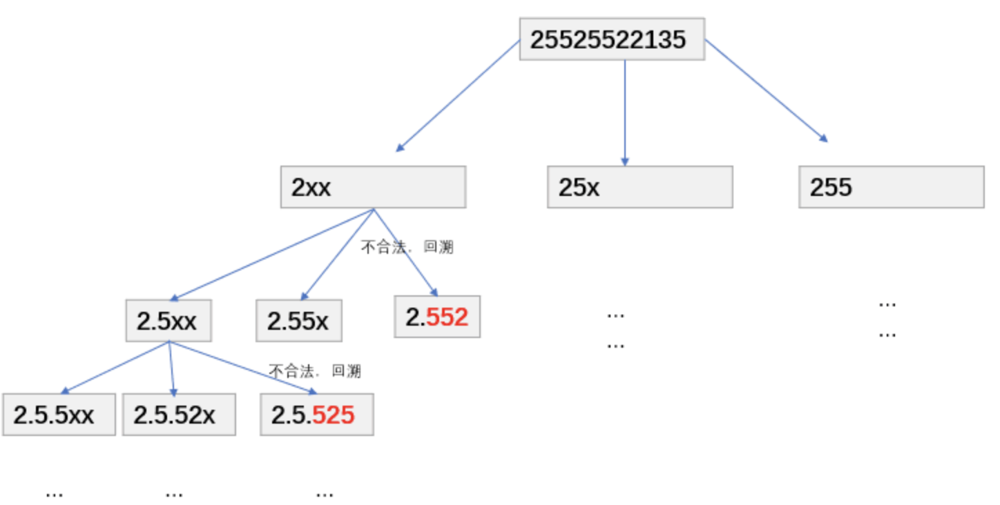

## 数字字符串转化成IP地址
<!--START_SECTION:badge-->

[](../../../README.md#中等)
[](../../../README.md#牛客)
[](../../../README.md#深度优先搜索)
<!--END_SECTION:badge-->
<!--info
tags: [DFS]
source: 牛客
level: 中等
number: '0020'
name: 数字字符串转化成IP地址
companies: [百度, 字节, 快手]
-->

<summary><b>问题简述</b></summary>

```txt
给定只包含数字的字符串, 将该字符串转化成 IP 地址的形式, 返回所有可能的情况.
例如: 给出的字符串为"25525522135",
返回: ["255.255.22.135", "255.255.221.35"]
```
> [数字字符串转化成IP地址_牛客题霸_牛客网](https://www.nowcoder.com/practice/ce73540d47374dbe85b3125f57727e1e)

<!--
<details><summary><b>详细描述</b></summary>

```txt
```

</details>
-->


<!-- <div align="center"></div> -->

<summary><b>思路: DFS + 回溯</b></summary>

- 相当于构建一颗三叉树;

<div align="center"></div>

<details><summary><b>Python</b></summary>

```python
#
# 代码中的类名、方法名、参数名已经指定, 请勿修改, 直接返回方法规定的值即可
#
#
# @param s string字符串
# @return string字符串一维数组
#
class Solution:
    def restoreIpAddresses(self , s: str) -> List[str]:
        # write code here

        ret = []

        def valid(x):
            """验证函数"""
            if not x:  # 非空
                return False
            if x.startswith('0') and len(x) > 1:  # 存在前缀 0
                return False
            return int(x) <= 255

        def dfs(k, depth, tmp):
            if depth == 3:  # 到第三层的时候, 直接判断所有剩余字符
                if valid(s[k:]):
                    tmp.append(s[k:])
                    ret.append('.'.join(tmp))
                    tmp.pop()  # 这里也要回溯
                return

            for i in range(1, 4):
                sub = s[k: k + i]
                if valid(sub):
                    tmp.append(sub)
                    dfs(k + i, depth + 1, tmp)
                    tmp.pop()

        dfs(0, 0, [])
        return ret
```

</details>


<!--START_SECTION:relate-->
---

### 相关主题

<details><summary><b>深度优先搜索</b></summary>

> [[中等, LeetCode] 括号生成 🔥](../10/LeetCode_0022_中等_括号生成.md)  
> [[中等, LeetCode] 电话号码的字母组合 🔥](../10/LeetCode_0017_中等_电话号码的字母组合.md)  
> [[中等, LeetCode] 组合总和 🔥](../10/LeetCode_0039_中等_组合总和.md)  
> [[中等, LeetCode] 路径总和III](../06/LeetCode_0437_中等_路径总和III.md)  
> [[中等, 剑指Offer] 二叉树中和为某一值的路径](../../2021/12/剑指Offer_3400_中等_二叉树中和为某一值的路径.md)  
> [[中等, 剑指Offer] 字符串的排列 (全排列) 🔥](../../2021/12/剑指Offer_3800_中等_字符串的排列(全排列).md)  
> [[中等, 剑指Offer] 打印从1到最大的n位数 (N叉树的遍历)](../../2021/11/剑指Offer_1700_中等_打印从1到最大的n位数(N叉树的遍历).md)  
> [[中等, 剑指Offer] 机器人的运动范围](../../2021/11/剑指Offer_1300_中等_机器人的运动范围.md)  
> [[中等, 剑指Offer] 矩阵中的路径](../../2021/11/剑指Offer_1200_中等_矩阵中的路径.md)  
> [[中等, 牛客] 二叉树中和为某一值的路径(二)](牛客_0008_中等_二叉树中和为某一值的路径(二).md)  
> [[中等, 牛客] 二叉树根节点到叶子节点的所有路径和](牛客_0005_中等_二叉树根节点到叶子节点的所有路径和.md)  
> [[中等, 牛客] 字符串的排列 🔥](../05/牛客_0121_中等_字符串的排列.md)  
> [[中等, 牛客] 实现二叉树先序、中序、后序遍历](../03/牛客_0045_中等_实现二叉树先序、中序、后序遍历.md)  
> [[中等, 牛客] 岛屿数量 🔥](../04/牛客_0109_中等_岛屿数量.md)  
  > 
> [[困难, 牛客] 多叉树的直径](../04/牛客_0099_困难_多叉树的直径.md)  
  > 
> [[简单, LeetCode] 二叉树的最小深度](../07/LeetCode_0111_简单_二叉树的最小深度.md)  
> [[简单, 剑指Offer] 二叉搜索树的第k大节点](剑指Offer_5400_简单_二叉搜索树的第k大节点.md)  
> [[简单, 剑指Offer] 从尾到头打印链表](../../2021/11/剑指Offer_0600_简单_从尾到头打印链表.md)  
> [[简单, 牛客] 二叉树中和为某一值的路径(一)](牛客_0009_简单_二叉树中和为某一值的路径(一).md)  
  > 

</details>
<!--END_SECTION:relate-->