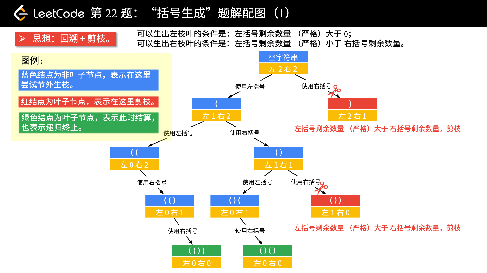

## 括号生成
<!--START_SECTION:badge-->

[](../../../README.md#中等)
[](../../../README.md#leetcode)
[](../../../README.md#深度优先搜索)
[](../../../README.md#leetcode-hot-100)
<!--END_SECTION:badge-->
<!--info
tags: [dfs+回溯, lc100]
source: LeetCode
level: 中等
number: '0022'
name: 括号生成
companies: []
-->

> [22. 括号生成 - 力扣 (LeetCode) ](https://leetcode.cn/problems/generate-parentheses)

<summary><b>问题简述</b></summary>

```txt
数字 n 代表生成括号的对数, 请你设计一个函数, 用于能够生成所有可能的并且 有效的 括号组合.
```

<!--
<details><summary><b>详细描述</b></summary>

```txt
```

</details>
-->

<!-- <div align="center"></div> -->

<summary><b>思路</b></summary>

- 相当于对 `['(', ')']` 进行深度优先遍历;
- 通过剪枝排除无效情况;

    <div align="center"></div>

    > [回溯算法 (深度优先遍历) + 广度优先遍历 (Java) - liweiwei1419](https://leetcode.cn/problems/generate-parentheses/solution/hui-su-suan-fa-by-liweiwei1419/)


<details><summary><b>Python (写法 1) </b></summary>

```python
class Solution:
    def generateParenthesis(self, n: int) -> List[str]:

        ret = []

        def dfs(l, r, tmp):
            # 非法情况 (剪枝)
            if l < r or l > n:  # 已经包括 r > n
                return

            if l == r == n:
                ret.append(''.join(tmp))
                return

            # 先添加左括号
            tmp.append('(')
            dfs(l + 1, r, tmp)
            tmp.pop()

            # 再添加右括号
            tmp.append(')')
            dfs(l, r + 1, tmp)
            tmp.pop()

        dfs(0, 0, [])
        return ret
```

</details>

<details><summary><b>Python (写法 2, 写法 1 的等价写法) </b></summary>

```python
class Solution:
    def generateParenthesis(self, n: int) -> List[str]:

        ret = []

        def dfs(l, r, tmp):
            # 非法情况
            if l < r or l > n:  # 已经包括 r > n
                return

            if l == r == n:
                ret.append(''.join(tmp))
                return

            for c in '()':
                # 注意 l 和 r 也要回溯, 这里直接传表达式可以省略这一步;
                # 同样, 如果不用 tmp 数组, 而是传字符串表达式, 那么 tmp 的回溯也可以省略 (写法3)
                # if c == '(': l += 1
                # else: r += 1
                tmp.append(c)
                dfs(l + 1 if c == '(' else l,
                    r + 1 if c == ')' else r,
                    tmp)
                tmp.pop()
                # if c == '(': l -= 1
                # else: r -= 1

        dfs(0, 0, [])
        return ret
```

</details>

<details><summary><b>Python (写法 3, 不回溯) </b></summary>

```python
class Solution:
    def generateParenthesis(self, n: int) -> List[str]:

        ret = []

        def dfs(l, r, tmp):
            # 非法情况
            if l < r or l > n:  # 已经包括 r > n
                return

            if l == r == n:
                ret.append(tmp)
                return

            for c in '()':
                # 不回溯的写法
                dfs(l + 1 if c == '(' else l,
                    r + 1 if c == ')' else r,
                    tmp + c)

        dfs(0, 0, '')
        return ret
```

</details>
<!--START_SECTION:relate-->
---

### 相关主题

<details><summary><b>深度优先搜索</b></summary>

> [[中等, LeetCode] 电话号码的字母组合 🔥](LeetCode_0017_中等_电话号码的字母组合.md)  
> [[中等, LeetCode] 组合总和 🔥](LeetCode_0039_中等_组合总和.md)  
> [[中等, LeetCode] 路径总和III](../06/LeetCode_0437_中等_路径总和III.md)  
> [[中等, 剑指Offer] 二叉树中和为某一值的路径](../../2021/12/剑指Offer_3400_中等_二叉树中和为某一值的路径.md)  
> [[中等, 剑指Offer] 字符串的排列 (全排列) 🔥](../../2021/12/剑指Offer_3800_中等_字符串的排列(全排列).md)  
> [[中等, 剑指Offer] 打印从1到最大的n位数 (N叉树的遍历)](../../2021/11/剑指Offer_1700_中等_打印从1到最大的n位数(N叉树的遍历).md)  
> [[中等, 剑指Offer] 机器人的运动范围](../../2021/11/剑指Offer_1300_中等_机器人的运动范围.md)  
> [[中等, 剑指Offer] 矩阵中的路径](../../2021/11/剑指Offer_1200_中等_矩阵中的路径.md)  
> [[中等, 牛客] 二叉树中和为某一值的路径(二)](../01/牛客_0008_中等_二叉树中和为某一值的路径(二).md)  
> [[中等, 牛客] 二叉树根节点到叶子节点的所有路径和](../01/牛客_0005_中等_二叉树根节点到叶子节点的所有路径和.md)  
> [[中等, 牛客] 字符串的排列 🔥](../05/牛客_0121_中等_字符串的排列.md)  
> [[中等, 牛客] 实现二叉树先序、中序、后序遍历](../03/牛客_0045_中等_实现二叉树先序、中序、后序遍历.md)  
> [[中等, 牛客] 岛屿数量 🔥](../04/牛客_0109_中等_岛屿数量.md)  
> [[中等, 牛客] 数字字符串转化成IP地址](../01/牛客_0020_中等_数字字符串转化成IP地址.md)  
  > 
> [[困难, 牛客] 多叉树的直径](../04/牛客_0099_困难_多叉树的直径.md)  
  > 
> [[简单, LeetCode] 二叉树的最小深度](../07/LeetCode_0111_简单_二叉树的最小深度.md)  
> [[简单, 剑指Offer] 二叉搜索树的第k大节点](../01/剑指Offer_5400_简单_二叉搜索树的第k大节点.md)  
> [[简单, 剑指Offer] 从尾到头打印链表](../../2021/11/剑指Offer_0600_简单_从尾到头打印链表.md)  
> [[简单, 牛客] 二叉树中和为某一值的路径(一)](../01/牛客_0009_简单_二叉树中和为某一值的路径(一).md)  
  > 

</details>
<details><summary><b>LeetCode Hot 100</b></summary>

> [[中等, LeetCode] 三数之和 🔥](../../2021/10/LeetCode_0015_中等_三数之和.md)  
> [[中等, LeetCode] 下一个排列 🔥](LeetCode_0031_中等_下一个排列.md)  
> [[中等, LeetCode] 两数相加 🔥](../../2021/10/LeetCode_0002_中等_两数相加.md)  
> [[中等, LeetCode] 全排列 🔥](LeetCode_0046_中等_全排列.md)  
> [[中等, LeetCode] 全排列II 🔥](LeetCode_0047_中等_全排列II.md)  
> [[中等, LeetCode] 删除链表的倒数第N个结点 🔥](../01/LeetCode_0019_中等_删除链表的倒数第N个结点.md)  
> [[中等, LeetCode] 在排序数组中查找元素的第一个和最后一个位置 🔥](LeetCode_0034_中等_在排序数组中查找元素的第一个和最后一个位置.md)  
> [[中等, LeetCode] 字母异位词分组 🔥](LeetCode_0049_中等_字母异位词分组.md)  
> [[中等, LeetCode] 搜索旋转排序数组 🔥](../../2021/10/LeetCode_0033_中等_搜索旋转排序数组.md)  
> [[中等, LeetCode] 数组中的第K个最大元素 🔥](LeetCode_0215_中等_数组中的第K个最大元素.md)  
> [[中等, LeetCode] 无重复字符的最长子串 🔥](../02/LeetCode_0003_中等_无重复字符的最长子串.md)  
> [[中等, LeetCode] 最长回文子串 🔥](../../2021/10/LeetCode_0005_中等_最长回文子串.md)  
> [[中等, LeetCode] 电话号码的字母组合 🔥](LeetCode_0017_中等_电话号码的字母组合.md)  
> [[中等, LeetCode] 盛最多水的容器 🔥](../../2021/10/LeetCode_0011_中等_盛最多水的容器.md)  
> [[中等, LeetCode] 组合总和 🔥](LeetCode_0039_中等_组合总和.md)  
> [[中等, LeetCode] 组合总和II 🔥](LeetCode_0040_中等_组合总和II.md)  
  > 
> [[困难, LeetCode] K个一组翻转链表 🔥](../02/LeetCode_0025_困难_K个一组翻转链表.md)  
> [[困难, LeetCode] 合并K个升序链表 🔥](LeetCode_0023_困难_合并K个升序链表.md)  
> [[困难, LeetCode] 寻找两个正序数组的中位数 🔥](../02/LeetCode_0004_困难_寻找两个正序数组的中位数.md)  
> [[困难, LeetCode] 接雨水 🔥](../../2021/10/LeetCode_0042_困难_接雨水.md)  
> [[困难, LeetCode] 最长有效括号 🔥](LeetCode_0032_困难_最长有效括号.md)  
> [[困难, LeetCode] 正则表达式匹配 🔥](../01/LeetCode_0010_困难_正则表达式匹配.md)  
  > 
> [[简单, LeetCode] 两数之和 🔥](../../2021/10/LeetCode_0001_简单_两数之和.md)  
> [[简单, LeetCode] 合并两个有序链表 🔥](../../2021/10/LeetCode_0021_简单_合并两个有序链表.md)  
> [[简单, LeetCode] 有效的括号 🔥](../03/LeetCode_0020_简单_有效的括号.md)  
  > 

</details>
<!--END_SECTION:relate-->