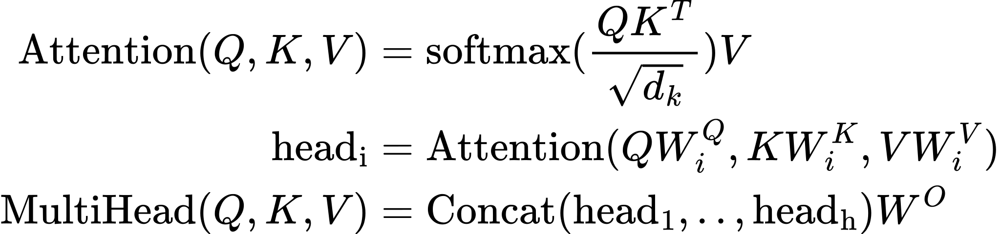

Attention 备忘 <!-- suffix --> ✒️ <!-- suffix -->
===
<!--START_SECTION:badge-->


<!--END_SECTION:badge-->
<!--info
top: false
draft: true
hidden_in_recent: true
tags: [dl_model]
-->

> ***Keywords**: Attention*

<!--START_SECTION:toc-->
- [Multi-head Self Attention](#multi-head-self-attention)
    - [前向过程 (PyTorch 实现)](#前向过程-pytorch-实现)
<!--END_SECTION:toc-->

---

## Multi-head Self Attention

<!--
### 前向过程

<div align='center'><a href='_formulas/Attention/f_001.js.tex'></a></div>

 -->

### 前向过程 (PyTorch 实现)

```python
def forward(x, mask, H, D):
    q = k = v = x  # [B, L, N]
    B, L, N = x.shape

    # linear
    q = W_q(q).reshape([B, L, H, D]).transpose(1, 2)  # [B, H, T, D]
    k = W_k(k).reshape([B, L, H, D]).transpose(1, 2)  # [B, H, T, D]
    v = W_v(v).reshape([B, L, H, D]).transpose(1, 2)  # [B, H, T, D]

    # attention
    logits = matmul(q, k.transpose(-2, -1)) / sqrt(D) + mask
    a = softmax(logits)

    # output
    o = matmul(a, v)
    o = W_o(o).reshape([B, L, N])
    return o

```