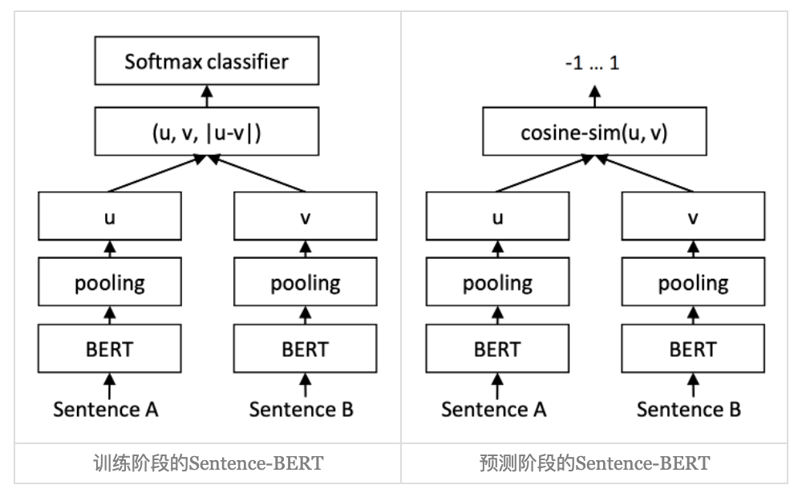

链表操作备忘
===
<!--START_SECTION:badge-->


<!--END_SECTION:badge-->
<!--info
top: false
draft: false
hidden_in_recent: false
tags: [algo_temp]
algo_tags: [链表]
-->

<!-- TOC -->
- [基础操作](#基础操作)
    - [遍历 (查)](#遍历-查)
    - [插入 (增)](#插入-增)
    - [删除 (删)](#删除-删)
- [反转链表](#反转链表)
    - [区间反转 📌](#区间反转-)
        - [K 个一组反转 ✨](#k-个一组反转-)
- [合并与分割](#合并与分割)
    - [合并两个有序链表](#合并两个有序链表)
    - [分割链表](#分割链表)
- [快慢指针技巧 📌](#快慢指针技巧-)
    - [找中点 . 判断环 . 等](#找中点--判断环--等)
- [链表排序](#链表排序)
    - [归并排序 🚩](#归并排序-)
    - [插入排序](#插入排序)
- [相关问题](#相关问题)
<!-- TOC -->

<!-- 快速编辑

> algorithms/[xxx](../../../../algorithms/README.md#xxx)

<div align="center"></div>

<table>
<tr valign="top">
<th> ... </td>
<th> ... </td>
</tr>
<tr>
<td> ... </td>
<td> ... </td>
</tr>
</table>
-->

---

**以下操作基于该链表结构**:
```python
class ListNode:
    def __init__(self, val=0, next=None):
        self.val = val
        self.next = next
```

---

## 基础操作

### 遍历 (查)

```python
cur = head
while cur:
    # do something with cur.val
    cur = cur.next
```

<details><summary><b>🔸 计算长度</b></summary>

```python
length, cur = 0, head
while cur:
    length += 1
    cur = cur.next
```

</details>

<details><summary><b>🔸 第 k 个节点</b></summary>

```python
# 从 head 开始, 移动 k-1 次
cur = head
for _ in range(k - 1):
    if not cur:   # k 超过链表长度
        return None
    cur = cur.next

return cur
```

</details>

<details><summary><b>🔸 倒数第 k 个节点</b></summary>

> [快慢指针技巧 - 倒数第 k 个节点](#a-倒数第k个节点)

</details>

---

### 插入 (增)

**头插**
```python
new_node.next = head
head = new_node
```

**尾插**
```python
cur = head
while cur.next:
    cur = cur.next
cur.next = new_node
```

<details><summary><b>🔸 在第 k 个节点后插入</b></summary>

```python
cur = head
for _ in range(k - 1):   # 移动 k-1 步到第 k 个节点
    cur = cur.next
new_node.next = cur.next
cur.next = new_node
```

</details>

<details><summary><b>🔸 在第 k 个节点后插入 (带哑节点的通用写法, ♦️推荐♦️)</b></summary>

- 好处: 避免单独处理 "插入到头部" 的特殊情况
```python
dummy = ListNode(0, head)
cur = dummy
for _ in range(k):      # 移动 k 步到第 k 个节点 (带哑节点)
    cur = cur.next
new_node.next = cur.next
cur.next = new_node
return dummy.next
```

</details>

---

### 删除 (删)

**删除头节点**
```python
if head.next:
    head = head.next
```

**删除尾结点**
```python
cur = head
while cur.next and cur.next.next:
    cur = cur.next
cur.next = None
```

<details><summary><b>🔸 删除第 k 个节点 (使用哑节点)</b></summary>

```python
dummy = ListNode(0, head)
cur = dummy
for _ in range(k):
    cur = cur.next
cur.next = cur.next.next
return dummy.next
```
- `k=0` 时等价于删除头节点

</details>

<details><summary><b>🔸 删除指定值</b></summary>

> [203. 移除链表元素 - 力扣 (LeetCode) ](https://leetcode.cn/problems/remove-linked-list-elements/)
```python
dummy = ListNode(0, head)
cur = dummy
while cur.next:
    if cur.next.val == val:
        cur.next = cur.next.next
    else:
        cur = cur.next
return dummy.next
```

</details>

<details><summary><b>🔸 删除倒数第 N 个节点</b></summary>

> [19. 删除链表的倒数第 N 个结点 - 力扣 (LeetCode) ](https://leetcode.cn/problems/remove-nth-node-from-end-of-list/)
```python
dummy = ListNode(0, head)
fast = slow = dummy
for _ in range(n):
    fast = fast.next
while fast.next:
    fast = fast.next
    slow = slow.next
slow.next = slow.next.next
return dummy.next
```

</details>

<details><summary><b>🔸 删除给定节点 (无法访问头节点)</b></summary>

> 
- 直接覆盖当前节点的值, 再跳过下一个节点;
```python
def deleteNode(node):
    node.val = node.next.val
    node.next = node.next.next
```

</details>

---

## 反转链表

**整体反转 (迭代写法)**
> [206. 反转链表 - 力扣 (LeetCode) ](https://leetcode.cn/problems/reverse-linked-list/)
```python
pre, cur = None, head
while cur:
    nxt = cur.next      # 暂存下一节点
    cur.next = pre      # 指针反转
    pre = cur
    cur = nxt           # "顶真"

return pre
```

<details><summary><b>🔸 头插法</b></summary>

- 本质上是不断把节点插入到新链表的头部
```python
new_head = None

cur = head
while cur:
    nxt = cur.next
    cur.next = new_head
    new_head = cur
    cur = nxt

return new_head
```

</details>

<details><summary><b>🔸 递归写法 (后序处理)</b></summary>

- **递归定义**: 反转以 head 为起点的链表, 返回新头结点.
- **思路**:
    - 假设 head.next 之后的子链表已经被反转;
        - **注意**: **此时 head 就成了新链表的尾结点**
    - 在回溯时, 把 head 接到子链表的尾部;
    - 最终返回新的头结点.
- 
```python
def reverseList(head):
    if not head or not head.next:
        return head
    last = reverseList(head.next)       # 递归反转子链表, 子链表的最后一个节点就是新的头结点
    head.next.next = head               # 把当前节点接到子链表尾部
    head.next = None                    # 断开原来的指针
    return last
```

</details>

<details><summary><b>🔸 递归写法 (前序处理, 尾递归)</b></summary>

- **思路**: 
    - 在递归时就逐步反转指针, 而不是等回溯时再处理;
    - 需要额外传入 pre 指针, 类似迭代写法的递归版.
```python
def reverseList(cur, pre=None):
    if not cur:
        return pre
    nxt = cur.next
    cur.next = pre
    return reverseList(nxt, cur)

reverseList(head, None)
```

</details>

---

### 区间反转 📌

**模板函数 `reverse(head, k)`**: 反转从 head 开始的 k 个节点
```python
def reverse(head, k):
    """
    反转从 head 开始的 k 个节点
        假设链表长度 >= k, 函数内部不判断该逻辑
    返回: (new_head, new_tail, nxt)
        - new_head: 反转后的头
        - new_tail: 反转后的尾 (即原 head)
        - nxt: 反转区间之后的第一个节点
    """
    pre, cur = None, head
    for _ in range(k):
        nxt = cur.next
        cur.next = pre
        pre, cur = cur, nxt
    new_head, new_tail, nxt = pre, head, cur
    # new_tail.next = nxt  # 考虑到 "职责分离", 不在内部处理
    return new_head, new_tail, nxt
```
⚠️ 注意: `reverse(head, k)` 返回 `new_head, new_tail` 是一段 **"悬空"** 的链表, 即 `new_tail.next is None`, 所以同时返回了 `nxt`.
- 视情况是否在内部完成拼接: `new_tail.next = nxt`

<details><summary><b>🔸 反转 <code>[left, right]</code> 区间</b></summary>

> [92. 反转链表 II - 力扣 (LeetCode) ](https://leetcode.cn/problems/reverse-linked-list-ii/)
```python
def reverse(head, k):
    pre, cur = None, head
    for _ in range(k):
        nxt = cur.next
        cur.next = pre
        pre, cur = cur, nxt
    new_head, new_tail, nxt = pre, head, cur
    return new_head, new_tail, nxt

# 反转闭区间 [left, right] 之间的节点
dummy = ListNode(0, head)

# 先找到第 left - 1 个节点
cur = dummy
for _ in range(left - 1):
    cur = cur.next

# 从 cur.next 开始反转之后的 k 个节点
new_head, new_tail, nxt = reverse(cur.next, right - left + 1)
cur.next = new_head
new_tail.next = nxt

return dummy.next
```

</details>

---

#### K 个一组反转 ✨

<details><summary><b>🔸 Python 实现</b></summary>

> [25. K 个一组翻转链表 - 力扣 (LeetCode) ](https://leetcode.cn/problems/reverse-nodes-in-k-group/)
```python
def reverse(head, k):
    pre, cur = None, head
    for _ in range(k):
        nxt = cur.next
        cur.next = pre
        pre, cur = cur, nxt
    new_head, new_tail, nxt = pre, head, cur
    return new_head, new_tail, nxt

dummy = ListNode(0, head)
pre = dummy
while True:
    # 检查是否有 k 个节点
    tmp = pre
    for _ in range(k):
        tmp = tmp.next
        if not tmp:
            return dummy.next
    # 反转 k 个节点
    new_head, new_tail, nxt = reverse(pre.next, k)
    # 拼接
    pre.next = new_head
    new_tail.next = nxt
    pre = new_tail

return dummy.next
```

</details>

<details><summary><b>🔸 递归写法 (参考)</b></summary>

```python
def reverseKGroup(head, k):
    # 检查是否有 k 个节点
    cur = head
    for i in range(k):
        if not cur:
            return head
        cur = cur.next
    # 反转前 k 个节点
    pre, cur = None, head
    for i in range(k):
        nxt = cur.next
        cur.next = pre
        pre, cur = cur, nxt
    # head 现在是这一段的尾，接上递归结果
    head.next = reverseKGroup(cur, k)
    return pre
```

</details>

---

## 合并与分割

### 合并两个有序链表
> [21. 合并两个有序链表 - 力扣 (LeetCode) ](https://leetcode.cn/problems/merge-two-sorted-lists/)

- **思路**:
    - 创建一个哑节点 `dummy`, 用 `cur` 指针维护新链表的尾部;
    - 遍历两个链表 `l1` 和 `l2`:
        - 比较当前节点值, 较小的接到 `cur.next`, 并移动该链表指针;
        - `cur` 前进一格;
    - 当一个链表遍历完后, 把另一个链表剩余部分直接接上.

    <details><summary><b>🔸 Python 实现</b></summary>

    ```python
    dummy = cur = ListNode(0)
    while l1 and l2:
        if l1.val < l2.val:
            cur.next, l1 = l1, l1.next
        else:
            cur.next, l2 = l2, l2.next
        cur = cur.next
    cur.next = l1 or l2  # 剩余部分
    return dummy.next
    ```

    </details>

### 分割链表
> [86. 分隔链表 - 力扣 (LeetCode) ](https://leetcode.cn/problems/partition-list/)

- **思路**:
    - 准备两个链表: `small` 链表存放 `< x` 的节点, `large` 链表存放 `>= x` 的节点;
    - 如果 `cur.val < x`, 接到 `small` 的尾部, 否则接到 `large` 的尾部;
    - 遍历结束后, 把 large 接到 small 的尾部;
    - **注意**: 最后 `large_tail.next = None`, 避免形成环;
    - 返回 `small.next`.

    <details><summary><b>🔸 Python 实现</b></summary>

    ```python
    # 问题大意: 对链表进行分隔, 使得所有 小于 x 的节点都出现在 大于或等于 x 的节点之前
    small = small_cur = ListNode(0)
    large = large_cur = ListNode(0)
    cur = head
    while cur:
        # 把节点接到 small 或 large 的尾部
        if cur.val < x:
            small_cur.next, small_cur = , cur
            # small_cur.next = cur
            # small_cur = small_cur.next
        else:
            large_cur.next, large_cur = cur, cur
        cur = cur.next

    small_cur.next = large.next  # 把 small 和 large 拼接起来
    large_cur.next = None  # 不能省略, 可能会出现环
    return small.next
    ```
    - `small_cur.next, small_cur = cur, cur` 其实就是 `其实就是 small_cur.next = cur; small_cur = small_cur.next`; 
        - 这么写是因为 `small_cur.next, small_cur = cur, small_cur.next` 会报错

    </details>

---

## 快慢指针技巧 📌

- **核心思想**: 
    - 两个指针以不同速度前进, 通过速度差制造相对位移, 
    - 然后利用它们的相对位置关系来解决问题;

### 找中点 . 判断环 . 等

<details><summary><b>🔸 找中点</b></summary>

> [876. 链表的中间结点 - 力扣 (LeetCode) ](https://leetcode.cn/problems/middle-of-the-linked-list/)

- 在归并排序、回文链表等问题中, 需要找到链表的中点.
- **方法**: 
    - `slow` 每次走一步, `fast` 每次走两步;
    - 当 `fast` 到达末尾时, `slow` 正好在中点.

```Python
# 情况 1: 偶数长度时取靠后的那个
slow, fast = head, head
while fast and fast.next:
    slow = slow.next
    fast = fast.next.next
# slow 即为中点

# 情况 2: 偶数长度时取靠后的那个
slow, fast = head, head.next  # 关键改动
while fast and fast.next:
    slow = slow.next
    fast = fast.next.next
# slow 即为中点

# 当节点数为奇数时, 两者结果一致
```

</details>

<details><summary><b>🔸 判断环</b></summary>

> [141. 环形链表 - 力扣 (LeetCode) ](https://leetcode.cn/problems/linked-list-cycle/)

- **方法**:
    - `slow` 每次走一步, `fast` 每次走两步;
    - 如果存在环, `fast` 一定会在环内追上 slow, 否则 fast 会先到达 None;

```python
slow = fast = head
while fast and fast.next:
    slow = slow.next
    fast = fast.next.next
    if slow == fast:
        return True
return False
```

</details>

<details><summary><b>🔸 找环入口</b></summary>

> [142. 环形链表 II - 力扣 (LeetCode) ](https://leetcode.cn/problems/linked-list-cycle-ii/)

- **方法**:
    - 当 `slow == fast` 时, 说明在环内相遇;
    - 然后让一个指针从头开始, 另一个从相遇点开始, 两者同步前进;
    - 再次相遇时, 就是环的入口.

```python
slow = fast = head
while fast and fast.next:
    slow = slow.next
    fast = fast.next.next
    if slow == fast:  # 快慢指针相遇, 说明有环
        break
else:
    return None  # 无环

# 有环: 
#   相遇点一定在环内
#   相遇点是一个 "对称点" , 它保证了 "从头节点出发" 和 "从相遇点出发" 以相同速度前进, 必然在环入口重合
flow = head
while slow != fast:
    slow = slow.next
    fast = fast.next
return slow
```

</details>

<details id="a-倒数第k个节点"><summary><b>🔸 倒数第 k 个节点</b></summary>

- **方法**:
    - `fast` 先走 `k` 步, 然后 `slow` 和 `fast` 一起走;
    - 当 `fast` 到达末尾时, `slow` 就在倒数第 k 个节点.

```python
# fast 先走 k 步
fast = head
for _ in range(k):
    if not fast:   # k 超过链表长度
        return None
    fast = fast.next

# 然后 slow 和 fast 一起走
slow = head
while fast:
    fast = fast.next
    slow = slow.next

return slow  # slow 即为倒数第 k 个节点
```

</details>

---

## 链表排序
> [148. 排序链表 - 力扣 (LeetCode) ](https://leetcode.cn/problems/sort-list/description/)

### 归并排序 🚩

- **思路 1 - 自顶向下 (递归)**:
    - 用快慢指针找到链表中点, 断开成两半;
    - 递归排序左右子链表;
    - 合并两个有序链表.
    - 时间复杂度 $O(n\log n)$, 空间复杂度 $O(n)$;

    <details><summary><b>🔸 Python 实现</b></summary>

    ```python
    class Solution:
        def sortList(self, head: Optional[ListNode]) -> Optional[ListNode]:
            if not head or not head.next:
                return head

            # 找中点
            slow, fast = head, head.next
            while fast and fast.next:
                slow, fast = slow.next, fast.next.next
            mid = slow.next
            slow.next = None

            # 分治
            left = self.sortList(head)
            right = self.sortList(mid)

            # 合并
            return self.merge(left, right)

        def merge(self, l1, l2):
            dummy = cur = ListNode(0)
            while l1 and l2:
                if l1.val < l2.val:
                    cur.next, l1 = l1, l1.next
                else:
                    cur.next, l2 = l2, l2.next
                cur = cur.next
            cur.next = l1 if l1 else l2
            return dummy.next
    ```

    </details>

- **思路 2 - 自底向上 (迭代)**:
    - 先按长度 1 的子链表两两合并;
    - 再按长度 2、4、8 … 逐步扩大;
    - 直到整个链表有序.
    - 时间复杂度 $O(n\log n)$, 空间复杂度 $O(1)$;

    <details><summary><b>🔸 Python 实现</b></summary>

    ```python
    class Solution:
        def sortList(self, head: Optional[ListNode]) -> Optional[ListNode]:
            if not head or not head.next:
                return head

            # 计算链表长度
            length, cur = 0, head
            while cur:
                length += 1
                cur = cur.next

            dummy = ListNode(0, head)
            size = 1
            while size < length:
                pre, cur = dummy, dummy.next
                while cur:
                    # 拆分两段
                    left = cur
                    right = self.split(left, size)
                    cur = self.split(right, size)
                    # 合并
                    pre.next = self.merge(left, right)
                    while pre.next:
                        pre = pre.next
                size <<= 1
            return dummy.next

        def split(self, head, size):
            for _ in range(size - 1):
                if head and head.next:
                    head = head.next
                else:
                    break
            if not head:
                return None
            nxt, head.next = head.next, None
            return nxt

        def merge(self, l1, l2):
            dummy = cur = ListNode(0)
            while l1 and l2:
                if l1.val < l2.val:
                    cur.next, l1 = l1, l1.next
                else:
                    cur.next, l2 = l2, l2.next
                cur = cur.next
            cur.next = l1 if l1 else l2
            return dummy.next
    ```

    </details>

---

### 插入排序

- **思路**:
    - 用一个 哑节点 (dummy) 作为已排序部分的头, 方便插入操作;
    - 遍历链表, 每次取出当前节点 cur, 在已排序部分找到合适位置插入;
    - 插入完成后继续处理下一个节点.

    <details><summary><b>🔸 Python 实现</b></summary>

    ```python
    if not head or not head.next:
        return head

    dummy = ListNode(0)   # 哑节点，已排序部分的头
    cur = head            # 当前待插入节点

    while cur:
        # 每次都从 dummy 开始找插入位置
        pre = dummy
        while pre.next and pre.next.val < cur.val:
            pre = pre.next

        # 暂存下一个待处理节点
        nxt = cur.next

        # 插入 cur 到 pre 和 pre.next 之间
        cur.next = pre.next
        pre.next = cur

        # 继续处理下一个
        cur = nxt

    return dummy.next
    ```

    </details>

---

## 相关问题

<!--START_SECTION:related_problems-->

<details><summary><b>链表 (31)</b></summary>

> [[中等, LeetCode] 两数相加 🔥](../../../../algorithms/problems/2021/10/LeetCode_0002_中等_两数相加.md)  
> [[中等, LeetCode] 分隔链表](../../../../algorithms/problems/2021/10/LeetCode_0086_中等_分隔链表.md)  
> [[中等, LeetCode] 删除链表中的节点](../../../../algorithms/problems/2025/10/LeetCode_0237_中等_删除链表中的节点.md)  
> [[中等, LeetCode] 删除链表的倒数第N个结点 🔥](../../../../algorithms/problems/2022/01/LeetCode_0019_中等_删除链表的倒数第N个结点.md)  
> [[中等, LeetCode] 重排链表 🔥](../../../../algorithms/problems/2022/06/LeetCode_0143_中等_重排链表.md)  
> [[中等, 剑指Offer] 复杂链表的复制 (深拷贝) 🔥](../../../../algorithms/problems/2021/12/剑指Offer_3500_中等_复杂链表的复制(深拷贝).md)  
> [[中等, 牛客] 划分链表](../../../../algorithms/problems/2022/01/牛客_0023_中等_划分链表.md)  
> [[中等, 牛客] 删除有序链表中重复的元素-I](../../../../algorithms/problems/2022/01/牛客_0025_中等_删除有序链表中重复的元素-I.md)  
> [[中等, 牛客] 删除有序链表中重复的元素-II](../../../../algorithms/problems/2022/01/牛客_0024_中等_删除有序链表中重复的元素-II.md)  
> [[中等, 牛客] 重排链表](../../../../algorithms/problems/2022/01/牛客_0002_中等_重排链表.md)  
> [[中等, 牛客] 链表中的节点每k个一组翻转](../../../../algorithms/problems/2022/03/牛客_0050_中等_链表中的节点每k个一组翻转.md)  
> [[中等, 牛客] 链表内指定区间反转](../../../../algorithms/problems/2022/01/牛客_0021_中等_链表内指定区间反转.md)  
> [[中等, 牛客] 链表相加(二)](../../../../algorithms/problems/2022/03/牛客_0040_中等_链表相加(二).md)  
  > 
> [[困难, LeetCode] K个一组翻转链表 🔥](../../../../algorithms/problems/2022/02/LeetCode_0025_困难_K个一组翻转链表.md)  
> [[困难, LeetCode] 合并K个升序链表 🔥](../../../../algorithms/problems/2022/10/LeetCode_0023_困难_合并K个升序链表.md)  
  > 
> [[简单, LeetCode] 反转链表 🔥](../../../../algorithms/problems/2022/10/LeetCode_0206_简单_反转链表.md)  
> [[简单, LeetCode] 合并两个有序链表 🔥](../../../../algorithms/problems/2021/10/LeetCode_0021_简单_合并两个有序链表.md)  
> [[简单, LeetCode] 链表的中间结点](../../../../algorithms/problems/2022/06/LeetCode_0876_简单_链表的中间结点.md)  
> [[简单, 剑指Offer] 两个链表的第一个公共节点](../../../../algorithms/problems/2022/01/剑指Offer_5200_简单_两个链表的第一个公共节点.md)  
> [[简单, 剑指Offer] 从尾到头打印链表](../../../../algorithms/problems/2021/11/剑指Offer_0600_简单_从尾到头打印链表.md)  
> [[简单, 剑指Offer] 删除链表的节点](../../../../algorithms/problems/2021/11/剑指Offer_1800_简单_删除链表的节点.md)  
> [[简单, 剑指Offer] 反转链表 🔥](../../../../algorithms/problems/2021/11/剑指Offer_2400_简单_反转链表.md)  
> [[简单, 剑指Offer] 合并两个排序的链表](../../../../algorithms/problems/2021/11/剑指Offer_2500_简单_合并两个排序的链表.md)  
> [[简单, 剑指Offer] 链表中倒数第k个节点](../../../../algorithms/problems/2021/11/剑指Offer_2200_简单_链表中倒数第k个节点.md)  
> [[简单, 牛客] 两个链表的第一个公共结点 🔥](../../../../algorithms/problems/2022/03/牛客_0066_简单_两个链表的第一个公共结点.md)  
> [[简单, 牛客] 判断一个链表是否为回文结构](../../../../algorithms/problems/2022/04/牛客_0096_简单_判断一个链表是否为回文结构.md)  
> [[简单, 牛客] 判断链表中是否有环](../../../../algorithms/problems/2022/01/牛客_0004_简单_判断链表中是否有环.md)  
> [[简单, 牛客] 单链表的排序 🔥](../../../../algorithms/problems/2022/03/牛客_0070_简单_单链表的排序.md)  
> [[简单, 牛客] 反转链表](../../../../algorithms/problems/2022/03/牛客_0078_简单_反转链表.md)  
> [[简单, 牛客] 合并两个排序的链表](../../../../algorithms/problems/2022/02/牛客_0033_简单_合并两个排序的链表.md)  
> [[简单, 牛客] 链表中环的入口结点](../../../../algorithms/problems/2022/01/牛客_0003_简单_链表中环的入口结点.md)  
  > 

</details>
<!--END_SECTION:related_problems-->
