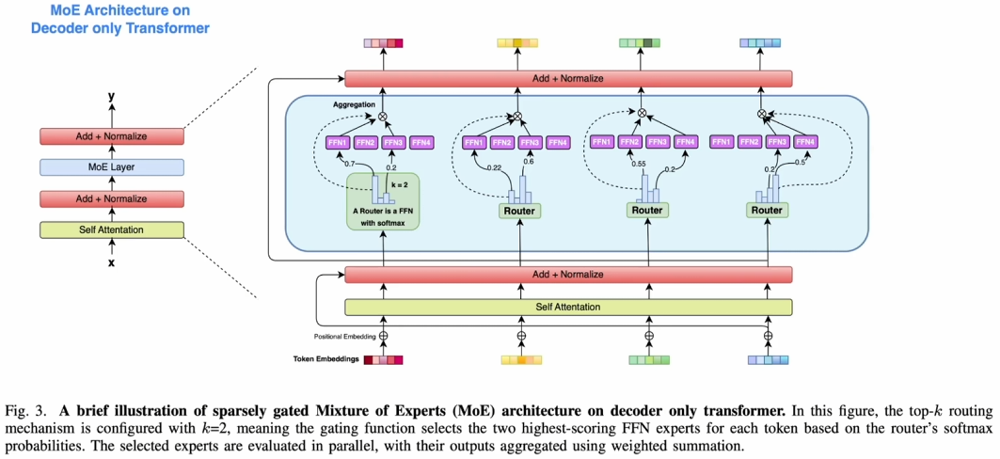

MoE 备忘
===
<!--START_SECTION:badge-->


<!--END_SECTION:badge-->
<!--info
date: 2025-09-03 08:53:08
top: false
draft: false
hidden: true
level: 0
tags: [llm]
-->

<!--START_SECTION:keywords-->
> ***Keywords**: MoE*
<!--END_SECTION:keywords-->

<!--START_SECTION:paper_title-->
<!--END_SECTION:paper_title-->

<!--START_SECTION:toc-->
- [背景](#背景)
- [MoE 出现的背景与动机](#moe-出现的背景与动机)
- [MoE 的结构 (MoE Layer)](#moe-的结构-moe-layer)
    - [MoE 的优势](#moe-的优势)
- [MoE 的常见优化](#moe-的常见优化)
    - [Fine-grained Expert (细粒度专家)](#fine-grained-expert-细粒度专家)
    - [Shared Expert (共享专家)](#shared-expert-共享专家)
    - [Expert Choice vs Token Choice](#expert-choice-vs-token-choice)
    - [Load Balancing Loss (负载均衡损失)](#load-balancing-loss-负载均衡损失)
    - [Router Z-loss](#router-z-loss)
- [MoE 的训练 (TODO)](#moe-的训练-todo)
- [参考资料](#参考资料)
<!--END_SECTION:toc-->

---

## 背景

MoE 涉及的几个主要部分:
1. **MoE 模型的架构** (本文重点)
2. MoE 模型的训练
3. MoE 模型在 infer 时的并行策略


## MoE 出现的背景与动机

**背景**
- **Scaling Law (规模化法则)** 已在 LLM 的快速发展中得到验证:  
  - 模型性能可通过以下三方面的 **Scale up** 进行提升:  
    1. **模型规模**  
    2. **训练数据**  
    3. **计算资源**  
- 对于 **Dense 架构**而言, 遵循 Scaling Law 会遭遇计算资源瓶颈, 形成所谓的 **不可能三角**:
  - **模型性能**: 参数越多, 表达能力越强;
  - **计算成本**: 参数越多, 训练与推理成本越高;
  - **模型规模**: 规模越大, 部署与优化难度越高;
- 在 Dense 架构中, 三者无法同时优化, 必须在性能、效率与规模之间做权衡;

**动机**
- MoE 的核心动机就是试图**解耦模型的参数量与计算量**:
    - 通过**稀疏激活 (Sparse Activate)**, 仅使部分专家参与计算, 显著降低 FLOPs;
    - 在相同计算量下, MoE 能容纳更多参数, 从而提升表达能力;
    - 因此, MoE 模型可以做到保持超大参数量的同时控制计算量, 从而突破不可能三角;
- (另一种解释) **增加知识容量** (继续**扩大参数量**):
    - 一般认为, LLM 的知识主要存储在 FFN 中,
    - 将 FFN 拆分为多个专家 (即较小的 FFN), 每个专家可视为承载不同知识的子网络;
    - 增加 Expert 数量可显著提升参数总量, 从而容纳更多知识,
    - 同时, 由于每次仅激活少量 Expert, 计算量保持可控;
- (**猜想**) MoE 属于一种引入**稀疏性**的归纳偏置,
    - **稀疏性常用于捕捉数据中的低维模式**;
    - MoE 的稀疏激活机制可类比于 CNN 的局部连接:
        - CNN 利用卷积的局部性先验 (稀疏连接) 减少计算量并聚焦关键信息;
        - MoE 通过稀疏路由, 将输入动态分配给最相关的 Expert, 从而在保持计算量可控的前提下提升**学习效率**;
    - 这种设计本质上是一种 **人为引入稀疏性的归纳偏置 (Inductive Bias)**;

    <div align='center'></div>

    > [OLMoE](https://arxiv.org/abs/2409.02060): 大部分情况下的领域问题不需要用到所有专家

## MoE 的结构 (MoE Layer)

- **专家 (Experts) 网络**:
    - 多个相对较小的 FFN (专家), 每个专家专注于不同子空间;
- **路由 (Router) / 门控 (Gating)**:
    - 可学习的路由机制, 根据输入选择 Top‑k 专家并分配权重;
- **稀疏激活**:
    - 每个 token 仅激活少数专家 (如 top-1 或 top-2), 其余专家保持静默;
- **负载均衡**:
    - 通过**辅助损失**, 避免专家利用率失衡;
- **嵌入方式**:
    - MoE 层通常替代 Transformer 中的 FFN 层, 其余结构保持不变;
        >  <div align='center'></div>

<details><summary><b>PyTorch 代码</b></summary>

```python
import torch
import torch.nn as nn
import torch.nn.functional as F

class Expert(nn.Module):
    """单个 Expert, 相当于一个小型 FFN"""
    def __init__(self, d_model, d_ff):
        super().__init__()
        self.fc1 = nn.Linear(d_model, d_ff)
        self.fc2 = nn.Linear(d_ff, d_model)

    def forward(self, x):
        # x: [num_tokens, d_model]
        return self.fc2(F.relu(self.fc1(x)))  # [num_tokens, d_model]


class Router(nn.Module):
    """Router: 根据输入 token 选择 Top-K 个专家"""
    def __init__(self, d_model, num_experts, k=2):
        super().__init__()
        self.num_experts = num_experts
        self.k = k
        self.gate = nn.Linear(d_model, num_experts)  # 输出 logits

    def forward(self, x):
        # x: [batch, seq_len, d_model]
        logits = self.gate(x)               # [batch, seq_len, num_experts]
        scores = F.softmax(logits, dim=-1)  # [batch, seq_len, num_experts]

        # 选 Top-K 专家
        topk_scores, topk_indices = torch.topk(scores, self.k, dim=-1)
        return topk_scores, topk_indices  # [batch, seq_len, k]


class MoE(nn.Module):
    """MoE 模块: 替代原 FFN"""
    def __init__(self, d_model, d_ff, num_experts=4, k=2):
        super().__init__()
        self.experts = nn.ModuleList([Expert(d_model, d_ff) for _ in range(num_experts)])
        self.router = Router(d_model, num_experts, k)

    def forward(self, x):
        # x: [batch, seq_len, d_model]

        # 路由
        topk_scores, topk_indices = self.router(x)  # [batch, seq_len, k]

        # 初始化输出
        output = torch.zeros_like(x)  # [batch, seq_len, d_model]

        # 对每个 token 分配 k 个专家
        for i in range(self.router.k):
            expert_idx = topk_indices[..., i]           # [batch, seq_len]
            score = topk_scores[..., i].unsqueeze(-1)   # [batch, seq_len, 1]

            # 遍历专家批量处理
            for e_id in range(len(self.experts)):
                mask = (expert_idx == e_id)     # [batch, seq_len]
                if mask.any():
                    selected = x[mask]          # [num_selected, d_model]
                    processed = self.experts[e_id](selected)  # [num_selected, d_model]
                    output[mask] += score[mask] * processed   # [batch, seq_len, d_model]

        return output


# ===== 测试 =====
if __name__ == "__main__":
    batch, seq_len, d_model, d_ff = 2, 5, 16, 32
    moe = MoE(d_model, d_ff, num_experts=4, k=2)
    x = torch.randn(batch, seq_len, d_model)
    y = moe(x)
    print(y.shape)  # [2, 5, 16]
```

</details>

- **`x[mask]` 操作说明**:
    - 布尔索引只保留掩码为 `True` 的位置, 并对掩码作用的轴按行优先顺序依次取出**压缩成一维**, **未被掩码的后续维度保持不变**;
    - 示例:
        - `mask:    [batch, seq_len]`
        - `x:       [batch, seq_len, d_model]`
        - `x[mask]: [num_selected, d_model]`
        - `num_selected` 等于 `mask` 中 `True` 的数量


### MoE 的优势

> 以下结论来自 [OLMoE](assets/[moe.2025.arxiv.01]%20OLMoE.pdf)
- 在所有任务上, **MoE 模型** (OLMoE‑1B‑7B) 都能用**更少的计算量** (FLOPs) 达到**更高的性能**;
- MoE 在达到稠密模型同等性能时,
    > 基于 **OLMoE‑1B‑7B** vs **OLMo‑1B**, 激活参数量接近, 但 MoE 的总参数量更大;
    - 所需 **Token 数仅为 1/3** (即 FLOPs 减少 3 倍);
    - **训练时间约为 1/2**;
        > 由于 MoE 总参数量较大, 训练时的显存开销更高, 导致每秒处理 token 数低于稠密模型;

> 以下结论来自 [Switch Transformers](assets/[moe.2022.arxiv.01]%20Switch%20Transformers.pdf)
- **扩展性** (Scaling properties)
    - 随着专家数量的增加, 模型总参数量显著上升, Test Loss 在不断降低, 但每个样本的计算量 (FLOPs) 保持不变;
    - **结论**: 在相同计算量下, 增加专家数可以降低测试损失, 说明**增加稀疏参数规模能提升模型性能**;
- **样本效率** (Sample efficient)
    - 在相同计算量/训练步数/训练时间下, Switch Transformer 收敛更快 (vs T5‑Base/Large);
    - **结论**: 稀疏模型在早期训练阶段就能达到密集模型更晚才能达到的性能, 体现了**更高的样本利用效率**;


## MoE 的常见优化

### Fine-grained Expert (细粒度专家)
> 细粒度专家切分 (Fine‑Grained Expert Segmentation), DeepSeekMoE

- **动机**:
    - 当专家数量有限时, 分配到同一专家的 token 可能包含多种不同类型的知识, 导致 **知识混杂**, 降低专家专化程度;
- **做法**:
    - 在保持 **总专家参数量** 与 **计算成本** 不变的前提下, 将每个专家 FFN **切分为 m 个更小的专家**(中间隐藏维度缩小为原来的 1/m),
    - 同时将 **激活的专家数量增加到原来的 m 倍**, 保证计算量不变,
    - 这种切分显著增加了可组合的专家激活模式, 组合数从 $\binom{N}{K}$ 激增到 $\binom{mN}{mK}$;
        > 例如 $N=16, K=2$, 有 $\binom{16}{2} = 120$ 种组合; 取 $m=4$, $\binom{64}{8}$ 有超过 44 亿种组合
- **效果**:
    - **知识分配更细**: 不同类型的知识被更精准地分配到不同专家中,
    - **专家专化提升**: 每个专家聚焦于更窄的知识领域,
    - **组合灵活性增强**: 提升知识获取的精准度与灵活性;

> [OLMoE](assets/[moe.2025.arxiv.01]%20OLMoE.pdf) 证实了 **Fine-grained Expert** 是一个有效的策略, 但是 N 也不是越大越好, 存在上限 (Sweet Point);

<div align='center'></div>

### Shared Expert (共享专家)
> 共享专家隔离 (Shared Expert Isolation), DeepSeekMoE

- **动机**:
    - 不同专家可能需要相同的公共知识 → 多个专家会重复学习这些内容, 造成 **参数冗余** → 削弱专家在差异化知识上的专化能力;
- **做法**:
    - 在细粒度专家切分的基础上, **额外划出 $K_s$ 个共享专家**, 专门存储 **公共知识**,
    - 每个 token **无条件** 路由到这些共享专家, 同时减少其他路由专家的激活数 $K_s$, 以保持计算成本不变,
    - 共享专家始终参与计算, 路由专家则专注于差异化知识;
- **效果**:
    - 公共知识集中存储, 减少冗余; 路由专家聚焦差异化知识, 提升参数效率与专化度;

> [OLMoE](assets/[moe.2025.arxiv.01]%20OLMoE.pdf) 指出 **Shared Expert** 在 N 不是很大时, 会大幅降低组合空间的数量, 导致性能反而降低; 作者认为这是一个人为注入的先验, 或许把 **公共专家** 交给模型自己学习会更好, 因此没有采用这个改动;
>> 取 $N = 32, K=4, K_s=1$, 有 $\binom{32}{4} = 35960 \rightarrow \binom{31}{3} = 4495$, 组合数减少了 ~90%;


### Expert Choice vs Token Choice
> Token 与 Expert 之间匹配的方式: **Expert 选择 Token** 还是 **Token 选择 Expert**?

- **专家选择 (Expert Choice, EC)**:
    - **专家选择 token**: 每个专家从输入序列中选择固定数量的 token 进行处理;
    - **优点**: 天然保证每个专家处理的 token 数相同, **实现完美负载均衡**, **提升训练吞吐率**, 并且不需要负载均衡损失;
    - **缺点**:
        1. **不适合自回归生成**, EC 依赖于批量 token 的全局排序, 而自回归生成一次只处理一个新 token, 无法满足这种路由需求;
            >  自回归中, 每个 token 只能看见自己之前的 token, 因此每个专家也看不到全部 token;
        2. 可能出现 token 丢弃 (某些 token 未被任何专家选中), 会损害性能 (**尤其是文本任务**);
        3. 也可能出现某些 token 被多个专家处理的情况, 这在某些场景下可能有益 (为重要 token 分配更多计算资源);
- **令牌选择 (Token Choice, TC)**:
    - **token 选择专家**: 每个 token 选择固定数量的专家进行处理;
    - **优点**: 所有 token 都能参与该层的计算和梯度更新 (dropless Token Choice)
    - **缺点**: 可能导致大量 token 选择同一个专家, 从而降低训练效率;
        - **常见做法**: 配合负载均衡损失, 鼓励 token 在专家间均匀分布;
- (Decoder-only 架构) **在相同 token 预算下, TC 在所有任务上都优于 EC**;
    > 以上结论来自 [OLMoE](assets/[moe.2025.arxiv.01]%20OLMoE.pdf)

### Load Balancing Loss (负载均衡损失)
> 本质是一个鼓励 Router 输出均匀分布的熵正则化项;

- **动机**:
    - 如果没有额外约束, MoE 模型在训练中会倾向于**只使用少数几个专家**, 导致其他专家几乎不更新, 成为 "**死专家**";
    - 这种不均衡会浪费显存和计算资源, 并可能降低模型性能与泛化能力;
- **做法**:
    - 引入 **负载均衡损失 (Load Balancing Loss, LBL)**, 鼓励 token 在专家间均匀分布;
    - **公式**:
        $$L_{LB} = \alpha \cdot N_E \sum_{i=1}^{N_E} f_i \cdot P_i$$
    - **说明**:
        - 计算每个专家在一个 batch 中接收到的 token 占比 $f_i$,
        - 与该专家获得的总路由概率 $P_i$ 相乘, 然后在所有专家上求和;
        - 将结果乘以**专家总数** $N_E$ 和**权重** $\alpha = 0.01$ (经验值);
- **效果**:
    - 无 LBL 时, 早期几乎所有 token 都集中到单个专家, 其他专家长期闲置;
    - 加入 LBL 后, 专家使用更均衡, 且训练损失和验证损失在仅训练数十亿 token 后就优于无 LBL 的模型;
- **缺点**:
    - LBL 会强制模型让所有专家的使用率大致相等, 从而**限制了模型的灵活性**;
    - 因此 **去掉负载均衡损失** 仍然是一个重要的未来研究方向;


### Router Z-loss
> 本质是一个针对 log-normalizer 的 L2 正则项;

- **动机**: MoE 中, Router 会根据 logits 决定 token 分配给哪些专家;
    - 如果 logits 过大, 可能在 MoE 层的大规模矩阵乘法中引发数值溢出, 导致训练不稳定;
- **公式**:
    $$L_{RZ}(x) = \beta \cdot \frac{1}{B} \sum_{i=1}^B \left( \log \sum_{j=1}^{N_E} \exp(x^{(i)}_j) \right)^2$$
    - 其中 $\beta = 0.001$ (经验值)
- **作用**: 惩罚路由器 logits 过大, 提升稳定性;


## MoE 的训练 (TODO)

MoE 的思想早有提出 (1991年), Switch Transformer 也是在 2022 年就出现了, 但是 MoE 真正流行却是在 LLM 出现后 (Mixtral‑8x7B 2024), 其中的主要原因就是 MoE 训练困难;

- **训练不稳定性**:
  - 门控决策导致梯度路径不连续, 损失波动较大.
- **通信开销问题**:
  - 在分布式训练中, 专家间的数据传输成为性能瓶颈.
- **批次稀疏性挑战**:
  - 每个专家实际处理样本较少, 梯度估计噪声大, 影响收敛.


## 参考资料

- [\[大模型面试\] 主流LLM为何选用MoE架构? MoE相较Dense的核心优点? LLM不可能三角_哔哩哔哩_bilibili](https://www.bilibili.com/video/BV1vThYz1Ef7/?spm_id_from=333.788.top_right_bar_window_history.content.click&vd_source=ba096786da8fb76742390c0bcea38a01)
- [一文弄懂 Mixture of Experts (MoE) 的前世今生 - 文章 - 开发者社区 - 火山引擎](https://developer.volcengine.com/articles/7390576064247889958)

