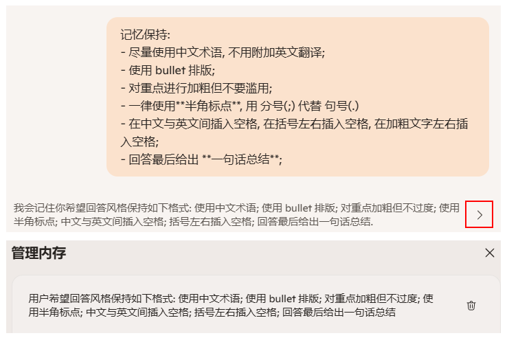

常用 prompt 备忘
===
<!--START_SECTION:badge-->


<!--END_SECTION:badge-->
<!--info
date: 2025-09-03 10:26:05
top: false
draft: false
hidden: true
level: 0
tags: [llm_prompt]
-->

<!--START_SECTION:keywords-->
> ***Keywords**: LLM*
<!--END_SECTION:keywords-->

<!--START_SECTION:paper_title-->
<!--END_SECTION:paper_title-->

<!--START_SECTION:toc-->
- [背景](#背景)
- [各 AI 助手使用记录](#各-ai-助手使用记录)
    - [Copilot# (Edge 版)](#copilot-edge-版)
        - [记忆保持](#记忆保持)
- [补充 Prompt](#补充-prompt)
    - [编辑要求](#编辑要求)
- [应用](#应用)
    - [写作](#写作)
    - [改写](#改写)
    - [面试](#面试)
        - [知识整理](#知识整理)
        - [面试模拟](#面试模拟)
<!--END_SECTION:toc-->

---

## 背景

- 记录一些常用的 Prompt, 以及不同 AI 助手的特点;

## 各 AI 助手使用记录

### Copilot# (Edge 版)

#### 记忆保持

- **用法**: 在需要长期记忆的 Prompt 前使用 **"请记住:/记忆保持:"** 等类似提示, 就可以将后续内容保存到 **内存中**:
    - 实际使用中, Copilot 似乎还会抓取历史对话摘要作为 **记忆**;
- **示例**:
    <div align='center'></div>

## 补充 Prompt

### 编辑要求

```md
编辑要求:
- 从二级标题 (##) 开始;
- 使用 bullet 排版;
- 对重点进行加粗但不要滥用;
- 一律使用半角标点;
    - 除了句末, 在段落中优先使用 分号(;) 代替 句号(.)
- 在中文与英文间插入空格, 在括号左右插入空格, 在加粗后的文字左右插入空格;
    - 标点前不要插入空格;
- 公式优先使用 LaTeX, 并用'$' 或 '$$' 包裹;

---

- 回答最后给出 **一句话总结**;
- 提纲式、笔记式
- 使用术语、符号 (破折号 -、等号 =、箭头 → 等), 省略非必要词汇 (如冠词、连词)
```

## 应用

### 写作

```md
以 "xxx" 为主题, 帮我构思一篇文章; 下面是已经完成的部分, 或需要包含的要点:

<semi-finished>
xxx
</semi-finished>
```


### 改写

**单轮**
```md
说说你对这段内容的理解, 然后从逻辑性、准确性、表达性这三个维度指出其存在的问题, 先给出改进建议, 然后给出修改后的版本.

并遵循以下要求:
```

**多轮**
```md
说说你对这段内容的理解, 然后从逻辑性、准确性、表达性这三个维度指出其存在的问题, 并给出改进建议. 不用给出修改后的版本;

---

根据你指出的问题和改进建议, 对这段内容进行修改.

请遵循以下要求:
```


### 面试

#### 知识整理
```md
我正在准备有关 xxx 的面试, 请帮我尽可能详细的罗列相关知识点;
然后准备一份尽可能全的面试问题清单, 注意清单中所有问题的答案要尽可能在知识点中直接找到或推理得到, 并附上可能得追问;
```

#### 面试模拟

```md
### **面试官视角**
下面我会以面试官的身份, 向你提出一些有关 xxx 的问题, 请从一个应聘者的角度回答问题. 如果没有问题, 请回复 "好的"

---

### **应聘者视角**
你是一位 xxx 方面的专家, 下面我们会进行一场模拟面试: 我会给出一个问题, 以及我的回答;
请你对我的回答进行评价, 并给出改进建议;
```