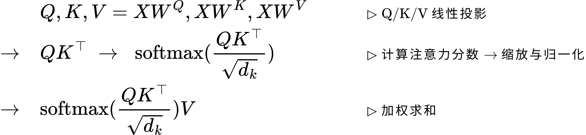

Transformer 模型架构 <!-- suffix --> [✒️](#todo "TODO(3)")<sup style="color:Gray">3</sup>[📋](#qa "面试问题整理(23)")<sup style="color:Brown">23</sup> <!-- suffix -->
===
<!--START_SECTION:badge-->


<!--END_SECTION:badge-->
<!--info
date: 2025-09-05 13:47:46
toc_title: 'Transformer 基础架构'
top: false
draft: false
hidden_in_recent: false
level: 1
tags: [transformer]
-->

<!--START_SECTION:keywords-->
> ***Keywords**: Transformer*
<!--END_SECTION:keywords-->

<!--START_SECTION:paper_title-->
<!--END_SECTION:paper_title-->

<!--START_SECTION:toc-->
- [背景](#背景)
- [核心架构](#核心架构)
    - [Encoder-Decoder 框架](#encoder-decoder-框架)
    - [多头注意力机制 (Multi-Head Attention Mechanism)](#多头注意力机制-multi-head-attention-mechanism)
        - [注意力机制 (Attention Mechanism)](#注意力机制-attention-mechanism)
        - [多头注意力 (Multi-Head Attention) 📌](#多头注意力-multi-head-attention-)
    - [逐位置前馈网络 (Position-wise FFN)](#逐位置前馈网络-position-wise-ffn)
    - [残差与归一化](#残差与归一化)
    - [正弦位置编码](#正弦位置编码)
- [推理优化](#推理优化)
- [示例代码](#示例代码)
- [Q\&A](#qa)
<!--END_SECTION:toc-->

---

## 背景

从理论基础、模型细节、编码实现和应用思考等多个维度梳理 Transformer 相关知识点;


## 核心架构

<!--START_SECTION:keyword-->
<!--keyword_info
name: 'Encoder-Decoder'
extra_url: false
-->
### Encoder-Decoder 框架
<!--END_SECTION:keyword-->

- Encoder 层 = **多头自注意力** → **前馈网络** (每层配 **残差连接** 与 **层归一化**)
- Decoder 层 = **掩码多头自注意力** → **交叉注意力** (Q 来自解码器, K/V 来自编码器) → **前馈网络** (每层配 **残差连接** 与 **层归一化**)

<div align='center'></div>

**三种形态**:
- **Encoder-Decoder** (原版, Seq2Seq)
- **Decoder-only** (Causal LM, 如 GPT)
    > 此外还衍生出了 Prefix LM, 由 UniLM 提出;
- **Encoder-only** (Masked LM 或 Bidirectional LM, 如 BERT)

---

<!--START_SECTION:keyword-->
<!--keyword_info
name: '注意力机制 (MHA)'
extra_url: false
-->
### 多头注意力机制 (Multi-Head Attention Mechanism)
<!--END_SECTION:keyword-->

#### 注意力机制 (Attention Mechanism)

- **动机/思想**:
    > 针对传统序列模型 (如 RNN) 的 **长程依赖建模困难** 和 **无法并行计算** 的瓶颈;
    - 让模型在处理序列时, 能 **像人类一样动态聚焦于关键信息**, 从而高效捕获全局依赖;
    - 具体到模型中, 即允许序列中的 **任意两个位置直接交互**, 动态计算其 **相关性权重**, 从而实现对 **全局上下文信息的高效捕获与融合**;
    - 支持**并行计算**;
- **作用**: 自注意力机制让模型能够评估输入序列中 **不同 token 的重要性**, 并动态调整它们对输出的影响;
- **公式 (缩放点积注意力)**:
    <div align='center'><a href='_formulas/Transformer/f_001.js.tex'></a></div>

    - 其中:
        <!-- - $Q=X_QW^Q$, $K=X_KW^K$, $V=X_VW^V$; -->
        - $M$: **掩码**, 用于屏蔽无效位置 (未来 token 或 padding token), 屏蔽处 $M = \text{-inf}$ (或极大负数), 其余处 $M = 0$
        - $d_k$: **输入 $K$ 的维度** (假设输入 `x` 的形状为 `[batch, seq_len, n_hidden]`, 则 $d_k$ = `n_hidden`)
            > **为什么除以 $\sqrt{d_k}$**: 点积 ($QK^\top$) 尺度随 $d_k$ 增大而增大, 将 **softmax** 函数推入梯度极小的区域 (梯度消失); 除以 $\sqrt{d_k}$ 可以稳定梯度;
    - **自注意力 (Self-Attention)**:
        - **Encode** 使用, $Q$, $K$, $V$ 均来自同一输入;
    - **掩码自注意力 (Masked Self-Attention)**:
        - **Decoder** 使用, 在计算 Decoder 的自注意力分数时, 通过一个**掩码 (mask)** 将当前位置之后的所有位置设置为负无穷或极大负数 → 经过 softmax 后, 这些位置的权重就变成了 0;
        - **做法**: 将掩码 $M$ 的 **上三角** 位置置为负无穷或极大负数;
    - **交叉注意力 (Cross-Attention)**:
        - **Decoder** 使用, $Q$ 来自**解码器**上一输出, $K$, $V$ 来自**编码器**最终输出;

---

#### 多头注意力 (Multi-Head Attention) 📌

- **动机/直觉**:
    - 不同头学习不同关系子空间 (语法、共指、位置相对性等) → 增强了模型的表达能力;
    - 每个头以较低维子空间提升稳定性与并行度;
- **做法**:
    - 将 $Q$, $K$, $V$ 通过 $h$ 个不同的线性投影, 然后对每个头独立进行注意力计算, 得到 $h$ 个输出, 最后将这些输出拼接起来后, 再做一次线性投影;
- **公式**:
    <div align='center'><a href='_formulas/Transformer/f_002.js.tex'></a></div>

    - 其中
        <div align='center'><a href='_formulas/Transformer/f_003.js.tex'></a></div>

---

<!--START_SECTION:keyword-->
<!--keyword_info
name: 'FFN'
extra_url: false
-->
### 逐位置前馈网络 (Position-wise FFN)
<!--END_SECTION:keyword-->

- **作用**:
    - 提供非线性变换, 增加模型的容量 (capacity);
    - FFN 中的参数越多, 模型表达能力越强 → FFN 中的参数占整个模型中的大多数;
    - **逐位置 (position-wise)**: 对序列中每一个 token 的向量表示, 独立地应用同一个前馈网络 (**共享参数**);
- **结构**: 两层线性层 + 非线性激活 (ReLU/GELU/SwiGLU 等)
- **公式**:
    <div align='center'><a href='_formulas/Transformer/f_004.js.tex'></a></div>

    - 张量形状变化: `[batch, seq_len, d_model] -> [batch, seq_len, d_ff] -> [batch, seq_len, d_model]`
    - 中间扩展维度 (`d_ff`) 通常是隐藏维度 (`d_model`) 的 **3~4 倍** (原文为 4 倍: `d_model = 512, d_ff = 2048`)

---

### 残差与归一化

- **目的**:
    - **残差**: **缓解梯度消失/爆炸**, 让模型更容易训练到很深;
    - **归一化**: **稳定每层的输入分布, 减少内部协变量偏移, 加速收敛**; 通过可学习的缩放和平移参数保留表达灵活性;
- **归一化位置**:
    - **Post-LN** (原版, 子层后归一化) - **`LayerNorm( x + Sublayer(x) )`**
    - **Pre-LN** (现代常用, 子层前归一化, **训练更稳定**) - **`x + Sublayer( LayerNorm(x) )`**

**数据通路**
- **编码端**: 输入 tokens → **令牌嵌入** + **位置编码** → \[Encoder Layer\] × N → **上下文表示**
- **解码端**: 输出 tokens (shifted right) → **令牌嵌入** + **位置编码** → \[Decoder Layer\] × N → **输出分布** (下一个 token 概率)

---

<!--START_SECTION:keyword-->
<!--keyword_info
name: '正弦位置编码'
extra_url: false
-->
### 正弦位置编码
<!--END_SECTION:keyword-->
> Sinusoidal Position Encoding

- **背景/动机**: 自注意力机制具有 **置换不变/等变性**; 因此需要显式地注入 **位置信息** 来区分不同顺序的序列;
- **方法**: 为输入嵌入 (Input Embedding) 添加一个包含位置信息的编码
    - 使用不同频率的正弦和余弦函数来编码位置信息;
    - **公式**:
        - $PE_{(pos, 2i)} = \sin(\dfrac{pos}{10000^{2i/d_{model}}})$
        - $PE_{(pos, 2i+1)} = \cos(\dfrac{pos}{10000^{2i/d_{model}}})$
        - 其中 $pos$ 是 token 的位置索引, $i$ 是位置编码向量的分量索引;
    - **优点**:
        - 计算简单;
        - 有一定**外推性**, 可以表示比训练集中更长的序列位置;

> [_位置编码改进_](./Transformer_位置编码.md)

---

## 推理优化
> ##### TODO

---

## 示例代码

- [Transformer Demo (基于 Pytorch)](./_code/transformer_demo.py) <br>
    🔸 [EncoderBlock](./_code/transformer_demo.py#L10) 🔸 [DecoderBlock](./_code/transformer_demo.py#L88) <br>
    🔸 [Self-Attention](./_code/transformer_demo.py#L35) 🔸 [Masked Self-Attention](./_code/transformer_demo.py#L120) 🔸 [Cross-Attention](./_code/transformer_demo.py#L140) <br>
    🔸 [FFN](./_code/transformer_demo.py#L64) 🔸 [Post-LN & Pre-LN](./_code/transformer_demo.py#L72) <br>
    🔸 [make_padding_mask](./_code/transformer_demo.py#L210) 🔸 [make_causal_mask](./_code/transformer_demo.py#L220) 🔸 [make_cross_mask](./_code/transformer_demo.py#L228)

    > Self-Attention (Padding Mask) 与 Masked Self-Attention (Padding Mask + Causal Mask) 结构完全一致, 仅输入的 mask 不同;

> ##### TODO
> KVCache 版本


---

<!--START_SECTION:qa-->
<!--qa_info
subject: 'Transformer'
subject_level: 0
topic: '基础模型'
topic_level: 99
with_section_title: true
use_section_number: true
-->
## Q&A

<!--START_SECTION:qa_toc-->
- [1. 🏷️ 模型总览](#1-️-模型总览)
    - [1.1. ✅ 详细说明 Transformer 的整体架构](#11--详细说明-transformer-的整体架构)
    - [1.2. ✅ 简述 Transformer 的核心思想 (归纳偏置), 它解决了 RNN/CNN 的哪些瓶颈?](#12--简述-transformer-的核心思想-归纳偏置-它解决了-rnncnn-的哪些瓶颈)
    - [1.3. ✅ 说明 Transformer 的并行计算与全局依赖是如何实现的?](#13--说明-transformer-的并行计算与全局依赖是如何实现的)
    - [1.4. ✅ Transformer/CNN/RNN 的归纳偏置分别是什么? 比较它们的优缺点](#14--transformercnnrnn-的归纳偏置分别是什么-比较它们的优缺点)
    - [1.5. ✅ 简述 Transformer 中 Encoder 和 Decoder 各自的作用和结构](#15--简述-transformer-中-encoder-和-decoder-各自的作用和结构)
    - [1.6. ✅ 对比 Encoder–Decoder、Decoder-only、Encoder-only 三种形态, 解释它们各自更适合的任务与训练范式](#16--对比-encoderdecoderdecoder-onlyencoder-only-三种形态-解释它们各自更适合的任务与训练范式)
    - [1.7. 🚩 为什么主流 LLM 选择 Decoder-Only (Causal LM) 架构?](#17--为什么主流-llm-选择-decoder-only-causal-lm-架构)
- [2. 🏷️ 模型细节](#2-️-模型细节)
    - [2.1. ✅ 说明自注意力机制的计算过程](#21--说明自注意力机制的计算过程)
    - [2.2. ✅ 为什么要对 QK 的点积进行缩放? 缩放因子是?](#22--为什么要对-qk-的点积进行缩放-缩放因子是)
    - [2.3. 🚩 **Multi-Head** 的动机是什么? 本质是什么? 是如何实现的?](#23--multi-head-的动机是什么-本质是什么-是如何实现的)
    - [2.4. 💡 给定 embed dim 与 num heads, 如何估算 head dim、显存占用与吞吐的关系?](#24--给定-embed-dim-与-num-heads-如何估算-head-dim显存占用与吞吐的关系)
    - [2.5. ✅ 为什么 Decoder 中计算自注意力需要 "掩码"?](#25--为什么-decoder-中计算自注意力需要-掩码)
    - [2.6. ✅ Decoder 中的 Attention 与 Encoder 有什么不同?](#26--decoder-中的-attention-与-encoder-有什么不同)
    - [2.7. ✅ Decoder 中的 Cross Attention 中的 Q, K, V 分别来自哪里?](#27--decoder-中的-cross-attention-中的-q-k-v-分别来自哪里)
    - [2.8. ✅ 为什么 FFN 需要先升维再降维?](#28--为什么-ffn-需要先升维再降维)
- [3. 🏷️ 训练与推理差异](#3-️-训练与推理差异)
    - [3.1. ✅ 说明 Decoder 在训练与推理阶段对 **目标可见性** 的差异](#31--说明-decoder-在训练与推理阶段对-目标可见性-的差异)
    - [3.2. ✅ 什么是 "曝光偏差", 如何缓解?](#32--什么是-曝光偏差-如何缓解)
    - [3.3. ✅ 描述 **KV Cache** 的动机, 方法, 效果, 代价](#33--描述-kv-cache-的动机-方法-效果-代价)
    - [3.4. ⬆️ 推理阶段, 怎么优化随着输出序列越来越长带来的开销?](#34-️-推理阶段-怎么优化随着输出序列越来越长带来的开销)
    - [3.5. ✅ KV cache 带来的显存占用线性增长要如何管理?](#35--kv-cache-带来的显存占用线性增长要如何管理)
- [4. 🏷️ 解码相关](#4-️-解码相关)
    - [4.1. 🚨 🚩 💡 ❓ ⚠️ ⬆️ 🏷️ ✅ 对比常见的解码策略 (Beam Search, 贪心, 采样)](#41-----️-️-️--对比常见的解码策略-beam-search-贪心-采样)
    - [4.2. ✅ 为什么 LLM 在文本创作中倾向于使用采样策略?](#42--为什么-llm-在文本创作中倾向于使用采样策略)
    - [4.3. 🚨 🚩 💡 ❓ ⚠️ ⬆️ 🏷️ ✅ 如何控制生成序列的长度和终止?](#43-----️-️-️--如何控制生成序列的长度和终止)
    - [4.4. 🚨 🚩 💡 ❓ ⚠️ ⬆️ 🏷️ ✅ 怎么抑制 LLM 生成过程中的 重复问题?](#44-----️-️-️--怎么抑制-llm-生成过程中的-重复问题)
    - [4.5. 🚨 🚩 💡 ❓ ⚠️ ⬆️ 🏷️ ✅ 非自回归模型是如何解码的? 与自回归解码的优劣](#45-----️-️-️--非自回归模型是如何解码的-与自回归解码的优劣)
- [5. 🏷️ 工程优化、失败模式与诊断](#5-️-工程优化失败模式与诊断)
    - [5.1. ✅ 比较 Pre‑LN 与 Post‑LN 的优缺点](#51--比较-preln-与-postln-的优缺点)
    - [5.2. ✅ Pre‑LN 存在的问题与解决方法](#52--preln-存在的问题与解决方法)
<!--END_SECTION:qa_toc-->

---

<!-- omit in toc -->
### 1. 🏷️ 模型总览

<!-- omit in toc -->
#### 1.1. ✅ 详细说明 Transformer 的整体架构
> • Transformer 整体是一个基于 Encoder–Decoder 框架的模型, <br>
> • 输入层 (词嵌入 + 位置向量) ➡️ Encoder堆叠 (多头自注意力 → _残差+归一化_ → 前馈网络 → _残差+归一化_) ➡️ 解码器堆叠 (掩码自注意力 → _残差+归一化_ → 交叉注意力 → _残差+归一化_ → 前馈网络 → _残差+归一化_) ➡️ 输出层 (线性层 + Softmax) <br>

-   <details><summary><b> 展开详情 ⬇️ </b></summary>

    <div align='center'></div>

    </details>


<!-- omit in toc -->
#### 1.2. ✅ 简述 Transformer 的核心思想 (归纳偏置), 它解决了 RNN/CNN 的哪些瓶颈?
> • **核心思想**: 通过自注意机制和位置编码, 实现全局依赖建模和完全并行化; <br>
> • 解决了 RNN 的串行计算与长依赖问题, 和 CNN 的局部感受野限制; <br>

<!-- omit in toc -->
#### 1.3. ✅ 说明 Transformer 的并行计算与全局依赖是如何实现的?
> • **并行计算**: 通过矩阵化自注意力, 所有 token 同时处理; <br>
> • **全局依赖**: 每个 token 与所有 token 直接交互, 单层即可捕获长程关系; 通过 **位置编码** 保留序列结构 <br>


<!-- omit in toc -->
#### 1.4. ✅ Transformer/CNN/RNN 的归纳偏置分别是什么? 比较它们的优缺点
> **Transformer (位置编码 + 全局依赖)** / **CNN (局部性 + 平移不变性)** / **RNN (顺序性 + 马尔可夫假设)**

-   <details><summary><b> 展开详情 ⬇️ </b></summary>

    - 在机器学习中, **归纳偏置** 是指模型在学习之前 **对数据分布或任务结构的先验假设**;
        > [归纳偏置](./机器学习基础.md#归纳偏置-inductive-bias)

    **归纳偏置**
    - **Transformer**
        - **全局依赖假设**: 自注意力机制允许任意位置之间直接交互, 序列中的远距离依赖与近距离依赖同等重要;
        - **显式位置编码**: 注意力机制本身是置换不变的, 必须显式注入位置信息;
        > 弱结构假设: 没有内置的强归纳偏置, 更多依赖数据驱动;
    - **CNN**
        - **局部性** (Locality): 卷积核只关注局部区域; 
        - **平移不变性** (Translation Invariance): 同一卷积核在不同位置共享参数; 
        > 层次化特征: 通过堆叠卷积层逐步扩大感受野, 适合图像等具有空间局部相关性的任务
    - **RNN**
        - **顺序性** (Sequential Order): 隐状态按时间步递归更新; 
        - **马尔可夫式依赖: 当前状态依赖于前一状态; **
        > 时间一致性: 天然适合建模时间序列、语音、文本等逐步展开的信号, 适合流式输入和强时间依赖的任务

    **优缺点**
    - Transformer: 弱先验, 几乎不假设输入的内在结构 (位置关系通过显式编码输入);
        - **优点**: 灵活, 可以学习更丰富的模式
        - **缺点**: 需要更多数据和计算
    - CNN/RNN: 有较强的结构先验 (局部性 或 顺序性);
        - **优点**: 数据量不大也能学到一定模式
        - **缺点**: 强先验限制了表达能力

    </details>

<!-- omit in toc -->
#### 1.5. ✅ 简述 Transformer 中 Encoder 和 Decoder 各自的作用和结构
> • **Encoder**: (文本表示, 自注意力 → FFN); <br>
> • **Decoder**: (自回归, 掩码自注意力 → 交叉注意力 → FFN). <br>

-   <details><summary><b> 展开详情 ⬇️ </b></summary>

    - **Encoder**:
        - **作用**: 对输入序列编码, 将其表示为 **富含上下文信息的隐状态序列**;  
        - **结构**: $N$ 个相同的层堆叠结构, 每个层包含 2 个子层:  
            1. **多头自注意力** → **残差** → **层归一化**;
            2. **前馈网络** → **残差** → **层归一化**;
        - **输入**: Token 嵌入 + 位置编码;
        - **输出**: 上下文表示序列 (维度同输入);
    - **Decoder**:
        - **作用**: 以**自回归**方式, 根据 Encoder 输出和已生成前缀, **逐词**生成目标序列;
        - **结构**: $N$ 个相同的层堆叠结构, 每个层包含 3 个子层:  
            1. **掩码多头自注意力** → **残差** → **层归一化**;
            2. **交叉注意力** → **残差** → **层归一化**;
            3. **前馈网络** → **残差** → **层归一化**;
        - **输入**: 目标序列右移一位的嵌入 + 位置编码 + Encoder 输出;
        - **输出**: 对下一个 token 的概率分布;

    </details>

<!-- omit in toc -->
#### 1.6. ✅ 对比 Encoder–Decoder、Decoder-only、Encoder-only 三种形态, 解释它们各自更适合的任务与训练范式
> • Encoder–Decoder: 输入输出强依赖的 Seq2Seq 任务; 条件生成 (Conditional LM), 输入序列 → 输出序列 <br>
> • Decoder-only: 通用生成与大模型预训练; 因果语言建模 (Causal LM), 预测下一个 token <br>
> • Encoder-only: 理解与判别类任务; **掩码语言建模** (Masked LM), 随机 mask 输入 token 预测缺失部分 <br>

-   <details><summary><b> 展开详情 ⬇️ </b></summary>

    - Encoder–Decoder
        - **模型结构**: 编码器对输入双向建模 → 解码器单向生成输出, 并通过 cross-attn 融合输入;
        - **训练范式**: 条件生成 (Conditional LM), 输入序列 → 输出序列;
        - 适合任务: 机器翻译, 文本摘要, 问答生成 等 **输入输出强依赖** 的 Seq2Seq 任务;
        - **优势** 📌
            - **输入和输出解耦, 能处理输入输出分布差异大的任务**
        - **劣势**
            - **训练和推理复杂度较高**.
        - 典型代表: 原版 Transformer, T5, BART;

    - Decoder-only
        - **模型结构**: 只有解码器, 使用 **Causal Mask** 保证单向生成;
        - **训练范式**: **因果语言建模** (Causal LM), 预测下一个 token;
        - 适合任务
            - 开放域文本生成 (对话、故事、代码);
            - 统一范式后, 几乎所有任务都可转化为 **补全文本**;
        - **优势** 📌
            - 训练目标简单统一 (next-token prediction)
            - 可扩展性强, 适合大规模预训练
        - **劣势**
            - 输入和输出混在同一序列中, **条件建模** 效率可能不如 Encoder–Decoder;
            - 对 **理解类任务** 不如 Encoder-only 高效.
        - 典型代表: GPT 系列, LLaMA, ChatGPT 等;

    - Encoder-only
        - **模型结构**: 只有编码器, 双向自注意力;
        - **训练范式**: **掩码语言建模** (Masked LM) - 随机 mask 输入 token 预测缺失部分;
        - 适合任务
            - 文本分类 (情感分析, 新闻分类)
            - 序列标注 (NER, POS tagging)
            - 检索/匹配 (语义检索, 文本相似度)
        - **优势**
            - 双向上下文建模, 理解能力强
        - **劣势**
            - 不具备自然的生成能力
        - 典型代表: BERT, RoBERTa, DeBERTa 等;

    </details>


<!-- omit in toc -->
#### 1.7. 🚩 为什么主流 LLM 选择 Decoder-Only (Causal LM) 架构?
<!-- > • **LLM 的核心能力** 是自回归生成, 与 Decoder 的的工作模式相匹配; <br> -->
> _Encoder-only 的生成能力较弱, 所以主要比较 Encoder-Decoder 架构_; <br>
> • **参数效率**: 避免了双塔结构的冗余; <br>
> • **低秩风险**: 减少跨模块投影, 训练更稳定; <br>
> • **工程生态**: 推理优化、分布式框架、KV Cache 全部围绕自回归任务发展; <br>

-   <details><summary><b> 展开详情 ⬇️ </b></summary>

    > 💡 **Decoder-Only 相较于 Encoder-Decoder 的优势主要来源于实证结果** 
    - **任务匹配**
        - LLM 的核心能力是 **"给定上下文, 预测下一个 token"**, 这与 Decoder 的工作模式匹配;
        - Encoder-Decoder 架构是为 **Seq2Seq** 任务设计的 —— **先对输入进行编码, 再解码到输出** —— 对于单纯的生成任务, Encoder 部分可能并非必要, 实践中这种更复杂的架构也没有表现出优势;
    - **参数效率**
        - Decoder-Only 中所有参数专注于自回归预测; Encoder-Decoder 中参数分散在编码和解码两部分;
        - **在给定参数量预算下**, 将所有参数都投入到 Decoder 的上限更高, 更符合 **Scaling Laws**;
        - 在海量数据上训练后, Decoder-Only 模型展现出强大的 **涌现能力**; 在零样本泛化上优于 Encoder-Decoder;
            <!-- > **Causal Decoder** 严格遵守从左到右, 只看历史, 不看未来 (包括 Prompt 部分) -->
    - **推理效率**
        - **KV Cache 优化**: Decoder-only 的自回归推理天然适合 KV Cache, 每步只需计算新 token 的 Q, 推理复杂度从 $O(n^2)$ 降到 $O(n)$;
    - **工程生态**
        > 所有主流大模型 (GPT, LLaMA等) 都采用此架构, 整个软硬件生态都针对其进行了极度优化;
        - **分布式并行**: 主流框架 (Megatron-LM, DeepSpeed, vLLM) 都针对 Decoder-only 优化了流水线并行、张量并行、推理批处理;
        - **统一范式**: 所有任务都可转化为 "补全文本", 简化了数据格式、预训练目标和下游适配;
    - **低秩问题**:
        - Encoder 输出的语义表示再输入 Decoder 的过程中, 如果跨注意力层容量不足, 输入信息可能被压缩到低秩子空间, 导致退化;
        - 双向注意力在深层堆叠时更容易出现 "近似低秩", 导致表达能力受限;
            > 观察注意力矩阵: $\displaystyle\text{softmax}\!\left(\frac{QK^T}{\sqrt{d_k}}\right)$
            > - $QK^T$ 的秩最多为 $\min(n,d)$, 而通常 $n \gg d$, 所以天然存在低秩倾向;
            > - softmax 虽然可能 "升秩", 但奇异值分布往往极度不均衡 → **有效秩** 下降 → 信息交互不足;
        - Decoder-only 的 Attention 矩阵是一个 **三角阵**, 即使在深层堆叠中也不会出现严格低秩塌缩;
            > - 下三角矩阵性质: 行列式 = 对角线元素之积; 
            > - softmax 保证对角线元素始终 $> 0$ → 行列式非零 → 矩阵严格满秩;
            > - 奇异值分布更均匀, 有效秩下降速度慢, 保持较强的表达能力;
    - **参考资料**
        - [为什么现在的LLM都是Decoder-only的架构? - 科学空间|Scientific Spaces](https://kexue.fm/archives/9529)
        - [解码器仅架构: 探究大语言模型 (LLM) 采用Decoder-only架构的原因-百度开发者中心](https://developer.baidu.com/article/detail.html?id=2145079)
        - [为什么当前的大型语言模型 (LLMs) 普遍采用 "仅解码器" (Decoder-only) 架构? _decoder-only自回归模型架构-CSDN博客](https://blog.csdn.net/Listennnn/article/details/147934482)
        - [面试官问我: 大模型为何都用 Decoder only 架构? _大模型为什么是基于decoder-CSDN博客](https://blog.csdn.net/2401_84033492/article/details/143260251)

    </details>

---

<!-- omit in toc -->
### 2. 🏷️ 模型细节

<!-- omit in toc -->
#### 2.1. ✅ 说明自注意力机制的计算过程
> • Q/K/V 线性投影 → 计算注意力分数 → 缩放与归一化 → 加权求和 <br>

-   <details><summary><b> 展开详情 ⬇️ </b></summary>

    <div align='center'><a href='_formulas/Transformer/f_005.js.tex'></a></div>

    </details>

<!-- omit in toc -->
#### 2.2. ✅ 为什么要对 QK 的点积进行缩放? 缩放因子是?
> • 防止点积 ($QK^\top$) 的数值过大引发梯度消失; 缩放因子是 $\sqrt{d_k}$ (其中 $d_k$ 为输入向量 $K$ 的维度) <br>

-   <details><summary><b> 展开详情 ⬇️ </b></summary>

    - **数学解释**: **两个均值为 0、方差为 1 的 d 维向量, 其点积的均值为 0、方差为 d**; 
    - 直接 softmax 会出现数值极小的分量, 反向传播时这些分量的梯度会趋于零, 导致梯度消失;

    </details>

<!-- omit in toc -->
#### 2.3. 🚩 **Multi-Head** 的动机是什么? 本质是什么? 是如何实现的?
> • **动机**: 将特征空间切分成多个独立的低维子空间 → 学习不同的注意力分布/不同的依赖关系; <br>
> • **本质**: **Multi-Head 的本质是 _ensemble_ (集成学习)**; <br>
> • **实现**: 将 Q/K/V 投影到多个低维子空间 → 每个头独立执行 Attention → 将结果拼接后再整体投影; <br>
>> 具体实现时会利用向量操作进行简化: `[B, L, d_model] → [B, L, H*d_k] → [B, H, L, d_k]`

-   <details><summary><b> 展开详情 ⬇️ </b></summary>

    > [示例代码](./_code/transformer_demo.py#L35)

    - **独立视角**: 每个 head 就像一个弱学习器, 专注于不同的模式 (语法、语义、长程依赖等);
    - **并行学习**: 这些 head 是并行计算的, 而不是顺序依赖, 类似于 Bagging 中的多个树;
    - **结果融合**: 拼接 + 线性变换的过程, 相当于把多个子模型的输出集成成一个更强的表示;
    - **泛化能力**: 就像 ensemble 能减少单一模型的偏差, 多头注意力也能避免单一注意力模式的局限;

    > [为什么 Transformer 需要进行 Multi-head Attention? - 知乎 | 香侬科技 | stone 用户的评论](https://www.zhihu.com/question/341222779/answer/814111138)

    </details>

<!-- omit in toc -->
#### 2.4. 💡 给定 embed dim 与 num heads, 如何估算 head dim、显存占用与吞吐的关系?
> • 一般来说, 更多 heads → 更小 head_dim → 参数量/KV Cache不变, 显存占用增加; 矩阵乘法效率下降, 吞吐下降. <br>

-   <details><summary><b> 展开详情 ⬇️ </b></summary>

    **更多 heads 时**:
    - 参数量与 head 数无关
        - 因为 Q/K/V 投影矩阵的维度始终是 `[d_model, d_model]`;
    - KV Cache (推理) 与 head 数无关
        - 每个 token 存储 K/V: `[B, H, L, d_head]`
    - 显存占用随 head 数增加而线性增长
        - Attention logits: `[B, H, L, L]`, 显存随 head 数 H 线性增加
    - head_dim 更小, 矩阵乘法效率下降, 吞吐降低;

    </details>

<!-- omit in toc -->
#### 2.5. ✅ 为什么 Decoder 中计算自注意力需要 "掩码"?
> • 维持自回归特性, 防止数据泄露 <br>

-   <details><summary><b> 展开详情 ⬇️ </b></summary>

    - **核心目的: 维持自回归特性, 防止数据泄露**;
        - Decoder 的任务是 **自回归生成 (auto-regressive generation)**, 即逐个预测下一个 token;
        - 在生成第 `t` 个 token 时, 模型只能依据 **已经生成的 `1` 到 `t-1` 个 token**;
        - 若不加掩码, 模型在训练时会在计算第 `t` 个位置的注意力时 **"看到" 整个目标序列** (包括未来的 `t+1, t+2, ...` token), 这相当于 **数据泄露 (data leakage)**;
        - 掩码通过遮蔽 (设为负无穷) 当前位置之后的所有未来 token, 确保注意力权重仅基于历史信息, 从而 **强制训练与推理的行为保持一致**;
    - **实现方式: 前瞻掩码 (Look-ahead Mask)**;
        - 掩码通常是一个 **下三角矩阵 (lower triangular matrix)**, 其对角线及左侧元素为 `0` (允许参与计算), 右上角元素为 `-inf` (被遮蔽);
        - 经过 softmax 后, 被遮蔽位置的权重变为 `0`, 从而在计算加权和时忽略这些未来信息;
    - **一句话总结**: 掩码通过遮蔽未来信息, 确保 Decoder 在训练时只能基于历史上下文进行预测, 从而模拟推理时的自回归生成过程, 防止作弊;

    </details>

<!-- omit in toc -->
#### 2.6. ✅ Decoder 中的 Attention 与 Encoder 有什么不同?
> • Encoder 只有 Self-Attention; <br>
> • Decoder 包括 Masked Self-Attention 和 Cross-Attention; <br>

<!-- omit in toc -->
#### 2.7. ✅ Decoder 中的 Cross Attention 中的 Q, K, V 分别来自哪里?
> • Q 来自 Decoder 上一层的输出; K, V 来自 Encoder 最后一层的输出 (不再变化); <br>

<!-- omit in toc -->
#### 2.8. ✅ 为什么 FFN 需要先升维再降维?
> • **表达能力** 与 **计算效率** 的折中. <br>
> • **升维**: 增强模型表达能力, 捕捉更复杂的特征关系; **降维**: 控制模型复杂度, 保持输入输出一致. <br>

-   <details><summary><b> 展开详情 ⬇️ </b></summary>

    > [【面试总结】FFN 在 Transformer 模型中先升维再降维的原因 - CSDN博客](https://blog.csdn.net/hhhhhhhhhhwwwwwwwwww/article/details/145299992)

    > [为什么transformer的 FFN 需要先升维再降维? - 知乎](https://www.zhihu.com/question/665731716)

    </details>

---

<!-- omit in toc -->
### 3. 🏷️ 训练与推理差异

<!-- omit in toc -->
#### 3.1. ✅ 说明 Decoder 在训练与推理阶段对 **目标可见性** 的差异
> • **训练阶段**: Decoder 使用 **教师强制 (teacher forcing)**, 目标序列整体可见, 但通过 Causal Mask 限制每个位置只能看到过去和当前 token; <br>
> • **推理阶段**: Decoder 是自回归的, 每次只输入已生成的 token, 天然保证了因果性; <br>

-   <details><summary><b> 展开详情 ⬇️ </b></summary>

    - **训练阶段**:
        - **模式**: **教师强制 (Teacher Forcing)**
        - **过程**:
            - 将完整的目标序列一次性输入 Decoder,
            - 在计算**第 i 个**位置的输出时, 模型可以看到**第 1 到 i-1 位**的真实标签;
        - **特点**:
            - **并行计算**;
            - 整个目标序列可以同时输入, 通过**掩码**确保**当前位置看不到未来信息**, 一次性计算出所有位置的输出;
        - **缺点**:
            - **曝光偏差** (Exposure Bias)
    - **推理阶段**:
        - **模式**: **自回归 (Auto-regressive)**
        - **过程**:
            - 从仅包含一个起始符 `<sos>` 的序列开始,
            - 模型每预测出下一个 token, 就**将该 token 追加到输入序列末尾**, 作为生成下一个 token 的上下文,
            - 直到生成结束符 `<eos>` 或达到最大长度;
        - **缺点**:
            - **串行计算**, 效率低;
        - **优化**:
            - **KV Cache**

    </details>

<!-- omit in toc -->
#### 3.2. ✅ 什么是 "曝光偏差", 如何缓解?
> • **曝光偏差**: 训练阶段与推理阶段输入分布不一致 <br>
> • **缓解方法**: 计划采样 (Scheduled sampling), 对比学习, 强化学习 <br>
>> 在大模型时代, 曝光偏差问题的重要性被弱化了: **大规模预训练 + RLHF + 采样解码策略** 在实践中缓解了训练/推理分布不一致的问题.

-   <details><summary><b> 展开详情 ⬇️ </b></summary>

    - 计划采样 (Scheduled sampling)
        - 在训练中逐步用模型预测替代真实 token, 缩小训练/推理差距
        - 缺点: 可能引入训练不稳定
    - 对比学习 + 对抗扰动
        - 通过对比正负样本, 提升模型在 "非黄金输入" 下的鲁棒性
            > [ICLR 2021 @ 利用对比学习缓解文本生成中的曝光偏差问题 - 知乎](https://zhuanlan.zhihu.com/p/400444415)
    - 强化学习
        - 训练目标不再是逐 token 的交叉熵, 减少了对 teacher forcing 的依赖

    </details>

<!-- omit in toc -->
#### 3.3. ✅ 描述 **KV Cache** 的动机, 方法, 效果, 代价
> • **动机** (减少重复计算) → **方法** (缓存历史 K/V, 增量计算) → **效果** (降低计算复杂度) → **代价** (显存占用线性增长) <br>

-   <details><summary><b> 展开详情 ⬇️ </b></summary>

    - **背景/动机**
        - 在**自回归**生成中, 第 `i` 个 token 的注意力计算需基于前 `i` 个 token `K/V` (含开始符);
        - 其中前 `i-1` 个 token 的 `K/V` 在之前步骤中已计算过, 可以通过 **缓存** 避免重复计算;
    - **方法**
        - 每步仅计算当前 token 的 `Q/K/V`, 并将新的 `K/V` 追加至缓存 `K_cache/V_cache` 中;
        - 执行 `Attention(Q, K_cache, V_cache)` —— **节省计算量的核心步骤**;
        - 生成当前 token, 并循环此过程;
    - **效果**
        - 时间复杂度由 $O(n^2)$ 降至 $O(n)$;
    - **代码展开说明**:
        ```python
        # 初始化缓存
        K_cache = torch.empty(batch, 0, d_model)
        V_cache = torch.empty(batch, 0, d_model)

        # --- 第 i 步: 生成第 i 个 token ---
        # 输入: [B, 1, D]
        Xi = torch.randn(batch, 1, d_model)

        # 计算 Q, K, V (假设这是解码器自注意力层)
        Qi = linear_q(Xi)  # [B, 1, D]
        Ki = linear_k(Xi)  # [B, 1, D]  
        Vi = linear_v(Xi)  # [B, 1, D]

        # 更新缓存: 将 Ki, Vi 存入
        K_cache = torch.cat([K_cache, Ki], dim=1) # [B, prev_len + 1, D]
        V_cache = torch.cat([V_cache, Vi], dim=1) # [B, prev_len + 1, D]

        # 计算自注意力
        Ai = attention(Qi, K_cache, V_cache) # [B, 1, D]

        # 经过 FFN 等操作, 生成第 i 个token
        ...
        ```

    </details>

<!-- omit in toc -->
#### 3.4. ⬆️ 推理阶段, 怎么优化随着输出序列越来越长带来的开销?
> • **方法**: KV Cache; **效果**: $O(n^2) → O(n)$ <br>

<!-- omit in toc -->
#### 3.5. ✅ KV cache 带来的显存占用线性增长要如何管理?
> • 低精度存储, 分块存储 / Paged Attention, 滑动窗口 / Streaming Attention, 分层裁剪 (Layer-wise Eviction), 异构存储 (Offloading) <br>

-   <details><summary><b> 展开详情 ⬇️ </b></summary>

    1. **低精度存储**  
        - 将 KV Cache 从 FP16 压缩到 INT8/INT4, 显存占用减少 2–4 倍. 
        - 常见于推理引擎 (如 FasterTransformer, vLLM). 

    2. **分块存储 / Paged Attention**  
        - 将 KV Cache 按页管理, 避免大块连续内存分配; 
        - 支持动态回收和共享, 提高多请求并发能力. 

    3. **滑动窗口 / Streaming Attention**  
        - 只保留最近的上下文 (如 4K tokens), 丢弃远端 KV; 
        - 适合对长程依赖不敏感的任务 (对话、代码补全). 

    4. **分层裁剪 (Layer-wise Eviction)**  
        - 对不同层采用不同保留策略: 浅层丢弃远端 KV, 深层保留全局. 

    5. **异构存储 (Offloading)**  
        - 将部分 KV Cache 放到 CPU 内存或 NVMe, 再按需调入; 
        - 典型方案: DeepSpeed ZeRO-Inference, vLLM 的异步 KV 管理. 

    </details>

<!-- omit in toc -->
### 4. 🏷️ 解码相关

<!-- omit in toc -->
#### 4.1. 🚨 🚩 💡 ❓ ⚠️ ⬆️ 🏷️ ✅ 对比常见的解码策略 (Beam Search, 贪心, 采样)
> • **Beam Search**: 保留多个候选路径 (beam), 逐步扩展并选择累计概率最高的序列 <br>
> • **贪心**: 每一步都选取概率最大的 token <br>
> • **采样**: 直接按概率分布采样 <br>

-   <details><summary><b> 展开详情 ⬇️ </b></summary>

    - #### 1. Beam Search
        - **机制**: 保留多个候选路径 (beam), 逐步扩展并选择累计概率最高的序列. 
        - **优点**: 比贪心更全局, 能找到更优解; 常用于机器翻译、摘要. 
        - **缺点**: 仍然偏向高概率 token, 输出趋同, 容易生成模式化、冗长或重复的文本. 
        - **适用场景**: 需要高精度、低随机性的任务. 

    - #### 2. 贪心 (Greedy Search)
        - **机制**: 每一步都选取概率最大的 token. 
        - **优点**: 简单高效, 生成速度快. 
        - **缺点**: 容易陷入局部最优, 输出单一、缺乏多样性. 
        - **适用场景**: 快速推理、对结果唯一性要求高的任务. 

    - #### 3. 采样 (Sampling)
        - **随机采样**: 直接按概率分布采样, 随机性过大. 
        - **Top‑k 采样**: 只在概率前 k 个 token 中采样, 避免低概率噪声. 
        - **Nucleus (Top‑p) 采样**: 在累计概率达到 p 的最小集合中采样, 动态调整候选集, 更灵活. 
        - **优点**: 引入受控随机性, 生成结果多样、富有创造性. 
        - **缺点**: 可能生成不够稳定或偶尔不合理的输出. 
        - **适用场景**: 对话、故事、诗歌、广告文案等创作类任务. 

    </details>

<!-- omit in toc -->
#### 4.2. ✅ 为什么 LLM 在文本创作中倾向于使用采样策略?
> • 避免模式化, 引入多样性, 控制随机性, 用户体验 <br>

-   <details><summary><b> 展开详情 ⬇️ </b></summary>

    1. **避免模式化**: 贪心/Beam 会反复选择高概率词, 导致输出千篇一律; 采样能打破这种模式. 
    2. **引入多样性**: 创作任务需要 "意料之外但合理" 的表达, 采样能在合理范围内探索低概率词. 
    3. **控制随机性**: Top‑k / Nucleus 提供了 "可控的创造力", 既不会完全随机, 也不会过于死板. 
    4. **用户体验**: 创作类应用 (小说、对话、广告文案) 更看重新颖性和多样性, 而不是唯一正确答案. 

    </details>

<!-- omit in toc -->
#### 4.3. 🚨 🚩 💡 ❓ ⚠️ ⬆️ 🏷️ ✅ 如何控制生成序列的长度和终止?
> •  <br>

-   <details><summary><b> 展开详情 ⬇️ </b></summary>


    </details>

<!-- omit in toc -->
#### 4.4. 🚨 🚩 💡 ❓ ⚠️ ⬆️ 🏷️ ✅ 怎么抑制 LLM 生成过程中的 重复问题?
> •  <br>

-   <details><summary><b> 展开详情 ⬇️ </b></summary>


    </details>

<!-- omit in toc -->
#### 4.5. 🚨 🚩 💡 ❓ ⚠️ ⬆️ 🏷️ ✅ 非自回归模型是如何解码的? 与自回归解码的优劣
> •  <br>

-   <details><summary><b> 展开详情 ⬇️ </b></summary>


    </details>


---

<!-- omit in toc -->
### 5. 🏷️ 工程优化、失败模式与诊断

> ##### TODO
> - 何时选择 RMSNorm?
> - 残差缩放或 μ‑parameterization 在深层网络中的作用
> - 在长序列训练中如何识别并处理梯度方差增大与熵失控
> - 分类阐述远距注意力退化、跨段对齐失败、KV 污染三类问题的症状与原因
> - 

<!-- omit in toc -->
#### 5.1. ✅ 比较 Pre‑LN 与 Post‑LN 的优缺点
> • Pre‑LN: 训练更稳定, 梯度流动顺畅, 适合深层/大模型; 但可能导致激活方差累积, 最终性能略逊 <br>
> • Post‑LN: 原始设计, 浅层模型表现好, 输出分布更稳定; 但深层训练不稳, 需长 warm‑up <br>
<!-- > • Post‑LN (归一化在子层之后) 是原始 Transformer 设计，浅层模型可收敛，但深层时容易出现梯度消失/爆炸，需要较长 warm‑up <br> -->
<!-- > • Pre‑LN (归一化在子层之前) 训练更稳定，梯度流动顺畅，适合深层/大模型 <br> -->

-   <details><summary><b> 展开详情 ⬇️ </b></summary>

    <!-- - #### 稳定性差异
        1. **梯度流动**  
            - Post‑LN：梯度必须穿过子层和 LN 才能回传到输入，深层时容易衰减或爆炸  
            - Pre‑LN：残差路径直接绕过子层，梯度能稳定传递，避免消失  
        2. **训练收敛**  
            - Post‑LN：需要较长的学习率 warm‑up，否则初期训练不稳定  
            - Pre‑LN：即使在较大学习率下也能稳定收敛  
        3. **深层扩展性**  
            - Post‑LN：在 >100 层时几乎无法稳定训练  
            - Pre‑LN: 已成为主流大模型 (如 GPT‑3, LLaMA, GLM) 的默认选择   -->

    <!-- omit in toc -->
    #### Pre‑LN (前置 LayerNorm)
    - 优点  
        - **训练稳定性强**: 梯度能直接通过残差路径传播, 不易消失或爆炸. 
        - **收敛更快**: 不依赖长时间 warm‑up, 初期即可稳定训练. 
        - **可扩展性好**: 支持百层以上的深层 Transformer, 是 GPT‑2/3、LLaMA 等大模型的主流选择. 
    - 缺点  
        - **激活方差累积**: 每层残差直接叠加, 可能导致输出方差逐层放大. 
        - **性能略差**: 在浅层或中等规模模型中, Pre‑LN 的收敛效果通常不如 Post‑LN 精细. 
        - **需额外技巧**: 常结合 DeepNorm、RMSNorm、残差缩放等方法缓解方差膨胀. 

    <!-- omit in toc -->
    #### Post‑LN (后置 LayerNorm)
    - 优点  
        - **输出分布稳定**: 每次残差相加后立即归一化, 保证层间激活尺度一致. 
        - **浅层性能好**: 在小规模任务或浅层网络中, Post‑LN 收敛后往往优于 Pre‑LN. 
        - **原始 Transformer 架构**: 机器翻译、摘要等早期任务中表现良好. 
    - 缺点  
        - **训练不稳定**: 深层时梯度可能消失或爆炸. 
        - **强依赖 warm‑up**: 需要较长的学习率预热才能稳定训练. 
        - **难以扩展**: 在百层以上的深层网络中几乎无法收敛. 

    </details>

<!-- omit in toc -->
#### 5.2. ✅ Pre‑LN 存在的问题与解决方法
> • **问题**: 方差累积, 表示退化, 收敛性能差 <br>
> • **方法**: 残差缩放 (DeepNorm), 归一化替代 (RMSNorm), 正则化技巧 (DropPath, Stochastic Depth), 学习率/初始化策略优化 <br>

-   <details><summary><b> 展开详情 ⬇️ </b></summary>

    <!-- omit in toc -->
    #### Pre‑LN 的主要问题
    1. **方差累积 (Variance Explosion)**  
        - 每层残差直接叠加, 缺乏归一化约束, 导致激活方差逐层放大; 
        - 在超深网络中, 可能出现输出分布不稳定. 

    2. **表示退化 (Representation Collapse)**  
        - 由于 LayerNorm 在输入端, 残差路径几乎是 "恒等映射"; 
        - 模型可能过度依赖残差直通, 子层贡献减弱, 导致表示能力下降. 

    3. **收敛性能差**  
        - 在浅层或中等规模模型中, Pre‑LN 的最终性能往往不如 Post‑LN; 
        - 主要体现在 BLEU/ROUGE 等指标上. 

    4. **训练动态问题**  
        - Pre‑LN 虽然稳定, 但可能导致梯度过早饱和; 
        - 需要额外技巧来保持梯度多样性. 

    <!-- omit in toc -->
    #### 解决方法
    1. **残差缩放 (Residual Scaling)**  
        - **DeepNorm** 提出在残差连接前后引入缩放因子 (如 $\alpha = (2N)^{1/4} $); 
        - 有效控制方差膨胀, 使得 Transformer 可扩展到上千层. 

    2. **归一化替代**  
        - **RMSNorm**: 去掉均值归一化, 仅保留方差归一化, 减少方差累积; 
        - **ScaleNorm**: 直接用向量范数缩放, 计算更简洁. 

    3. **正则化技巧**  
        - **DropPath / Stochastic Depth**: 随机丢弃部分残差路径, 缓解退化问题; 
        - **Attention Dropout**: 减少注意力过度集中, 提升梯度多样性. 

    4. **优化与初始化**  
        - **学习率调度**: Pre‑LN 可用更大学习率, 但仍需 warm‑up; 
        - **参数初始化**: 如 Xavier/He 初始化 + 残差缩放, 避免初期梯度过大. 

    5. **混合范式**  
        - 部分工作采用 **Hybrid Norm**: 浅层用 Pre‑LN 保证稳定, 深层用 Post‑LN 保证性能; 
        - 或在不同子层 (Attention vs FFN) 使用不同归一化策略. 

    </details>
<!--END_SECTION:qa-->