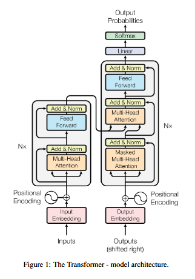
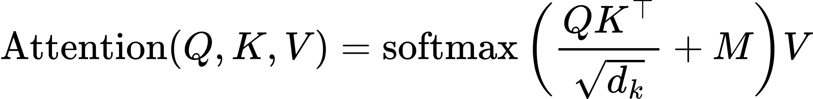
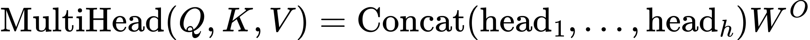
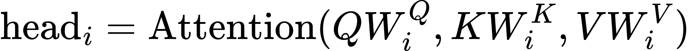
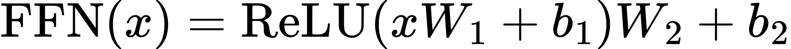

Transformer 模型架构 <!-- suffix --> [📋](#qa "面试问题整理(16)")$\color{Brown}^{16}$ <!-- suffix -->
===
<!--START_SECTION:badge-->


<!--END_SECTION:badge-->
<!--info
date: 2025-09-05 13:47:46
toc_title: 'Transformer 基础架构'
top: false
draft: false
hidden_in_recent: false
level: 1
tags: [transformer]
-->

<!--START_SECTION:keywords-->
> ***Keywords**: Transformer*
<!--END_SECTION:keywords-->

<!--START_SECTION:paper_title-->
<!--END_SECTION:paper_title-->

<!--START_SECTION:toc-->
- [背景](#背景)
- [核心架构](#核心架构)
    - [Encoder-Decoder 框架](#encoder-decoder-框架)
    - [多头注意力机制 (Multi-Head Attention Mechanism)](#多头注意力机制-multi-head-attention-mechanism)
        - [注意力机制 (Attention Mechanism)](#注意力机制-attention-mechanism)
        - [多头注意力 (Multi-Head Attention) 📌](#多头注意力-multi-head-attention-)
    - [逐位置前馈网络 (Position-wise FFN)](#逐位置前馈网络-position-wise-ffn)
    - [残差与归一化](#残差与归一化)
    - [正弦位置编码](#正弦位置编码)
- [Q\&A](#qa)
<!--END_SECTION:toc-->

---

## 背景

从理论基础、模型细节、编码实现和应用思考等多个维度梳理 Transformer 相关知识点;


## 核心架构

<!--START_SECTION:keyword-->
<!--keyword_info
name: 'Encoder-Decoder'
extra_url: false
-->
### Encoder-Decoder 框架
<!--END_SECTION:keyword-->

- Encoder 层 = **多头自注意力** → **前馈网络** (每层配 **残差连接** 与 **层归一化**)
- Decoder 层 = **掩码自注意力** (因果掩码) → **交叉注意力** (Q 来自解码器, K/V 来自编码器) → **前馈网络** (每层配 **残差连接** 与 **层归一化**)

**三种形态**:
- **Encoder-Decoder** (原版, Seq2Seq)
- **Decoder-only** (Causal LM, 如 GPT)
    > 此外还衍生出了 Prefix LM, 由 UniLM 提出;
- **Encoder-only** (Masked LM 或 Bidirectional LM, 如 BERT)

<div align='center'></div>

---

<!--START_SECTION:keyword-->
<!--keyword_info
name: '注意力机制 (MHA)'
extra_url: false
-->
### 多头注意力机制 (Multi-Head Attention Mechanism)
<!--END_SECTION:keyword-->

#### 注意力机制 (Attention Mechanism)

- **动机/思想**:
    > 针对传统序列模型 (如 RNN) 的 **长程依赖建模困难** 和 **无法并行计算** 的瓶颈;
    - 让模型在处理序列时, 能 **像人类一样动态聚焦于关键信息**, 从而高效捕获全局依赖;
    - 具体到模型中, 即允许序列中的 **任意两个位置直接交互**, 动态计算其 **相关性权重**, 从而实现对 **全局上下文信息的高效捕获与融合**;
    - 支持**并行计算**;
- **作用**: 自注意力机制让模型能够评估输入序列中 **不同 token 的重要性**, 并动态调整它们对输出的影响;
- **公式 (缩放点积注意力)**:
    <div align='center'><a href='_formulas/Transformer/f_001.js.tex'></a></div>

    - 其中:
        <!-- - $Q=X_QW^Q$, $K=X_KW^K$, $V=X_VW^V$; -->
        - $M$: **掩码**, 用于屏蔽无效位置 (未来 token 或 padding token), 屏蔽处 $M = \text{-inf}$ (或极大负数), 其余处 $M = 0$
        - $d_k$: **输入 $K$ 的维度** (假设输入 `x` 的形状为 `[batch, seq_len, n_hidden]`, 则 $d_k$ = `n_hidden`)
            > **为什么除以 $\sqrt{d_k}$**: 点积 ($QK^\top$) 尺度随 $d_k$ 增大而增大, 将 **softmax** 函数推入梯度极小的区域 (梯度消失); 除以 $\sqrt{d_k}$ 可以稳定梯度;
    - **自注意力 (Self-Attention)**:
        - **Encode** 使用, $Q$, $K$, $V$ 均来自同一输入;
    - **掩码自注意力 (Masked Self-Attention)**:
        - **Decoder** 使用, 在计算 Decoder 的自注意力分数时, 通过一个**掩码 (mask)** 将当前位置之后的所有位置设置为负无穷或极大负数 → 经过 softmax 后, 这些位置的权重就变成了 0;
        - **做法**: 将掩码 $M$ 的 **上三角** 位置置为负无穷或极大负数;
    - **交叉注意力 (Cross-Attention)**:
        - **Decoder** 使用, $Q$ 来自**解码器**上一输出, $K$, $V$ 来自**编码器**最终输出;

---

#### 多头注意力 (Multi-Head Attention) 📌

- **动机/直觉**:
    - 不同头学习不同关系子空间 (语法、共指、位置相对性等) → 增强了模型的表达能力;
    - 每个头以较低维子空间提升稳定性与并行度;
- **做法**:
    - 将 $Q$, $K$, $V$ 通过 $h$ 个不同的线性投影, 然后对每个头独立进行注意力计算, 得到 $h$ 个输出, 最后将这些输出拼接起来后, 再做一次线性投影;
- **公式**:
    <div align='center'><a href='_formulas/Transformer/f_002.js.tex'></a></div>

    - 其中
        <div align='center'><a href='_formulas/Transformer/f_003.js.tex'></a></div>

---

<!--START_SECTION:keyword-->
<!--keyword_info
name: 'FFN'
extra_url: false
-->
### 逐位置前馈网络 (Position-wise FFN)
<!--END_SECTION:keyword-->

- **作用**:
    - 提供非线性变换, 增加模型的容量 (capacity);
    - FFN 中的参数越多, 模型表达能力越强 → FFN 中的参数占整个模型中的大多数;
    - **逐位置 (position-wise)**: 对序列中每一个 token 的向量表示, 独立地应用同一个前馈网络 (**共享参数**);
- **结构**: 两层线性层 + 非线性激活 (ReLU/GELU/SwiGLU 等)
- **公式**:
    <div align='center'><a href='_formulas/Transformer/f_004.js.tex'></a></div>

    - 张量形状变化: `[batch, seq_len, d_model] -> [batch, seq_len, d_ff] -> [batch, seq_len, d_model]`
    - 中间扩展维度 (`d_ff`) 通常是隐藏维度 (`d_model`) 的 **3~4 倍** (原文为 4 倍: `d_model = 512, d_ff = 2048`)

---

### 残差与归一化

- **目的**:
    - **残差**: **缓解梯度消失/爆炸**, 让模型更容易训练到很深;
    - **归一化**: **稳定每层的输入分布, 减少内部协变量偏移, 加速收敛**; 通过可学习的缩放和平移参数保留表达灵活性;
- **归一化位置**:
    - **Post-LN** (原版, 子层后归一化) - **`LayerNorm( x + Sublayer(x) )`**
    - **Pre-LN** (现代常用, 子层前归一化, **训练更稳定**) - **`x + Sublayer( LayerNorm(x) )`**

**数据通路**
- **编码端**: 输入 tokens → **令牌嵌入** + **位置编码** → \[Encoder Layer\] × N → **上下文表示**
- **解码端**: 输出 tokens (shifted right) → **令牌嵌入** + **位置编码** → \[Decoder Layer\] × N → **输出分布** (下一个 token 概率)

---

<!--START_SECTION:keyword-->
<!--keyword_info
name: '正弦位置编码'
extra_url: false
-->
### 正弦位置编码
<!--END_SECTION:keyword-->
> Sinusoidal Position Encoding

- **背景/动机**: 自注意力机制具有 **置换不变/等变性**; 因此需要显式地注入 **位置信息** 来区分不同顺序的序列;
- **方法**: 为输入嵌入 (Input Embedding) 添加一个包含位置信息的编码
    - 使用不同频率的正弦和余弦函数来编码位置信息;
    - **公式**:
        - $PE_{(pos, 2i)} = \sin(\dfrac{pos}{10000^{2i/d_{model}}})$
        - $PE_{(pos, 2i+1)} = \cos(\dfrac{pos}{10000^{2i/d_{model}}})$
        - 其中 $pos$ 是 token 的位置索引, $i$ 是位置编码向量的分量索引;
    - **优点**:
        - 计算简单;
        - 有一定**外推性**, 可以表示比训练集中更长的序列位置;

> [_位置编码改进_](./Transformer_位置编码.md)

---

<!--START_SECTION:qa-->
<!--qa_info
subject: 'Transformer'
subject_level: 0
topic: '基础模型'
topic_level: 99
with_section_title: true
use_section_number: true
-->
## Q&A

<!--START_SECTION:qa_toc-->
- [1. 🏷️ 模型框架](#1-️-模型框架)
    - [1.1. ✅ 简要阐述 Transformer 的核心思想](#11--简要阐述-transformer-的核心思想)
    - [1.2. ✅ Transformer 的归纳偏置是什么? 与 CNN/RNN 有何不同?](#12--transformer-的归纳偏置是什么-与-cnnrnn-有何不同)
    - [1.3. ✅ 为什么 Transformer 比 RNN/LSTM 更好](#13--为什么-transformer-比-rnnlstm-更好)
    - [1.4. ✅ 简述 Transformer 中 Encoder 和 Decoder 各自的作用和结构](#14--简述-transformer-中-encoder-和-decoder-各自的作用和结构)
    - [1.5. ✅ 为什么大多数通用大模型选择 Decoder-Only (CausalLM) 架构?](#15--为什么大多数通用大模型选择-decoder-only-causallm-架构)
    - [1.6. ✅ 说明自注意力机制的计算过程](#16--说明自注意力机制的计算过程)
    - [1.7. ✅ 为什么要对 QK 的点积进行缩放? 缩放因子是?](#17--为什么要对-qk-的点积进行缩放-缩放因子是)
    - [1.8. ✅ 多头注意力中 "多头" 的动机是什么, 是如何实现的?](#18--多头注意力中-多头-的动机是什么-是如何实现的)
    - [1.9. ✅ 为什么 Decoder 中计算自注意力需要 "掩码"?](#19--为什么-decoder-中计算自注意力需要-掩码)
    - [1.10. ✅ Decoder 中的 Attention 与 Encoder 有什么不同?](#110--decoder-中的-attention-与-encoder-有什么不同)
    - [1.11. ✅ Decoder 中的 Cross Attention 中的 Q, K, V 分别来自哪里?](#111--decoder-中的-cross-attention-中的-q-k-v-分别来自哪里)
- [2. 🏷️ 训练与推理](#2-️-训练与推理)
    - [2.1. ✅ 说明 Decoder 在训练与推理阶段的差异](#21--说明-decoder-在训练与推理阶段的差异)
    - [2.2. ✅ 推理阶段, 怎么优化随着输出序列越来越长带来的开销?](#22--推理阶段-怎么优化随着输出序列越来越长带来的开销)
    - [2.3. ✅ 🚨 描述 **KV Cache** 的动机, 方法, 效果](#23---描述-kv-cache-的动机-方法-效果)
    - [2.4. ✅ 🚨 🚩 💡 ❓ ⚠️ ⬆️ 解释 "曝光偏差", 怎么引起的, 怎么缓解?](#24------️-️-解释-曝光偏差-怎么引起的-怎么缓解)
- [3. 🏷️ 解码相关](#3-️-解码相关)
    - [3.1. ✅ 🚨 🚩 💡 ❓ ⚠️ ⬆️ 介绍常见的序列生成策略](#31------️-️-介绍常见的序列生成策略)
    - [3.2. ✅ 🚨 🚩 💡 ❓ ⚠️ ⬆️ 🏷️ 对比 BeamSearch 和 贪心搜索 的优劣](#32------️-️-️-对比-beamsearch-和-贪心搜索-的优劣)
    - [3.3. ✅ 🚨 🚩 💡 ❓ ⚠️ ⬆️ 🏷️ 为什么 LLM 在文本创作中倾向于使用 Sampling, 而不是 BeamSearch?](#33------️-️-️-为什么-llm-在文本创作中倾向于使用-sampling-而不是-beamsearch)
    - [3.4. ✅ 🚨 🚩 💡 ❓ ⚠️ ⬆️ 🏷️ 如何控制生成序列的长度和终止?](#34------️-️-️-如何控制生成序列的长度和终止)
    - [3.5. ✅ 🚨 🚩 💡 ❓ ⚠️ ⬆️ 🏷️ 怎么抑制 LLM 生成过程中的 重复问题?](#35------️-️-️-怎么抑制-llm-生成过程中的-重复问题)
    - [3.6. ✅ 🚨 🚩 💡 ❓ ⚠️ ⬆️ 🏷️ 非自回归模型是如何解码的? 与自回归解码的优劣](#36------️-️-️-非自回归模型是如何解码的-与自回归解码的优劣)
<!--END_SECTION:qa_toc-->

---

<!-- omit in toc -->
### 1. 🏷️ 模型框架

<!-- omit in toc -->
#### 1.1. ✅ 简要阐述 Transformer 的核心思想
> 多头自注意机制 → 全局依赖关系

<!-- omit in toc -->
#### 1.2. ✅ Transformer 的归纳偏置是什么? 与 CNN/RNN 有何不同?
> **Transformer (位置编码 + 全局依赖)** / **CNN (局部性 + 平移不变性)** / **RNN (顺序性 + 马尔可夫假设)**

-   <details><summary><b> 展开详情 ⬇️ </b></summary>

    - 在机器学习中, **归纳偏置** 是指模型在学习之前**对数据分布或任务结构的先验假设**;
        > [归纳偏置](./机器学习基础.md#归纳偏置-inductive-bias)

    - **Transformer**
        - **最小结构假设**: 除位置编码, 无强结构先验;
        - **全局依赖**: 依赖自注意力机制学习任意位置间的关系;
    - **差异**:
        - CNN/RNN: 有较强的结构先验 (局部性 或 顺序性);
            - **优点**: 数据量不大也能学到一定模式
            - **缺点**: 强先验限制了表达能力
        - Transformer: 弱先验, 几乎不假设输入的内在结构 (位置关系通过显式编码输入);
            - **优点**: 灵活, 可以学习更丰富的模式
            - **缺点**: 需要更多数据和计算

    </details>

<!-- omit in toc -->
#### 1.3. ✅ 为什么 Transformer 比 RNN/LSTM 更好
> • 1) 长程依赖/全局交互, 2) 并行计算/训练速度

<!-- omit in toc -->
#### 1.4. ✅ 简述 Transformer 中 Encoder 和 Decoder 各自的作用和结构
> • **Encoder**: (文本表示, 自注意力 → FFN); <br>
> • **Decoder**: (自回归, 掩码自注意力 → 交叉注意力 → FFN). <br>

-   <details><summary><b> 展开详情 ⬇️ </b></summary>

    - **Encoder**:
        - **作用**: 对输入序列编码, 将其表示为 **富含上下文信息的隐状态序列**;  
        - **结构**: $N$ 个相同的层堆叠结构, 每个层包含 2 个子层:  
            1. **多头自注意力** → **残差** → **层归一化**;
            2. **前馈网络** → **残差** → **层归一化**;
        - **输入**: Token 嵌入 + 位置编码;
        - **输出**: 上下文表示序列 (维度同输入);
    - **Decoder**:
        - **作用**: 以**自回归**方式, 根据 Encoder 输出和已生成前缀, **逐词**生成目标序列;
        - **结构**: $N$ 个相同的层堆叠结构, 每个层包含 3 个子层:  
            1. **掩码多头自注意力** → **残差** → **层归一化**;
            2. **交叉注意力** → **残差** → **层归一化**;
            3. **前馈网络** → **残差** → **层归一化**;
        - **输入**: 目标序列右移一位的嵌入 + 位置编码 + Encoder 输出;
        - **输出**: 对下一个 token 的概率分布;

    </details>

<!-- omit in toc -->
#### 1.5. 🚩 为什么大多数 LLM 选择 Decoder-Only (CausalLM) 架构?
> • **LLM 的核心能力** 是自回归生成, 与 Decoder 的的工作模式相匹配; <br>
> • **低秩问题**: Decoder-Only 中的下三角注意力矩阵天然避免了低秩塌缩, 保证了更强的表达能力; <br>
> • **参数效率**: Encoder-Decoder vs Decoder-Only; <br>
> • **训练效率**: 单任务 vs 多任务; <br>
> • **工程优势**: 软硬件生态; <br>

-   <details><summary><b> 展开详情 ⬇️ </b></summary>

    > 💡 **Decoder-Only 相较于 Encoder-Decoder 的优势主要来源于现实中的实践** 
    - **任务匹配**
        - LLM 的核心能力是 **"给定上下文, 预测下一个 token"**, 这与 Decoder 的工作模式匹配;
        - Encoder-Decoder 架构是为 **Seq2Seq** 任务设计的 —— **先对输入进行编码, 再解码到输出** —— 对于单纯的生成任务, Encoder 部分可能并非必要, 实践中这种更复杂的架构也没有表现出优势;
    - **参数效率**
        - Decoder-Only 中所有参数专注于核心任务; Encoder-Decoder 中参数分散在编码和解码两部分;
        - **在给定参数量预算下**, 将所有参数都投入到 Decoder 的上限更高 —— 更符合 **Scaling Laws**;
        - 在海量数据上训练后, Decoder-Only 模型展现出强大的 **涌现能力**; 在零样本泛化上优于 Encoder-Decoder;
            > **Causal Decoder** 严格遵守从左到右, 只看历史, 不看未来 (包括 Prompt 部分)
    - **训练效率**
        - **Decoder-Only 的训练目标只有一个**: Next Token 预测;
        - Encoder-Decoder 往往是**多任务联合训练**, 更容易出现训练不稳定的情况, 需要平衡各任务的 Loss;
    - **工程优势**
        - 所有主流大模型 (GPT, LLaMA等) 都采用此架构, 整个软硬件生态都针对其进行了极度优化;
    - **低秩问题**:
        - 双向注意力在深层堆叠时更容易出现 "近似低秩", 导致表达能力受限;
            > 观察注意力矩阵: $\displaystyle\text{softmax}\!\left(\frac{QK^T}{\sqrt{d_k}}\right)$
            > - $QK^T$ 的秩最多为 $\min(n,d)$, 而通常 $n \gg d$, 所以天然存在低秩倾向;
            > - softmax 虽然可能 "升秩", 但奇异值分布往往极度不均衡 → **有效秩** 下降 → 信息交互不足;
        - Decoder-only 的 Attention 矩阵是一个 **三角阵**, 即使在深层堆叠中也不会出现严格低秩塌缩;
            > - 下三角矩阵性质: 行列式 = 对角线元素之积; 
            > - softmax 保证对角线元素始终 $> 0$ → 行列式非零 → 矩阵严格满秩;
            > - 奇异值分布更均匀, 有效秩下降速度慢, 保持较强的表达能力;
    - **参考资料**
        - [为什么现在的LLM都是Decoder-only的架构？ - 科学空间|Scientific Spaces](https://kexue.fm/archives/9529)
        - [解码器仅架构: 探究大语言模型 (LLM) 采用Decoder-only架构的原因-百度开发者中心](https://developer.baidu.com/article/detail.html?id=2145079)
        - [为什么当前的大型语言模型 (LLMs) 普遍采用 "仅解码器" (Decoder-only) 架构? _decoder-only自回归模型架构-CSDN博客](https://blog.csdn.net/Listennnn/article/details/147934482)
        - [面试官问我: 大模型为何都用 Decoder only 架构? _大模型为什么是基于decoder-CSDN博客](https://blog.csdn.net/2401_84033492/article/details/143260251)

    </details>

<!-- omit in toc -->
#### 1.6. ✅ 说明自注意力机制的计算过程
> • Q/K/V 投影 → 计算注意力分数 → 缩放与归一化 → 加权求和 <br>

-   <details><summary><b> 展开详情 ⬇️ </b></summary>

    $Q, K, V = XW^Q, XW^K, XW^V → QK^\top → \text{softmax}(\frac{QK^\top}{\sqrt{d_k}}) → \text{softmax}(\frac{QK^\top}{\sqrt{d_k}})V$

    </details>

<!-- omit in toc -->
#### 1.7. ✅ 为什么要对 QK 的点积进行缩放? 缩放因子是?
> • 防止点积 ($QK^\top$) 的数值过大引发梯度消失; 缩放因子是 $\sqrt{d_k}$ (其中 $d_k$ 为输入向量 $K$ 的维度) <br>

-   <details><summary><b> 展开详情 ⬇️ </b></summary>

    - **数学解释**: **两个均值为 0、方差为 1 的 d 维向量, 其点积的均值为 0、方差为 d**; 
    - 直接 softmax 会出现数值极小的分量, 反向传播时这些分量的梯度会趋于零, 导致梯度消失;

    </details>

<!-- omit in toc -->
#### 1.8. 🚩 **Multi-Head** 的动机是什么? 本质是什么? 是如何实现的?
> • **动机**: 将特征空间切分成多个独立的低维子空间 → 学习不同的注意力分布/不同的依赖关系; <br>
> • **本质**: **Multi-Head 的本质是 _ensemble_ (集成学习)**; <br>
> • **实现**: 将 Q/K/V 投影到多个低维子空间 → 每个头独立执行 Attention → 将结果拼接后再整体投影; <br>
>> 具体实现时会利用向量操作进行简化: `[B, L, d_model] → [B, L, H*d_k] → [B, H, L, d_k]`

-   <details><summary><b> 展开详情 ⬇️ </b></summary>

    - **独立视角**: 每个 head 就像一个弱学习器, 专注于不同的模式 (语法、语义、长程依赖等);
    - **并行学习**: 这些 head 是并行计算的, 而不是顺序依赖, 类似于 Bagging 中的多个树;
    - **结果融合**: 拼接 + 线性变换的过程, 相当于把多个子模型的输出集成成一个更强的表示;
    - **泛化能力**: 就像 ensemble 能减少单一模型的偏差, 多头注意力也能避免单一注意力模式的局限;

    > [为什么Transformer 需要进行 Multi-head Attention？ - 知乎 | 香侬科技 | stone 用户的评论](https://www.zhihu.com/question/341222779/answer/814111138)

    </details>
-   <details><summary><b> 代码演示 ⬇️ </b></summary>

    > 实际并不会真的独立执行多个 Attention, 而是利用 **张量操作和广播机制** 一次完成;
    ```python
    def attn(self, x, mask):
        """
        x: [B, L, d_model]
        mask: [B, 1, 1, L]  -  Padding Mask
        or [B, 1, L, L]  -  Causal Mask
        """
        # 1. 线性映射到 Q, K, V
        #    [B, L, d_model]
        Q, K, V = self.W_Q(x), self.W_K(x), self.W_V(x)
        d_k = K.size(-1) // self.num_head  # 每个头的维度: d_model // H
        # 2. 重排为多头形式:
        #    [B, L, H*d_k] → [B, H, L, d_k]
        Q = einops.rearrange(Q, 'B L (H d) -> B H L d', H=self.num_head)
        K = einops.rearrange(K, 'B L (H d) -> B H L d', H=self.num_head)
        V = einops.rearrange(V, 'B L (H d) -> B H L d', H=self.num_head)
        # 3. 计算注意力权重 (scale → mask → softmax):
        #    [B, H, L, d_k] @ [B, H, d_k, L] → [B, H, L, L]
        scores = Q @ K.transpose(-2, -1) / math.sqrt(d_k)
        A = torch.softmax(scores + mask, dim=-1)
        # 4. 合并多头 → 投影
        #    [B, H, L, d_k] → [B, L, H*d_k] = [B, L, d_model]
        O = einops.rearrange(A @ V, 'B H L d -> B L (H d)')
        O = self.W_O(O)
        return O
    ```

    </details>

<!-- omit in toc -->
#### 1.9. ✅ 为什么 Decoder 中计算自注意力需要 "掩码"?
> • 维持自回归特性, 防止数据泄露 <br>

-   <details><summary><b> 展开详情 ⬇️ </b></summary>

    - **核心目的: 维持自回归特性, 防止数据泄露**;
        - Decoder 的任务是 **自回归生成 (auto-regressive generation)**, 即逐个预测下一个 token;
        - 在生成第 `t` 个 token 时, 模型只能依据 **已经生成的 `1` 到 `t-1` 个 token**;
        - 若不加掩码, 模型在训练时会在计算第 `t` 个位置的注意力时 **"看到" 整个目标序列** (包括未来的 `t+1, t+2, ...` token), 这相当于 **数据泄露 (data leakage)**;
        - 掩码通过遮蔽 (设为负无穷) 当前位置之后的所有未来 token, 确保注意力权重仅基于历史信息, 从而 **强制训练与推理的行为保持一致**;
    - **实现方式: 前瞻掩码 (Look-ahead Mask)**;
        - 掩码通常是一个 **下三角矩阵 (lower triangular matrix)**, 其对角线及左侧元素为 `0` (允许参与计算), 右上角元素为 `-inf` (被遮蔽);
        - 经过 softmax 后, 被遮蔽位置的权重变为 `0`, 从而在计算加权和时忽略这些未来信息;
    - **一句话总结**: 掩码通过遮蔽未来信息, 确保 Decoder 在训练时只能基于历史上下文进行预测, 从而模拟推理时的自回归生成过程, 防止作弊;

    </details>

<!-- omit in toc -->
#### 1.10. ✅ Decoder 中的 Attention 与 Encoder 有什么不同?
> • Encoder 只有 Self-Attention; <br>
> • Decoder 包括 Masked Self-Attention 和 Cross-Attention; <br>

<!-- omit in toc -->
#### 1.11. ✅ Decoder 中的 Cross Attention 中的 Q, K, V 分别来自哪里?
> • Q 来自 Decoder 上一层的输出; K, V 来自 Encoder 最后一层的输出 (不再变化); <br>

<!-- omit in toc -->
### 2. 🏷️ 训练与推理

<!-- omit in toc -->
#### 2.1. ✅ 说明 Decoder 在训练与推理阶段的差异
> • **核心差异**: 对 **目标序列** 的 **可见性** 不同; <br>

-   <details><summary><b> 展开详情 ⬇️ </b></summary>

    - **训练阶段**:
        - **模式**: **教师强制 (Teacher Forcing)**
        - **过程**:
            - 将完整的目标序列一次性输入 Decoder,
            - 在计算**第 i 个**位置的输出时, 模型可以看到**第 1 到 i-1 位**的真实标签;
        - **特点**:
            - **并行计算**;
            - 整个目标序列可以同时输入, 通过**掩码**确保**当前位置看不到未来信息**, 一次性计算出所有位置的输出;
        - **缺点**:
            - **曝光偏差** (Exposure Bias)
    - **推理阶段**:
        - **模式**: **自回归 (Auto-regressive)**
        - **过程**:
            - 从仅包含一个起始符 `<sos>` 的序列开始,
            - 模型每预测出下一个 token, 就**将该 token 追加到输入序列末尾**, 作为生成下一个 token 的上下文,
            - 直到生成结束符 `<eos>` 或达到最大长度;
        - **缺点**:
            - **串行计算**, 效率低;
        - **优化**:
            - **KV Cache**

    </details>

<!-- omit in toc -->
#### 2.2. ✅ 推理阶段, 怎么优化随着输出序列越来越长带来的开销?
> • **方法**: KV Cache; **效果**: $O(n^2) → O(n)$ <br>

<!-- omit in toc -->
#### 2.3. ✅ 🚨 描述 **KV Cache** 的动机, 方法, 效果
> • **动机** (重复计算) → **方法** (缓存历史 K/V, 增量计算) → **效果** (降低计算复杂度) <br>

-   <details><summary><b> 展开详情 ⬇️ </b></summary>

    - **背景/动机**
        - 在**自回归**生成中, 第 `i` 个 token 的注意力计算需基于前 `i` 个 token `K/V` (含开始符);
        - 其中前 `i-1` 个 token 的 `K/V` 在之前步骤中已计算过, 可以通过 **缓存** 避免重复计算;
    - **方法**
        - 每步仅计算当前 token 的 `Q/K/V`, 并将新的 `K/V` 追加至缓存 `K_cache/V_cache` 中;
        - 执行 `Attention(Q, K_cache, V_cache)` —— **节省计算量的核心步骤**;
        - 生成当前 token, 并循环此过程;
    - **效果**
        - 时间复杂度由 $O(n^2)$ 降至 $O(n)$;
    - **代码展开说明**:
        ```python
        # 初始化缓存
        K_cache = torch.empty(batch, 0, d_model)
        V_cache = torch.empty(batch, 0, d_model)

        # --- 第 i 步: 生成第 i 个 token ---
        # 输入: [B, 1, D]
        Xi = torch.randn(batch, 1, d_model)

        # 计算 Q, K, V (假设这是解码器自注意力层)
        Qi = linear_q(Xi)  # [B, 1, D]
        Ki = linear_k(Xi)  # [B, 1, D]  
        Vi = linear_v(Xi)  # [B, 1, D]

        # 更新缓存: 将 Ki, Vi 存入
        K_cache = torch.cat([K_cache, Ki], dim=1) # [B, prev_len + 1, D]
        V_cache = torch.cat([V_cache, Vi], dim=1) # [B, prev_len + 1, D]

        # 计算自注意力
        Ai = attention(Qi, K_cache, V_cache) # [B, 1, D]

        # 经过 FFN 等操作, 生成第 i 个token
        ...
        ```

    </details>

<!-- omit in toc -->
#### 2.4. ✅ 🚨 🚩 💡 ❓ ⚠️ ⬆️ 解释 "曝光偏差", 怎么引起的, 怎么缓解?
> •  <br>

-   <details><summary><b> 展开详情 ⬇️ </b></summary>


    </details>

<!-- omit in toc -->
### 3. 🏷️ 解码相关

<!-- omit in toc -->
#### 3.1. ✅ 🚨 🚩 💡 ❓ ⚠️ ⬆️ 介绍常见的序列生成策略
> •  <br>

-   <details><summary><b> 展开详情 ⬇️ </b></summary>


    </details>

<!-- omit in toc -->
#### 3.2. ✅ 🚨 🚩 💡 ❓ ⚠️ ⬆️ 🏷️ 对比 BeamSearch 和 贪心搜索 的优劣
> •  <br>

-   <details><summary><b> 展开详情 ⬇️ </b></summary>


    </details>

<!-- omit in toc -->
#### 3.3. ✅ 🚨 🚩 💡 ❓ ⚠️ ⬆️ 🏷️ 为什么 LLM 在文本创作中倾向于使用 Sampling, 而不是 BeamSearch?
> •  <br>

-   <details><summary><b> 展开详情 ⬇️ </b></summary>


    </details>

<!-- omit in toc -->
#### 3.4. ✅ 🚨 🚩 💡 ❓ ⚠️ ⬆️ 🏷️ 如何控制生成序列的长度和终止?
> •  <br>

-   <details><summary><b> 展开详情 ⬇️ </b></summary>


    </details>

<!-- omit in toc -->
#### 3.5. ✅ 🚨 🚩 💡 ❓ ⚠️ ⬆️ 🏷️ 怎么抑制 LLM 生成过程中的 重复问题?
> •  <br>

-   <details><summary><b> 展开详情 ⬇️ </b></summary>


    </details>

<!-- omit in toc -->
#### 3.6. ✅ 🚨 🚩 💡 ❓ ⚠️ ⬆️ 🏷️ 非自回归模型是如何解码的? 与自回归解码的优劣
> •  <br>

-   <details><summary><b> 展开详情 ⬇️ </b></summary>


    </details>
<!--END_SECTION:qa-->