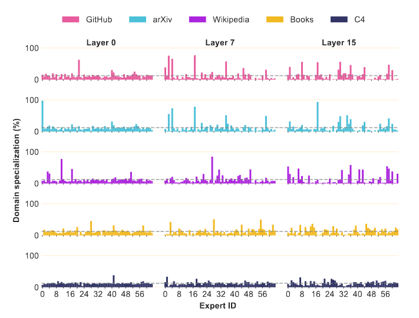
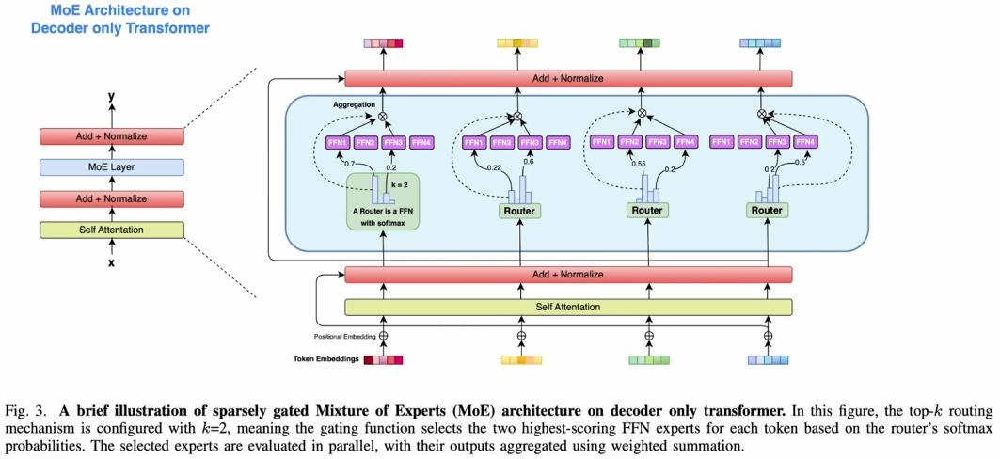
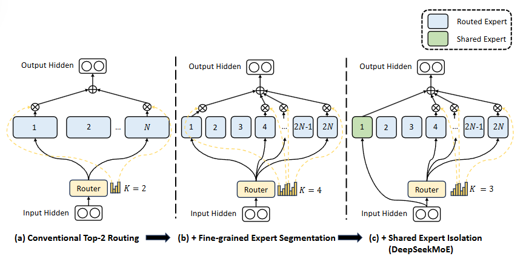

MoE 备忘 <!-- suffix --> [✒️](#todo "TODO(1)")<sup style="color:Gray">1</sup>[📋](#qa "面试问题整理(8)")<sup style="color:Brown">8</sup> <!-- suffix -->
===
<!--START_SECTION:badge-->


<!--END_SECTION:badge-->
<!--info
date: 2025-09-03 08:53:08
toc_title: 'MoE (Mixture of Experts)'
top: false
draft: false
hidden_in_recent: true
level: 0
tags: [transformer]
-->

<!--START_SECTION:keywords-->
> ***Keywords**: MoE (Mixture of Experts, 混合专家模型), [Transformer 改进](./Transformer_改进.md)*
<!--END_SECTION:keywords-->

<!--START_SECTION:paper_title-->
<!--END_SECTION:paper_title-->

<!--START_SECTION:toc-->
- [背景](#背景)
- [MoE 出现的背景与动机](#moe-出现的背景与动机)
- [MoE 的结构 (MoE Layer)](#moe-的结构-moe-layer)
    - [MoE 的优势](#moe-的优势)
- [MoE 的常见优化](#moe-的常见优化)
    - [Fine-grained Expert (细粒度专家)](#fine-grained-expert-细粒度专家)
    - [Shared Expert (共享专家)](#shared-expert-共享专家)
    - [Expert Choice \& Token Choice](#expert-choice--token-choice)
    - [Load Balancing Loss (负载均衡损失)](#load-balancing-loss-负载均衡损失)
    - [Router Z-loss](#router-z-loss)
- [MoE 的训练](#moe-的训练)
- [参考资料](#参考资料)
- [Q\&A](#qa)
<!--END_SECTION:toc-->

---

## 背景

MoE 涉及的几个主要部分:
1. **MoE 模型的架构** (本文重点)
2. MoE 模型的训练
3. MoE 模型在 infer 时的并行策略


## MoE 出现的背景与动机

**背景**
- **Scaling Law (规模化法则)** 已在 LLM 的快速发展中得到验证:  
  - 模型性能可通过以下三方面的 **Scale up** 进行提升:  
    1. **模型规模**  
    2. **训练数据**  
    3. **计算资源**  
- 对于 **Dense 架构**而言, 遵循 Scaling Law 会遭遇计算资源瓶颈, 形成所谓的 **不可能三角**:
  - **模型性能**: 参数越多, 表达能力越强;
  - **计算成本**: 参数越多, 训练与推理成本越高;
  - **模型规模**: 规模越大, 部署与优化难度越高;
- 在 Dense 架构中, 三者无法同时优化, 必须在性能、效率与规模之间做权衡;

**动机**
- MoE 的核心动机就是试图**解耦模型的参数量与计算量**:
    - 通过**稀疏激活 (Sparse Activate)**, 仅使部分专家参与计算, 显著降低 FLOPs;
    - 在相同计算量下, MoE 能容纳更多参数, 从而提升表达能力;
    - 因此, MoE 模型可以做到保持超大参数量的同时控制计算量, 从而突破不可能三角;
- (另一种解释) **增加知识容量** (继续**扩大参数量**):
    - 一般认为, LLM 的知识主要存储在 FFN 中,
    - 将 FFN 拆分为多个专家 (即较小的 FFN), 每个专家可视为承载不同知识的子网络;
    - 增加 Expert 数量可显著提升参数总量, 从而容纳更多知识,
    - 同时, 由于每次仅激活少量 Expert, 计算量保持可控;
- (**猜想**) MoE 属于一种引入**稀疏性**的归纳偏置,
    - **稀疏性常用于捕捉数据中的低维模式**;
    - MoE 的稀疏激活机制可类比于 CNN 的局部连接:
        - CNN 利用卷积的局部性先验 (稀疏连接) 减少计算量并聚焦关键信息;
        - MoE 通过稀疏路由, 将输入动态分配给最相关的 Expert, 从而在保持计算量可控的前提下提升**学习效率**;
    - 这种设计本质上是一种 **人为引入稀疏性的归纳偏置 (Inductive Bias)**;

    <div align='center'></div>

    > [OLMoE](https://arxiv.org/abs/2409.02060): 大部分情况下的领域问题不需要用到所有专家

## MoE 的结构 (MoE Layer)

- **专家 (Experts) 网络**:
    - 多个相对较小的 FFN (专家), 每个专家专注于不同子空间;
- **路由 (Router) / 门控 (Gating)**:
    - 可学习的路由机制, 根据输入选择 Top‑k 专家并分配权重;
- **稀疏激活**:
    - 每个 token 仅激活少数专家 (如 top-1 或 top-2), 其余专家保持静默;
- **负载均衡**:
    - 通过**辅助损失**, 避免专家利用率失衡;
- **嵌入方式**:
    - MoE 层通常替代 Transformer 中的 FFN 层, 其余结构保持不变;
        >  <div align='center'></div>

<details><summary><b>PyTorch 代码</b></summary>

```python
import torch
import torch.nn as nn
import torch.nn.functional as F

class Expert(nn.Module):
    """单个 Expert, 相当于一个小型 FFN"""
    def __init__(self, d_model, d_ff):
        super().__init__()
        self.fc1 = nn.Linear(d_model, d_ff)
        self.fc2 = nn.Linear(d_ff, d_model)

    def forward(self, x):
        # x: [num_tokens, d_model]
        return self.fc2(F.relu(self.fc1(x)))  # [num_tokens, d_model]


class Router(nn.Module):
    """Router: 根据输入 token 选择 Top-K 个专家"""
    def __init__(self, d_model, num_experts, k=2):
        super().__init__()
        self.num_experts = num_experts
        self.k = k
        self.gate = nn.Linear(d_model, num_experts)  # 输出 logits

    def forward(self, x):
        # x: [batch, seq_len, d_model]
        logits = self.gate(x)               # [batch, seq_len, num_experts]
        scores = F.softmax(logits, dim=-1)  # [batch, seq_len, num_experts]

        # 选 Top-K 专家
        topk_scores, topk_indices = torch.topk(scores, self.k, dim=-1)
        return topk_scores, topk_indices  # [batch, seq_len, k]


class MoE(nn.Module):
    """MoE 模块: 替代原 FFN"""
    def __init__(self, d_model, d_ff, num_experts=4, k=2):
        super().__init__()
        self.experts = nn.ModuleList([Expert(d_model, d_ff) for _ in range(num_experts)])
        self.router = Router(d_model, num_experts, k)

    def forward(self, x):
        # x: [batch, seq_len, d_model]

        # 路由
        topk_scores, topk_indices = self.router(x)  # [batch, seq_len, k]

        # 初始化输出
        output = torch.zeros_like(x)  # [batch, seq_len, d_model]

        # 对每个 token 分配 k 个专家
        for i in range(self.router.k):
            expert_idx = topk_indices[..., i]           # [batch, seq_len]
            score = topk_scores[..., i].unsqueeze(-1)   # [batch, seq_len, 1]

            # 遍历专家批量处理
            for e_id in range(len(self.experts)):
                mask = (expert_idx == e_id)     # [batch, seq_len]
                if mask.any():
                    selected = x[mask]          # [num_selected, d_model]
                    processed = self.experts[e_id](selected)  # [num_selected, d_model]
                    output[mask] += score[mask] * processed   # [batch, seq_len, d_model]

        return output


# ===== 测试 =====
if __name__ == "__main__":
    batch, seq_len, d_model, d_ff = 2, 5, 16, 32
    moe = MoE(d_model, d_ff, num_experts=4, k=2)
    x = torch.randn(batch, seq_len, d_model)
    y = moe(x)
    print(y.shape)  # [2, 5, 16]
```

</details>

- **`x[mask]` 操作说明**:
    - 布尔索引只保留掩码为 `True` 的位置, 并对掩码作用的轴按行优先顺序依次取出**压缩成一维**, **未被掩码的后续维度保持不变**;
    - 示例:
        - `mask:    [batch, seq_len]`
        - `x:       [batch, seq_len, d_model]`
        - `x[mask]: [num_selected, d_model]`
        - `num_selected` 等于 `mask` 中 `True` 的数量


### MoE 的优势

> 以下结论来自 [OLMoE](_assets/MoE/[moe.2025.arxiv.01]%20OLMoE.pdf)
- 在所有任务上, **MoE 模型** (OLMoE‑1B‑7B) 都能用**更少的计算量** (FLOPs) 达到**更高的性能**;
- MoE 在达到稠密模型同等性能时,
    > 基于 **OLMoE‑1B‑7B** vs **OLMo‑1B**, 激活参数量接近, 但 MoE 的总参数量更大;
    - 所需 **Token 数仅为 1/3** (即 FLOPs 减少 3 倍);
    - **训练时间约为 1/2**;
        > 由于 MoE 总参数量较大, 训练时的显存开销更高, 导致每秒处理 token 数低于稠密模型;

> 以下结论来自 [Switch Transformers](_assets/MoE/[moe.2022.arxiv.01]%20Switch%20Transformers.pdf)
- **扩展性** (Scaling properties)
    - 随着专家数量的增加, 模型总参数量显著上升, Test Loss 在不断降低, 但每个样本的计算量 (FLOPs) 保持不变;
    - **结论**: 在相同计算量下, 增加专家数可以降低测试损失, 说明**增加稀疏参数规模能提升模型性能**;
- **样本效率** (Sample efficient)
    - 在相同计算量/训练步数/训练时间下, Switch Transformer 收敛更快 (vs T5‑Base/Large);
    - **结论**: 稀疏模型在早期训练阶段就能达到密集模型更晚才能达到的性能, 体现了**更高的样本利用效率**;


## MoE 的常见优化

### Fine-grained Expert (细粒度专家)
> 细粒度专家切分 (Fine‑Grained Expert Segmentation), DeepSeekMoE

- **动机**:
    - 当专家数量有限时, 分配到同一专家的 token 可能包含多种不同类型的知识, 导致 **知识混杂**, 降低专家专化程度;
- **做法**:
    - 在保持 **总专家参数量** 与 **计算成本** 不变的前提下, 将每个专家 FFN **切分为 m 个更小的专家**(中间隐藏维度缩小为原来的 1/m),
    - 同时将 **激活的专家数量增加到原来的 m 倍**, 保证计算量不变,
    - 这种切分显著增加了可组合的专家激活模式, 组合数从 $\binom{N}{K}$ 激增到 $\binom{mN}{mK}$;
        > 例如 $N=16, K=2$, 有 $\binom{16}{2} = 120$ 种组合; 取 $m=4$, $\binom{64}{8}$ 有超过 44 亿种组合
- **效果**:
    - **知识分配更细**: 不同类型的知识被更精准地分配到不同专家中,
    - **专家专化提升**: 每个专家聚焦于更窄的知识领域,
    - **组合灵活性增强**: 提升知识获取的精准度与灵活性;

> [OLMoE](_assets/MoE/[moe.2025.arxiv.01]%20OLMoE.pdf) 证实了 **Fine-grained Expert** 是一个有效的策略, 但是 N 也不是越大越好, 存在上限 (Sweet Point);

<div align='center'></div>

### Shared Expert (共享专家)
> 共享专家隔离 (Shared Expert Isolation), DeepSeekMoE

- **动机**:
    - 不同专家可能需要相同的公共知识 → 多个专家会重复学习这些内容, 造成 **参数冗余** → 削弱专家在差异化知识上的专化能力;
- **做法**:
    - 在细粒度专家切分的基础上, **额外划出 $K_s$ 个共享专家**, 专门存储 **公共知识**,
    - 每个 token **无条件** 路由到这些共享专家, 同时减少其他路由专家的激活数 $K_s$, 以保持计算成本不变,
    - 共享专家始终参与计算, 路由专家则专注于差异化知识;
- **效果**:
    - 公共知识集中存储, 减少冗余; 路由专家聚焦差异化知识, 提升参数效率与专化度;

> [OLMoE](_assets/MoE/[moe.2025.arxiv.01]%20OLMoE.pdf) 指出 **Shared Expert** 在 N 不是很大时, 会大幅降低组合空间的数量, 导致性能反而降低; 作者认为这是一个人为注入的先验, 或许把 **公共专家** 交给模型自己学习会更好, 因此没有采用这个改动;
>> 取 $N = 32, K=4, K_s=1$, 有 $\binom{32}{4} = 35960 \rightarrow \binom{31}{3} = 4495$, 组合数减少了 ~90%;


### Expert Choice & Token Choice
> Token 与 Expert 之间匹配的方式: **Expert 选择 Token** 还是 **Token 选择 Expert**?

- **专家选择 (Expert Choice, EC)**:
    - **专家选择 token**: 每个专家从输入序列中选择固定数量的 token 进行处理;
    - **优点**: 天然保证每个专家处理的 token 数相同, **实现完美负载均衡**, **提升训练吞吐率**, 并且不需要负载均衡损失;
    - **缺点**:
        1. **不适合自回归生成**, EC 依赖于批量 token 的全局排序, 而自回归生成一次只处理一个新 token, 无法满足这种路由需求;
            >  自回归中, 每个 token 只能看见自己之前的 token, 因此每个专家也看不到全部 token;
        2. 可能出现 token 丢弃 (某些 token 未被任何专家选中), 会损害性能 (**尤其是文本任务**);
        3. 也可能出现某些 token 被多个专家处理的情况, 这在某些场景下可能有益 (为重要 token 分配更多计算资源);
- **令牌选择 (Token Choice, TC)**:
    - **token 选择专家**: 每个 token 选择固定数量的专家进行处理;
    - **优点**: 所有 token 都能参与该层的计算和梯度更新 (dropless Token Choice)
    - **缺点**: 可能导致大量 token 选择同一个专家, 从而降低训练效率;
        - **常见做法**: 配合负载均衡损失, 鼓励 token 在专家间均匀分布;
- (Decoder-only 架构) **在相同 token 预算下, TC 在所有任务上都优于 EC**;
    > 以上结论来自 [OLMoE](_assets/MoE/[moe.2025.arxiv.01]%20OLMoE.pdf)

### Load Balancing Loss (负载均衡损失)
> 本质是一个鼓励 Router 输出均匀分布的熵正则化项;

- **动机**:
    - 如果没有额外约束, MoE 模型在训练中会倾向于**只使用少数几个专家**, 导致其他专家几乎不更新, 成为 "**死专家**";
    - 这种不均衡会浪费显存和计算资源, 并可能降低模型性能与泛化能力;
- **做法**:
    - 引入 **负载均衡损失 (Load Balancing Loss, LBL)**, 鼓励 token 在专家间均匀分布;
    - **公式**:
        <div align='center'><a href='_formulas/Transformer_MoE/f_001.js.tex'></a></div>

    - **说明**:
        - 计算每个专家在一个 batch 中接收到的 token 占比 $f_i$,
        - 与该专家获得的总路由概率 $P_i$ 相乘, 然后在所有专家上求和;
        - 将结果乘以**专家总数** $N_E$ 和**权重** $\alpha = 0.01$ (经验值);
- **效果**:
    - 无 LBL 时, 早期几乎所有 token 都集中到单个专家, 其他专家长期闲置;
    - 加入 LBL 后, 专家使用更均衡, 且训练损失和验证损失在仅训练数十亿 token 后就优于无 LBL 的模型;
- **缺点**:
    - LBL 会强制模型让所有专家的使用率大致相等, 从而**限制了模型的灵活性**;
    - 因此 **去掉负载均衡损失** 仍然是一个重要的未来研究方向;


### Router Z-loss
> 本质是一个针对 log-normalizer 的 L2 正则项;

- **动机**: MoE 中, Router 会根据 logits 决定 token 分配给哪些专家;
    - 如果 logits 过大, 可能在 MoE 层的大规模矩阵乘法中引发数值溢出, 导致训练不稳定;
- **公式**:
    <div align='center'><a href='_formulas/Transformer_MoE/f_002.js.tex'></a></div>

    - 其中 $\beta = 0.001$ (经验值)
- **作用**: 惩罚路由器 logits 过大, 提升稳定性;


## MoE 的训练
> ##### TODO

MoE 的思想早有提出 (1991年), Switch Transformer 也是在 2022 年就出现了, 但是 MoE 真正流行却是在 LLM 出现后 (Mixtral‑8x7B 2024), 其中的主要原因就是 MoE 训练困难;

- **训练不稳定性**:
  - 门控决策导致梯度路径不连续, 损失波动较大.
- **通信开销问题**:
  - 在分布式训练中, 专家间的数据传输成为性能瓶颈.
- **批次稀疏性挑战**:
  - 每个专家实际处理样本较少, 梯度估计噪声大, 影响收敛.


## 参考资料

- [\[大模型面试\] 主流LLM为何选用MoE架构? MoE相较Dense的核心优点? LLM不可能三角_哔哩哔哩_bilibili](https://www.bilibili.com/video/BV1vThYz1Ef7/?spm_id_from=333.788.top_right_bar_window_history.content.click&vd_source=ba096786da8fb76742390c0bcea38a01)
- [一文弄懂 Mixture of Experts (MoE) 的前世今生 - 文章 - 开发者社区 - 火山引擎](https://developer.volcengine.com/articles/7390576064247889958)

---

<!--START_SECTION:qa-->
<!--qa_info
subject: 'LLM'  # Transformer, RLHF, SFT, Other
subject_level: 0  # subject 间的排序信号; 对已经设置过的 subject, 取最大值
topic: 'MoE (Mixture of Experts)'  # 默认取文档的 toc_title, 如果有层级结构, 用 · 分隔, 如 'SFT · PEFT'
topic_level: 0  # 同一个 subject 下的排序信号
with_section_title: true  # 如果不需要 section_title
use_section_number: true
-->
## Q&A

<!--START_SECTION:qa_toc-->
- [1. 🏷️ MoE 基础](#1-️-moe-基础)
    - [1.1. ✅ 什么是 MoE (Mixture of Experts)? 它与传统稠密 Transformer 的主要区别是什么?](#11--什么是-moe-mixture-of-experts-它与传统稠密-transformer-的主要区别是什么)
    - [1.2. ✅ 为什么 MoE 能在保持计算成本相对可控的情况下扩展到万亿参数规模?](#12--为什么-moe-能在保持计算成本相对可控的情况下扩展到万亿参数规模)
    - [1.3. ✅ 路由 (Router) / 门控网络 (Gating Network) 是如何为每个 token 选择合适的专家的?](#13--路由-router--门控网络-gating-network-是如何为每个-token-选择合适的专家的)
    - [1.4. ✅ 为什么 MoE 中的 **稀疏激活** 通常只选择少量专家 ( Top-1 或 Top-2 )?](#14--为什么-moe-中的-稀疏激活-通常只选择少量专家--top-1-或-top-2-)
- [2. 🏷️ MoE 架构的路由与负载均衡](#2-️-moe-架构的路由与负载均衡)
    - [2.1. ✅ **Top-k 路由** 与 **Switch 路由** 的差异](#21--top-k-路由-与-switch-路由-的差异)
    - [2.2. ✅ 为什么需要 **负载均衡 (Load Balancing)**? 没有会出现什么问题?](#22--为什么需要-负载均衡-load-balancing-没有会出现什么问题)
    - [2.3. 🚨 🚩 💡 ❓ ⚠️ ⬆️ 🏷️ ✅ 介绍几种常见的负载均衡方法, 并比较](#23-----️-️-️--介绍几种常见的负载均衡方法-并比较)
    - [2.4. 🚨 🚩 💡 ❓ ⚠️ ⬆️ 🏷️ ✅ 负载均衡损失项如何设计以避免专家塌陷?](#24-----️-️-️--负载均衡损失项如何设计以避免专家塌陷)
    - [2.5. ✅ 使用辅助损失解决负载均衡会存在什么问题?](#25--使用辅助损失解决负载均衡会存在什么问题)
    - [2.6. 🚨 🚩 💡 ❓ ⚠️ ⬆️ 🏷️ ✅ 什么是 "无辅助损失均衡 (aux-free balancing)"?](#26-----️-️-️--什么是-无辅助损失均衡-aux-free-balancing)
- [3. 🏷️ MoE 的工程与实现](#3-️-moe-的工程与实现)
    - [3.1. 🚨 🚩 💡 ❓ ⚠️ ⬆️ 🏷️ ✅ 如何设计实验来验证某个 MoE 路由策略是否真正提升了专家的 **"专长分工 (specialization)"**?](#31-----️-️-️--如何设计实验来验证某个-moe-路由策略是否真正提升了专家的-专长分工-specialization)
    - [3.2. 🚨 🚩 💡 ❓ ⚠️ ⬆️ 🏷️ ✅ 在推理阶段, 所有专家参数仍需加载到显存, 可以如何优化显存占用?](#32-----️-️-️--在推理阶段-所有专家参数仍需加载到显存-可以如何优化显存占用)
    - [3.3. 🚨 🚩 💡 ❓ ⚠️ ⬆️ 🏷️ ✅ 什么是 "专家容量 (Expert Capacity)"? 为什么需要? 当 token 超过容量时, 常见的处理策略有哪些?](#33-----️-️-️--什么是-专家容量-expert-capacity-为什么需要-当-token-超过容量时-常见的处理策略有哪些)
    - [3.4. 🚨 🚩 💡 ❓ ⚠️ ⬆️ 🏷️ ✅ MoE 在小数据集下微调时, 为什么容易过拟合或不如稠密模型稳定? 有哪些改进思路?](#34-----️-️-️--moe-在小数据集下微调时-为什么容易过拟合或不如稠密模型稳定-有哪些改进思路)
    - [3.5. 🚨 🚩 💡 ❓ ⚠️ ⬆️ 🏷️ ✅ 如果路由器在训练中出现 **专家塌陷**, 你会如何诊断与修复?](#35-----️-️-️--如果路由器在训练中出现-专家塌陷-你会如何诊断与修复)
    - [3.6. 🚨 🚩 💡 ❓ ⚠️ ⬆️ 🏷️ ✅ 假设你要在一个多模态任务 (文本+图像) 上设计 MoE, 你会如何划分专家?](#36-----️-️-️--假设你要在一个多模态任务-文本图像-上设计-moe-你会如何划分专家)
    - [3.7. ✅ 给定 8 专家, Top-2 策略, 400B 参数的 MoE 层, 估算单 token 实际激活的参数量和 batch size = 1024 时平均每个专家分配的 token 数.](#37--给定-8-专家-top-2-策略-400b-参数的-moe-层-估算单-token-实际激活的参数量和-batch-size--1024-时平均每个专家分配的-token-数)
<!--END_SECTION:qa_toc-->

---

<!-- omit in toc -->
### 1. 🏷️ MoE 基础

<!-- omit in toc -->
#### 1.1. ✅ 什么是 MoE (Mixture of Experts)? 它与传统稠密 Transformer 的主要区别是什么?
> • MoE (混合专家) 是一种在 Transformer 基础上引入 "专家网络 + 路由" 的稀疏化架构; <br>
> • **区别**: 稠密模型每次激活所有参数, MoE 只为每个输入 token 动态选择少数几个专家参与计算, 从而在保持超大参数规模的同时显著降低计算成本. <br>

-   <details><summary><b> 展开详情 ⬇️ </b></summary>

    - **MoE 的核心概念**
        - 专家网络 (Experts): 即多个并行的前馈子网络, 每个子网络 (专家) 可以学习不同的特征或任务模式;
        - 路由 (Router/Gating Network): 根据输入 token 的特征, 计算各专家的得分, 并选择 Top‑k 个专家来处理该 token;
        - 稀疏激活 (Sparse Activation): 每个 token 只激活少量专家, 其余专家不参与计算, 从而减少计算量;

    </details>

<!-- omit in toc -->
#### 1.2. ✅ 为什么 MoE 能在保持计算成本相对可控的情况下扩展到万亿参数规模?
> • 通过 **稀疏激活 (Sparse Activation)** 与 **条件计算 (Conditional Computation)**, 每个 token 在前向传播时只 **激活少量专家** (通常 Top‑1 或 Top‑2), 其余专家保持休眠; 因此 **总参数量可以无限扩展, 但每次实际计算的 FLOPs 与稠密模型相当**. <br>


<!-- omit in toc -->
#### 1.3. ✅ 路由 (Router) / 门控网络 (Gating Network) 是如何为每个 token 选择合适的专家的?
> • 线性层 + Softmax + Top-k 策略 <br>

<!-- omit in toc -->
#### 1.4. ✅ 为什么 MoE 中的 **稀疏激活** 通常只选择少量专家 ( Top-1 或 Top-2 )?
> • 计算成本与效率; 通信与系统开销; 梯度与负载均衡; 经验与实证结果 <br>

-   <details><summary><b> 展开详情 ⬇️ </b></summary>

    - **计算成本与效率**
        - 如果每个 token 激活过多专家, 计算量会接近稠密模型, 失去 MoE 的稀疏优势;
    - **通信与系统开销**
        - 在分布式训练中, 专家往往分布在不同设备;
        - 激活多个专家意味着需要跨设备传输更多 token, 通信瓶颈急剧增加;
    - **梯度与负载均衡**
        - 如果选择过多专家, 每个专家的梯度更新会变得稀释, 导致学习效率下降;
    - **经验与实证结果**
        - 当 `k>2` 时, 计算和通信成本急剧上升, 性能提升有限, 因此很少采用.

    </details>


---

<!-- omit in toc -->
### 2. 🏷️ MoE 架构的路由与负载均衡

<!-- omit in toc -->
#### 2.1. ✅ **Top-k 路由** 与 **Switch 路由** 的差异
> • Top‑k 路由为每个输入选择多个专家; Switch 路由只选择一个专家; <br>
> • 前者能更好利用专家多样性, 但计算和通信开销大; 后者效率更高, 但可能牺牲部分表达能力 <br>

<!-- omit in toc -->
#### 2.2. ✅ 为什么需要 **负载均衡 (Load Balancing)**? 没有会出现什么问题?
> • 防止路由时偏向少数专家; <br>
> • 如果没有负载均衡, 会导致部分专家过载、其他专家闲置, 进而造成 **计算资源浪费**、**训练不稳定**、**专家塌陷** 和 **模型性能下降** 等问题; <br>

-   <details><summary><b> 展开详情 ⬇️ </b></summary>

    - **计算资源浪费**
        - 少数专家持续被选择, 其余专家几乎闲置;
        - GPU/TPU 资源利用率下降, 吞吐量降低;
    - **训练不稳定**
        - 过载专家的梯度会主导更新, 导致训练震荡或收敛变慢;
    - **专家塌陷**
        - 路由器总是选择少数专家, 其他专家得不到训练信号, 无法形成专长;
    - **模型性能下降**
        - 未被使用的专家缺乏训练, 无法学到有效表示;
        - 模型整体表达能力受限, 泛化性能下降;

    </details>


<!-- omit in toc -->
#### 2.3. 🚨 🚩 💡 ❓ ⚠️ ⬆️ 🏷️ ✅ 介绍几种常见的负载均衡方法, 并比较
> •  <br>

-   <details><summary><b> 展开详情 ⬇️ </b></summary>

    - 辅助损失 (Auxiliary Loss, 如 GShard 的平方和损失)
    - 全局均衡 (Global-Batch Balance)
    - 动态偏置 (Dynamic Expert Bias, 如 DeepSeek V3)
    - 本地性约束 (Locality Loss, 如华为 LocMoE)

    > [MoE (Mixture of Experts) 模型中的 Balance Loss](https://www.ymshici.com/tech/2410.html)

    </details>


<!-- omit in toc -->
#### 2.4. 🚨 🚩 💡 ❓ ⚠️ ⬆️ 🏷️ ✅ 负载均衡损失项如何设计以避免专家塌陷?
> •  <br>

-   <details><summary><b> 展开详情 ⬇️ </b></summary>


    </details>

<!-- omit in toc -->
#### 2.5. ✅ 使用辅助损失解决负载均衡会存在什么问题?
> • 辅助损失 (auxiliary loss) 虽然能缓解专家塌陷, 但也带来 **梯度干扰**, **超参敏感**, **任务性能下降**, **通信开销增加** 等问题; <br>

-   <details><summary><b> 展开详情 ⬇️ </b></summary>

    - **梯度干扰**
        - 与主任务梯度方向冲突
        - 收敛慢, 不稳定
    - **超参敏感**
        - 权重难调, 需大量实验
        - 迁移性差; 初期有用, 后期拖累; 需动态调整
    - **任务性能下降**
        - 专家无法自由专化
        - 下游效果变差
    - **通信开销增加**
        - 需统计/同步专家分配
        - 通信负担重

    </details>

<!-- omit in toc -->
#### 2.6. 🚨 🚩 💡 ❓ ⚠️ ⬆️ 🏷️ ✅ 什么是 "无辅助损失均衡 (aux-free balancing)"?
> •  <br>

-   <details><summary><b> 展开详情 ⬇️ </b></summary>


    </details>


---

<!-- omit in toc -->
### 3. 🏷️ MoE 的工程与实现

<!-- omit in toc -->
#### 3.1. 🚨 🚩 💡 ❓ ⚠️ ⬆️ 🏷️ ✅ 如何设计实验来验证某个 MoE 路由策略是否真正提升了专家的 **"专长分工 (specialization)"**?
> •  <br>

-   <details><summary><b> 展开详情 ⬇️ </b></summary>


    </details>

<!-- omit in toc -->
#### 3.2. 🚨 🚩 💡 ❓ ⚠️ ⬆️ 🏷️ ✅ 在推理阶段, 所有专家参数仍需加载到显存, 可以如何优化显存占用?
> •  <br>

-   <details><summary><b> 展开详情 ⬇️ </b></summary>


    </details>

<!-- omit in toc -->
#### 3.3. 🚨 🚩 💡 ❓ ⚠️ ⬆️ 🏷️ ✅ 什么是 "专家容量 (Expert Capacity)"? 为什么需要? 当 token 超过容量时, 常见的处理策略有哪些?
> •  <br>

-   <details><summary><b> 展开详情 ⬇️ </b></summary>


    </details>

<!-- omit in toc -->
#### 3.4. 🚨 🚩 💡 ❓ ⚠️ ⬆️ 🏷️ ✅ MoE 在小数据集下微调时, 为什么容易过拟合或不如稠密模型稳定? 有哪些改进思路?
> •  <br>

-   <details><summary><b> 展开详情 ⬇️ </b></summary>


    </details>

<!-- omit in toc -->
#### 3.5. 🚨 🚩 💡 ❓ ⚠️ ⬆️ 🏷️ ✅ 如果路由器在训练中出现 **专家塌陷**, 你会如何诊断与修复?
> •  <br>

-   <details><summary><b> 展开详情 ⬇️ </b></summary>


    </details>

<!-- omit in toc -->
#### 3.6. 🚨 🚩 💡 ❓ ⚠️ ⬆️ 🏷️ ✅ 假设你要在一个多模态任务 (文本+图像) 上设计 MoE, 你会如何划分专家?
> •  <br>

-   <details><summary><b> 展开详情 ⬇️ </b></summary>


    </details>


<!-- omit in toc -->
#### 3.7. ✅ 给定 8 专家, Top-2 策略, 400B 参数的 MoE 层, 估算单 token 实际激活的参数量和 batch size = 1024 时平均每个专家分配的 token 数.
> • 100B 和 256 个 <br>

-   <details><summary><b> 展开详情 ⬇️ </b></summary>

    - 实际激活的参数量: $400\text{B} \cdot \dfrac{2}{8} = 100\text{B}$
    - 平均每个专家分配的 token 数: $\dfrac{1024 * 2}{8} = 256$

    </details>
<!--END_SECTION:qa-->