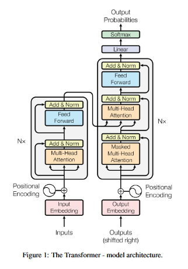

Transformer 模型架构
===
<!--START_SECTION:badge-->

<!--END_SECTION:badge-->
<!--info
date: 2025-09-05 13:47:46
toc_title: 模型架构
top: false
draft: false
hidden: false
level: 99
tag: [dl_transformer]
-->

<!--START_SECTION:keywords-->
> ***Keywords**: Transformer*
<!--END_SECTION:keywords-->

<!--START_SECTION:paper_title-->
<!--END_SECTION:paper_title-->

<!--START_SECTION:toc-->
- [背景](#背景)
- [核心架构](#核心架构)
    - [Encoder-Decoder 框架](#encoder-decoder-框架)
    - [注意力机制 (Attention Mechanism)](#注意力机制-attention-mechanism)
    - [多头注意力 (Multi-Head Attention)](#多头注意力-multi-head-attention)
    - [逐位置前馈网络 (Position-wise FFN)](#逐位置前馈网络-position-wise-ffn)
    - [残差与归一化](#残差与归一化)
    - [正弦位置编码](#正弦位置编码)
        - [位置编码的演进](#位置编码的演进)
- [面试问题整理](#面试问题整理)
<!--END_SECTION:toc-->

---

## 背景

从理论基础、模型细节、编码实现和应用思考等多个维度梳理 Transformer 相关知识点;

## 核心架构

### Encoder-Decoder 框架

- Encoder 层 = **多头自注意力** → **前馈网络** (每层配 **残差连接** 与 **层归一化**)
- Decoder 层 = **掩码自注意力** (因果掩码) → **交叉注意力** (Q 来自解码器, K/V 来自编码器) → **前馈网络** (每层配 **残差连接** 与 **层归一化**)

**三种形态**:
- **Encoder-Decoder** (原版, Seq2Seq)
- **Decoder-only** (Causal LM, 如 GPT)
- **Encoder-only** (如 BERT)

### 注意力机制 (Attention Mechanism)

- **动机/思想**:
    > 针对传统序列模型 (如 RNN) 的 **长程依赖建模困难** 和 **无法并行计算** 的瓶颈;
    - 让模型在处理序列时, 能 **像人类一样动态聚焦于关键信息**, 从而高效捕获全局依赖;
    - 具体到模型中, 即允许序列中的 **任意两个位置直接交互**, 动态计算其 **相关性权重**, 从而实现对 **全局上下文信息的高效捕获与融合**;
    - 支持**并行计算**;
- **作用**: 自注意力机制让模型能够评估输入序列中 **不同 token 的重要性**, 并动态调整它们对输出的影响;
- **公式 (缩放点积注意力)**:
    $$
    \text{Attention}(Q,K,V)=\text{softmax}\left(\frac{QK^\top}{\sqrt{d_k}}+M\right)V
    $$
    - 其中:
        <!-- - $Q=X_QW^Q$, $K=X_KW^K$, $V=X_VW^V$; -->
        - $M$: **掩码**, 用于屏蔽无效位置 (未来 token 或 padding token), 屏蔽处 $M = \text{-inf}$ (或极大负数), 其余处 $M = 0$
        - $d_k$: **输入 $K$ 的维度** (假设输入 `x` 的形状为 `[batch, seq_len, n_hidden]`, 则 $d_k$ = `n_hidden`)
            > **为什么除以 $\sqrt{d_k}$**: 点积 ($QK^\top$) 尺度随 $d_k$ 增大而增大, 将 **softmax** 函数推入梯度极小的区域 (梯度消失); 除以 $\sqrt{d_k}$ 可以稳定梯度;
    - **自注意力 (Self-Attention)**:
        - **Encode** 使用, $Q$, $K$, $V$ 均来自同一输入;
    - **掩码自注意力 (Masked Self-Attention)**:
        - **Decoder** 使用, 在计算 Decoder 的自注意力分数时, 通过一个**掩码 (mask)** 将当前位置之后的所有位置设置为负无穷或极大负数 → 经过 softmax 后, 这些位置的权重就变成了 0;
        - **做法**: 将掩码 $M$ 的 **上三角** 位置置为负无穷或极大负数;
    - **交叉注意力 (Cross-Attention)**:
        - **Decoder** 使用, $Q$ 来自**解码器**上一输出, $K$, $V$ 来自**编码器**最终输出;

### 多头注意力 (Multi-Head Attention)

- **动机/直觉**:
    - 不同头学习不同关系子空间 (语法、共指、位置相对性等) → 增强了模型的表达能力;
    - 每个头以较低维子空间提升稳定性与并行度;
- **做法**:
    - 将 $Q$, $K$, $V$ 通过 $h$ 个不同的线性投影, 然后对每个头独立进行注意力计算, 得到 $h$ 个输出, 最后将这些输出拼接起来后, 再做一次线性投影;
- **公式**:
    $$
    \text{MultiHead}(Q, K, V) = \text{Concat}(\text{head}_1, ..., \text{head}_h) W^O
    $$
    - 其中
        $$\text{head}_i = \text{Attention}(Q W_i^Q, K W_i^K, V W_i^V)$$

### 逐位置前馈网络 (Position-wise FFN)

- **作用**:
    - 提供非线性变换, 增加模型的容量 (capacity);
    - FFN 中的参数越多, 模型表达能力越强 → FFN 中的参数占整个模型中的大多数;
    - **逐位置 (position-wise)**: 对序列中每一个 token 的向量表示, 独立地应用同一个前馈网络 (**共享参数**);
- **结构**: 两层线性层 + 非线性激活 (ReLU/GELU/SwiGLU 等)
- **公式**:
    $$
    \text{FFN}(x) = \text{ReLU}(x W_1 + b_1) W_2 + b_2
    $$
    - 张量形状变化: `[batch, seq_len, d_model] -> [batch, seq_len, d_ff] -> [batch, seq_len, d_model]`
    - 中间扩展维度 (`d_ff`) 通常是隐藏维度 (`d_model`) 的 **3~4 倍** (原文为 4 倍: `d_model = 512, d_ff = 2048`)

### 残差与归一化

- **目的**:
    - **残差**: **缓解梯度消失/爆炸**, 让模型更容易训练到很深;
    - **归一化**: **稳定每层的输入分布, 减少内部协变量偏移, 加速收敛**; 通过可学习的缩放和平移参数保留表达灵活性;
- **归一化位置**:
    - **Post-LN** (原版, 子层后归一化) - **`LayerNorm( x + Sublayer(x) )`**
    - **Pre-LN** (现代常用, 子层前归一化, **训练更稳定**) - **`x + Sublayer( LayerNorm(x) )`**

**数据通路**
- **编码端**: 输入 tokens → **令牌嵌入** + **位置编码** → \[Encoder Layer\] × N → **上下文表示**
- **解码端**: 输出 tokens (shifted right) → **令牌嵌入** + **位置编码** → \[Decoder Layer\] × N → **输出分布** (下一个 token 概率)

### 正弦位置编码
> Sinusoidal position encoding

- **背景/动机**: 自注意力机制具有 **置换不变/等变性**; 因此需要显式地注入 **位置信息** 来区分不同顺序的序列;
- **方法**: 为输入嵌入 (Input Embedding) 添加一个包含位置信息的编码
    - 使用不同频率的正弦和余弦函数来编码位置信息;
    - **公式**:
        - $PE_{(pos, 2i)} = \sin(\dfrac{pos}{10000^{2i/d_{model}}})$
        - $PE_{(pos, 2i+1)} = \cos(\dfrac{pos}{10000^{2i/d_{model}}})$
        - 其中 $pos$ 是 token 的位置索引, $i$ 是位置编码向量的分量索引;
    - **优点**:
        - 计算简单;
        - 有一定**外推性**, 可以表示比训练集中更长的序列位置;

#### 位置编码的演进
> [Transformer位置编码](./位置编码.md)

**参考资料**
- 各种**绝对**/**相对位置编码**
    > [让研究人员绞尽脑汁的Transformer位置编码 - 科学空间|Scientific Spaces](https://kexue.fm/archives/8130)
- **旋转位置编码 (Rotary Postional Encoding, RoPE)**
    > [Transformer升级之路: 2、博采众长的旋转式位置编码 - 科学空间|Scientific Spaces](https://kexue.fm/archives/8265)  
    > [设计位置编码 - HuggingFace Blog](https://huggingface.co/blog/zh/designing-positional-encoding)  

## 面试问题整理
> [Transformer面试题](./Transformer面试题.md)