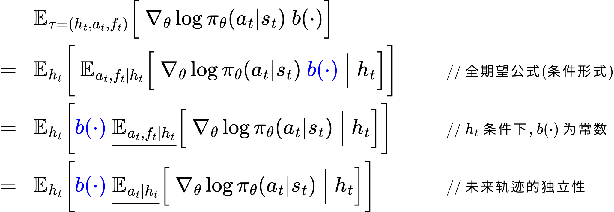

策略梯度定理及其推导 <!-- suffix --> 🧣 <!-- suffix -->
===
<!--START_SECTION:badge-->

<!--END_SECTION:badge-->
<!--info
date: 2025-10-03 12:58:41
toc_title: '策略梯度定理及其推导'
top: false
draft: false
thorough: true
hidden_in_recent: false
section_number: false
omit_in_tag_toc: false
level: 98
tags: []
-->

<!--START_SECTION:keywords-->
> ***Keywords**: [偏好学习](RLHF.md)*
<!--END_SECTION:keywords-->

<!--START_SECTION:paper_title-->
<!--END_SECTION:paper_title-->

<!--START_SECTION:toc-->
- [背景](#背景)
- [推导](#推导)
    - [基本形式](#基本形式)
    - [Q 函数形式](#q-函数形式)
    - [A 函数形式](#a-函数形式)
- [附录](#附录)
    - [Score Function 恒等式](#score-function-恒等式)
    - [基线不变性](#基线不变性)
- [注释](#注释)
    - [注: 基本形式的直观理解](#注-基本形式的直观理解)
    - [注: 状态动作视角与稳态分布视角的等价性](#注-状态动作视角与稳态分布视角的等价性)
    - [注: 边缘化操作 (交换求和顺序的物理含义)](#注-边缘化操作-交换求和顺序的物理含义)
<!--END_SECTION:toc-->

---

## 背景
> [_强化学习基础_](./RLHF_强化学习基础.md)

- 在强化学习中, 我们的目标是 **最大化策略 $\pi_{\theta}$ 的目标函数 $J(\theta)$** (一般是 **期望回报**); 
    - 这一过程被称为 **策略优化 (Policy Optimization)**.
- 由于 **期望回报关于策略参数的梯度通常无法直接求解**, 所以一般采用 **梯度上升** 等迭代方法来优化策略;
- **策略梯度定理**:
    - 目标函数 $J(\theta)$ 关于策略参数 $\theta$ 的 **梯度**, 可以表示为该函数在基于当前策略产生的某个分布下, 关于 **策略对数似然** 的 **期望**.
- **意义**: 
    - 这使我们可以通过 <u>**采样**</u> 的方式来对梯度进行无偏估计;
- 下面是 **策略梯度定理** 在不同分布下的等价形式, 通过不同视角/采样方法, 为具体实现提供不同的估计途径:
    - **基本形式** (基于 **长期回报** 与 **轨迹分布**):
        

    - **Q 函数形式** (基于 **价值估计** 和 **状态-动作分布**):
        

    - **A 函数形式** (基于 **优势估计**):
        

        > _实际算法一般都采用 A 函数形式, 以 **降低方差**, 如 **PPO**._

## 推导
> 以下推导旨在求得期望回报 $J(\theta)$ 关于策略参数 $\theta$ 梯度的具体期望表达式;

> 🚨**以下推导统一使用 *相对折扣记法***, 即 $\displaystyle G_t = \sum_{k=t}^{\infty}\gamma^{k-t}R_{k+1} = \sum_{k=t}^{\infty}\gamma^{k-t}r_{k+1}(s_t, a_t)$.
>> 注: ***绝对折扣记法*** $\displaystyle \tilde{G}_{t} = \sum_{k=t}^{\infty}\gamma^{k}R_{k+1} = \gamma^t G_t$, 两者差了一个 $\gamma^t$ 因子;  
>> 物理含义: 相对记法 **以当前时刻为基准进行折扣**, 绝对记法 **以轨迹起点为基准进行折扣**.

<!--START_SECTION:keyword-->
<!--keyword_info
name: ''
extra_url: false
-->
### 基本形式
<!--END_SECTION:keyword-->
> 也称为 **REINFORCE 策略梯度公式**

> **推导目标**: 
> - 从目标函数出发:
>   

>
> - 得到策略梯度的基本形式:
>   

>
>> [_💡注: 基本形式的另一种表示_](#注-基本形式的另一种表示)

>> [_💡注: 基本形式的直观理解_](#注-基本形式的直观理解)

---

- 对 $J(\theta)$ 求梯度:
    

    > ◦ **积分域 (轨迹空间 $\mathcal{T}$) 与参数无关**: 策略只影响轨迹出现的概率分布, 而不会改变轨迹集合本身;  
    > ◦ 同时其他正则条件默认成立: **策略关于参数可微, 且积分收敛良好**;  
    > 因此可以安全地 **交换积分与梯度**.  
- 其中轨迹分布: 
    

- 根据 **对数微分性质**:
    

- 代回, 得:
    

    > 该公式是 [Score Function 恒等式](#score-function-恒等式) 的重要推论.
- 展开 $\nabla_\theta \log p_\theta(\tau)$:
    

    > ◦ 初始项与环境项不含参数 $\theta$, 因此梯度为零;  
    > ◦ 这表明我们 **不需要知道环境的转移概率 $P(s_{t+1}|s_t,a_t)$, 只需采样轨迹即可估计梯度**.  
- 代回, 得:
    

- 根据 [**基线不变性**](#基线不变性), 可证:
    

- 因此:
    

    > 因为 $G_t$ 依然是从分布 $\tau\sim p_\theta(\tau)$ 中采样获得, 所以不需要修改期望下标.
- **推导完毕**.

---

<!--START_SECTION:keyword-->
<!--keyword_info
name: 'Q函数形式'
extra_url: false
-->
### Q 函数形式
<!--END_SECTION:keyword-->
> 推导目标:
> - 从 **轨迹视角** 的基本形式出发:
>   

>
> - 到 **状态-动作视角** 的 Q 函数形式:
>   

>
>   其中  
>   ◦ $\ p_t(s,a)$ 是轨迹分布 $p_\theta(\tau)$ 关于 **状态-动作对 $(s,a)$** 在时间 $t$ 的 **边缘分布**.  
>   ◦ $\ Q^{\pi_\theta}(s_t, a_t) = \mathbb{E}_{\tau \sim p_\theta(\tau)} \left\lbrack\ G_t \ |\ s_t, a_t \ \right\rbrack$.  
>> [_⚠️注: Q 函数形式的一种不规范写法_](#注-q-函数形式的一种不规范写法)
> - 再到 **稳态分布** 下的 Q 函数形式:
>   

>
>   ◦ 其中 $\displaystyle d^{\pi_\theta}(s) = (1 - \gamma) \sum_{t=0}^{\infty} \gamma^t \ p_t(s_t = s | \pi_\theta)$ 是 **(归一化) 折扣状态访问分布**.  
>   ◦ 所谓 **稳态分布**, 是指在固定策略下, 系统的状态分布在 $t \to \infty$ 时收敛到一个不随时间变化的分布, 因此可以 **省略时间下标**.  
>> [_💡注: 状态动作视角与稳态分布视角的等价性_](#注-状态动作视角与稳态分布视角的等价性)

---

- 根据期望的线性性质, 交换求和与期望, 有:
    

- 对每个固定的时间步 $t$, 应用 **全期望公式**, 有:
    

    > 通过这一变换, 我们将原来关于 **轨迹 $\tau$** 的期望, 转化为了关于 **特定时刻下状态-动作对 $(s_t,a_t)$** 在其边缘分布 $p_t(s_t,a_t)$ 下的期望;  
- **关键观察**:
    - 在给定 $s_t, a_t$ 条件下, $\boxed{\nabla_\theta\log \pi_\theta(a_t|s_t) \cdot \gamma^t}$ 是一个 **确定性常数**.
    - 因此可以将其提出内层期望, 即:
    

- **第一阶段推导完毕**.
> [*💡注: 以上推导过程也被称为 **边缘化操作***](#注-边缘化操作-交换求和顺序的物理含义)

---

- 将状态-动作视角的策略梯度展开:
    

- 边缘分布 $p_t(s_t, a_t)$ 本身是关于 $s_t$ 和 $a_t$ 的联合分布, 进一步分解:
    

- 代入, 得:
    

- 调整求和顺序, 并提取出 $\gamma^t$, 有:
    

    > 此时最外层的状态已经不再依赖于特定时间步, 因此 **将哑变量 $s_t$ 替换为 $s$, 以避免歧义**;
- 注意到:
    

- 代入, 得:
    

    > 此时公式中已不含时间 $t$, 因此把 **哑变量 $s_t, a_t$** 替换为 $s$ 和 $a$, **表明它们已不再是依赖特定时间步的变量**, 而是对所有可能状态和动作的求和.

    > 从定义来说, $d^{\pi_\theta}(s)$ 是折扣下状态 $s$ 的**稳态分布**, 它已经包含了所有时间步的加权平均, 因此不再依赖 $t$.

    > 常量系数 $\frac{1}{1 - \gamma}$ 一般被吸收到学习率中.
- **第二阶段推导完毕**.

---

<!--START_SECTION:keyword-->
<!--keyword_info
name: 'A函数形式'
extra_url: false
-->
### A 函数形式
<!--END_SECTION:keyword-->

> 推导目标:
> - 从 Q 函数形式出发:
>   

>
> - 得到策略梯度的 A 函数形式:
>   

>
>   其中 $A^{\pi_\theta}(s, a) = Q^{\pi_\theta}(s, a) - V^{\pi_\theta}(s)$.  

- 因为状态价值函数 $V^{\pi_\theta}(s)$ **不依赖于当前动作 $a$**, **满足基线函数性质**;
- 根据 [基线不变性](#基线不变性), 有:
    

- 代入, 得:
    

- **推导完毕**.

---

## 附录

<!--START_SECTION:keyword-->
<!--keyword_info
name: 'Score Function 恒等式'
extra_url: false
-->
### Score Function 恒等式
<!--END_SECTION:keyword-->
> 

<!-- > 即 **得分函数的期望为零**. -->

- 定义 **Score Function (得分函数)**:
    - 对于一个参数化的概率分布 $p_\theta(x)$, 其 **Score** 被定义为 **对数似然函数关于参数 $\theta$ 的梯度**:
    

- **Score Function 恒等式** 表明 **得分函数的期望为零**.
- **证明**:
    

    > 正则条件: 1) 积分域与参数无关, 2) 函数关于参数可微,  3) 积分收敛良好
- **重要推论**:
    - 对于一个随机变量 $x \sim p_\theta(x)$ 和一个 (几乎处处) 可微的函数 $f(x)$, **只要积分和求导/求和可交换** (一般都满足), 则以下等式成立:
        

        > 这个公式通常被称为 **REINFORCE 恒等式** 或 **Likelihood Ratio 恒等式**, 是 **策略梯度定理的基石**.
    - **直观理解**: 该恒等式将一个**期望的梯度**, 转化为了另一个**期望**;
        - 这意味着不需要知道 $f(x)$ 本身关于 $\theta$ 的梯度, 只需要知道概率分布 $p_\theta(x)$ 关于 $\theta$ 的梯度 (即 Score Function), 就可以估计出期望 $\mathbb{E}\left\lbrack\ f(x) \ \right\rbrack$ 的梯度; 
        - 这对于 $f(x)$ 不可微或者是一个黑盒函数的情况至关重要.

---

<!--START_SECTION:keyword-->
<!--keyword_info
name: '基线不变性'
extra_url: false
-->
### 基线不变性
<!--END_SECTION:keyword-->
> 设 $b(\cdot)$ 是任意 **不依赖于当前动作 $a_t$** 的函数 (称为基线), 则:
> 

>  
> **推论 1**:对于任意回报函数 $G(\tau)$ 和基线 $b(\cdot)$, 有:
> 

>
> **推论 2**: 整条回报 $G(\tau)$ 可被替换为从时刻 $t$ 开始的折扣回报 $\gamma^t G_t$:
> 

>
>> 其中 $\displaystyle G_t = \sum_{k=t}^{\infty} \gamma^{k-t}\ R_{k+1}$

- 根据期望的线性性质, 交换求和与期望:
    

- 下证对于 **每个固定的时刻 $t$**, 有:
    

1. **轨迹分解**:
    - 定义:
        

        其中: 
        - $h_t = (s_0,a_0,r_0,\dots,s_{t-1},a_{t-1},r_{t-1},s_t)$ : 到时刻 $t$ 的历史, **含 $s_t$**;
        - $a_t$ : 时刻 $t$ 的动作;
        - $f_t = (r_t,s_{t+1},a_{t+1},r_{t+1},\dots,s_T)$ : 未来轨迹.
    - 根据 **联合分布的链式法则**, 将轨迹概率分解为:
        

    - 因为策略 $\pi_\theta(a_t|s_t)$ 满足 **马尔可夫性**, 动作 $a_t$ 只与状态 $s_t$ 有关, 即:
        

    - 即:
        

2. **关键观察**:
    - 按定义, 基线 $b(\cdot)$ 只依赖于状态 $s_t$, 而 $s_t$ 完全由历史 $h_t$ 决定; 
    - 因此, **在给定 $h_t$ 条件下, $b(\cdot)$ 是常量**
3. **全期望公式展开**:
    

    > **未来轨迹的独立性**: 在给定 $h_t$ 条件下, $f_t$ 与被积函数 $\nabla_\theta\log \pi_\theta(a_t|s_t)$ 相互独立.
4. **内层期望分析**:
    

    > [_Score Function 恒等式_](#score-function-恒等式)
5. **得出结论**:
    

    > **证毕**.
6. **推论 1** 证明: 
    - 根据期望的线性性质, 显然有:
    

    > **证毕**.
7. **推论 2**:
    - 等价于证明:
    

    - 根据 $G_t$ 定义, 以及 $G(\tau) = G_0$, 令
    

    - $b_t$ 的依赖至 $t-1$ 时刻为止, 即 **不依赖当前动作 $a_t$**, 满足基线函数性质.
    > **证毕**.

---

## 注释

### 注: 基本形式的直观理解
> 因果性 (Causality): 在时刻 $t$ 所采取的动作 $a_t$ 只能影响在 $t$ 和之后的奖励, 而与 $t$ 之前的回报无关.
- $\nabla_\theta\log \pi_\theta(a_t|s_t)$ 只影响 **未来** 的动作选择;
- 在给定历史的条件下, **过去的回报** 与 **未来的动作概率** $\nabla_\theta \log \pi_\theta(a_t | s_t)$ 是统计独立的;
    - 因此 **过去的回报** 不能为如何调整未来动作的概率提供有效的梯度信号.
- 这个性质确保了策略梯度只依赖于动作的 **未来后果**.

---

<!-- omit in toc -->
### 注: 基本形式的另一种表示
> 

>
> 我认为的两种解释:  
> 1. 这里的 $G_t$ 实际上是 **绝对折扣回报**, 即 $\displaystyle \tilde{G}_t = \sum_{k=t}^{\infty}\gamma^{k}R_{k+1}$, 与相对折扣回报正好差一个 $\gamma^t$ 因子;
> 2. 在实际优化中, 系数 $\gamma^t$ 的 **平均缩放效应** 通过调整 **学习率** 做了部分补偿, 因此被省略了.

---

<!-- omit in toc -->
### 注: Q 函数形式的一种不规范写法
> 一开始我把状态-动作视角的 Q 函数形式写作:
> 

>
> 即把 $\sum_{t=0}^{\infty}$ 写在期望内;

> **这种写法是有问题的**, 因为这里期望下标 $s_t,a_t \sim p_t(s_t,a_t)$ 中的 **边缘分布 $p_t(s_t,a_t)$** 是依赖于时间 $t$ 的.

> 如果把 $\sum_{t=0}^{\infty}$ 写在期望内, 相当于说, 你从 $p_t(s_t,a_t)$ 采样了一对 $(s_t, a_t)$, 然后可以从中得到了 $t=0,1,2,...$ 的整条轨迹 $(s_0,a_0,s_1,a_1,...)$, 这显然是不对的.

---

### 注: 状态动作视角与稳态分布视角的等价性

> 两种形式的等价性:
> - 我们可以利用 **全期望公式** 或 **联合概率分解** 等工具, 将关于轨迹分布 $p_\theta(\tau)$ 的期望, 转化为关于 **边缘分布 $p_t(s,a)$** 的期望之和.

> - 这两种视角在数学上是等价的, 但提供了不同的理解和实现路径:
>   - **状态-动作视角** 显式地按时间步分解, 强调每个 $(s_t, a_t)$ 对梯度的贡献与其出现的时间步 $t$ 直接相关 (通过 $\gamma^t$ 折扣);
>   - **稳态分布视角** 则通过 **折扣状态访问分布 $d^{\pi_\theta}(s)$** 将所有时间步的贡献 "折叠" 起来, 形成一个 **与时间步无关** 的期望形式.

> - ~~在实际应用中, 我们 **不显式计算 $d^{\pi_\theta}(s)$, 而是通过采样轨迹来近似这个分布**.~~  
> - (正相反,) 在实际应用中, 我们一般 **不采样完整的轨迹**, 也 **不显式计算 $d^{\pi_\theta}(s)$** (因为这需要遍历所有可能的状态和轨迹), 
> - 而是利用一个关键事实: **从环境中按照策略 $\pi_\theta$ 交互产生的状态序列, 其经验分布会自动收敛到折扣状态访问分布 $d^{\pi_\theta}(s)$**;
> - 因此, 我们通常 **不会采样并存储完整的无限长轨迹**, 而是通过与环境在线交互 (或从经验回放池中采样) 得到的状态-动作对 $(s, a)$, 其背后的状态分布自然近似于 $d^{\pi_\theta}(s)$; 
> - 这使得我们可以直接使用稳态分布视角的公式进行随机梯度更新, 而无需显式地按时间步进行求和与折扣

---

### 注: 边缘化操作 (交换求和顺序的物理含义)
> 边缘化: 把联合分布投影到某个子集变量上

- 定义
    - 完整轨迹 : $\tau = (s_0,a_0,\dots,s_t,a_t,\dots)$
    - 关于轨迹 $\tau$ 的函数 : $f(\tau)$
    - 关于状态动作对在时间步 $t$ 的函数 : $f_t(s_t,a_t)$
- 根据边缘分布的定义:
    

- 通过 **边缘化操作**, 将对完整轨迹 $\tau$ 的期望
    

  转化为对 **特定时间步状态-动作对** 在边缘分布下的期望之和
    

  > 这就是 **交换求和顺序的物理含义**
- 其中 $\boxed{p_t(s_t,a_t)}$ 为关于 $(s_t,a_t)$ 在时间步 $t$ 的边缘分布:
    

---
