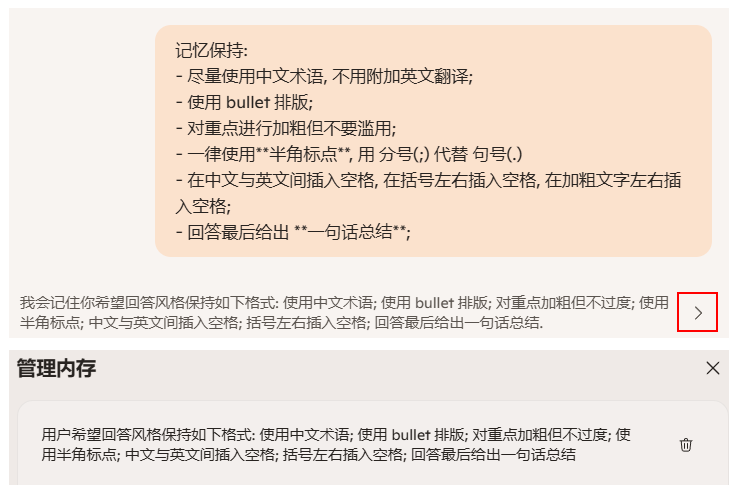

Copilot (Edge 版) 备忘
===
<!--START_SECTION:badge-->
<!--END_SECTION:badge-->
<!--info
date: 2025-11-13 00:59:32
toc_title: 'Copilot_备忘'
top: false
star: false
draft: false
thorough: false
out_of_date: false
hidden_in_recent: true
section_number: false
omit_in_tag_toc: false
level: 0
tags: [ai_tool]
algo_tags: []
-->

<!--START_SECTION:keywords-->
> ***Keywords**: Copilot_备忘*
<!--END_SECTION:keywords-->

<!--START_SECTION:paper_title-->
<!--END_SECTION:paper_title-->

<!--START_SECTION:toc-->
- [记忆保持](#记忆保持)
- [隐私管理 (边栏模式)](#隐私管理-边栏模式)
- [工具栏图标消失解决方法](#工具栏图标消失解决方法)
<!--END_SECTION:toc-->

---

### 记忆保持

- **用法**: 在需要长期记忆的 Prompt 前使用 **"请记住:/记忆保持:"** 等类似提示, 就可以将后续内容保存到 **内存中**:
    - 实际使用中, 当上下文太长时, 似乎还是会遗忘; 也可能是优先级会低于当前上下文的命令;
- **示例**:
    

### 隐私管理 (边栏模式)
> 右上角 `···` → `设置` → `隐私`
- 建议关闭 "上下文线索" 和 "个性化记忆";
- 关闭的原因跟隐私无关, 只是在使用中发现对 **重复提问** 可能会抓取历史回答, 有时重复提问本来就是为了多样性, 如果回答一样就没有意义了;
- 如果真的需要参考某选项卡, 可以显式 @;
<!-- - 实际使用中, Copilot 似乎还会抓取历史对话摘要作为 **记忆**; -->

### 工具栏图标消失解决方法
> [edge更新后工具栏中 copilot 图标消失 - Microsoft Q&A](https://learn.microsoft.com/zh-cn/answers/questions/5606011/edge-142-0-3595-53-\(-\)-\(64-\)-copilot)

- 打开 `%APPDATA%\..\Local\Microsoft\Edge\User Data\Local State` 文件;
- 找到 `variations_country` 键值, 修改为 `US` (`CN` 时, Copilot按钮不显示)

<!--## 相关问题-->
<!--START_SECTION:related_problems-->
<!--END_SECTION:related_problems-->