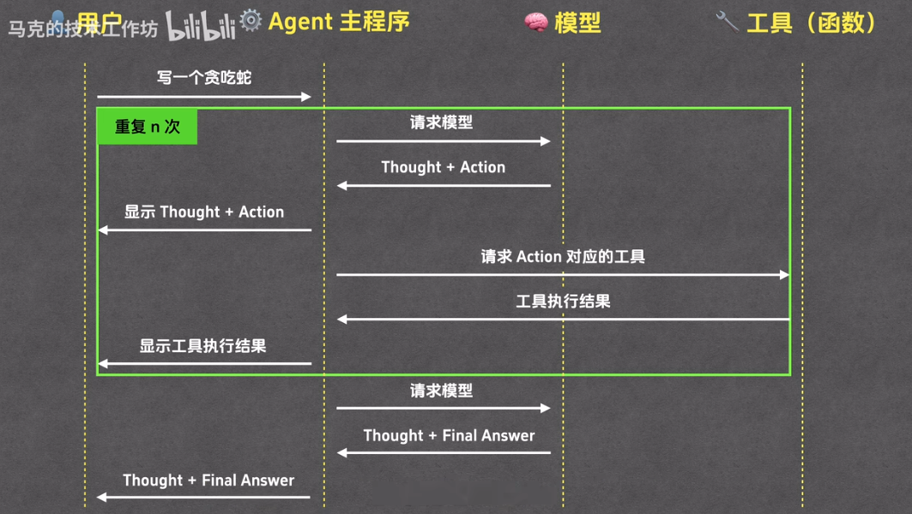
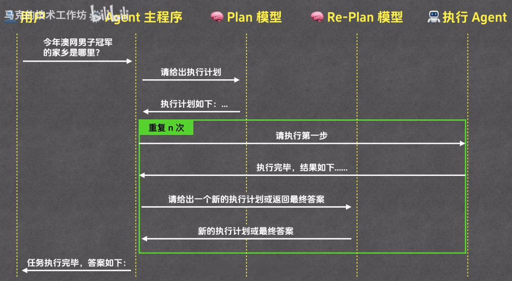

Prompt Engineering
===
<!--START_SECTION:badge-->
<!--END_SECTION:badge-->
<!--info
date: 2025-11-23 17:52:54
toc_title: 'Prompt Engineering'
top: false
star: false
draft: false
thorough: false
out_of_date: false
hidden_in_recent: true
section_number: false
omit_in_tag_toc: false
level: 0
tags: [llm_agent]
algo_tags: []
-->

<!--START_SECTION:keywords-->
> ***Keywords**: LLM_Prompt*
<!--END_SECTION:keywords-->

<!--START_SECTION:paper_title-->
<!--END_SECTION:paper_title-->

<!--START_SECTION:toc-->
- [ReAct (Reasoning and Acting)](#react-reasoning-and-acting)
- [Plan \& Execute](#plan--execute)
- [反思 (Reflexion)](#反思-reflexion)
- [Debate (辩论)](#debate-辩论)
    - [参考资料](#参考资料-3)
- [Q\&A](#qa)
<!--END_SECTION:toc-->

---

<!--START_SECTION:keyword-->
<!--keyword_info
name: 'ReAct'
extra_url: false
with_keywords: false
-->
## ReAct (Reasoning and Acting)
<!--END_SECTION:keyword-->

<!-- omit in toc -->
### 核心思想
- 让大模型在解决问题时, 将 **推理 (Reasoning)** 和 **行动 (Acting)** 交替进行, 形成交互式闭环;

<!-- omit in toc -->
### 工作流程
> ReAct 框架按照一个固定的格式来循环执行步骤, 这个循环通常包含三个部分
- **1. Thought (思考)**
    - 模型的 **推理部分**, 解释对问题的理解, 分解问题, 制定计划
    <!-- - 这里的计划可以是完整的步骤, 也可以只是下一步动作; -->
- **2. Action (行动)**
    - 模型的 **执行部分**, 根据上一步的思考, 决定一个具体的行动, **这个行动通常是一个调用外部工具的指令**;
- **3. Observation (观察)**
    - 环境的 **反馈部分**, 系统执行了 Action 后, 将结果作为 Observation 返回给模型

> [Agent 的概念、原理与构建模式 (18:56) — 马克的技术工作坊 - 哔哩哔哩_bilibili](https://www.bilibili.com/video/BV1TSg7zuEqR?t=1135.7)

<!-- omit in toc -->
### 运行示例
> **问题**: "珠穆朗玛峰的高度是多少米? 它比黄山高多少?"

- **Thought 1**: 用户问了两个问题; 首先需要知道珠穆朗玛峰的具体高度; 我可以使用搜索工具来查找这个事实信息;
    - **Action 1**: `Search: 珠穆朗玛峰 高度 米`
    - **Observation 1**: `珠穆朗玛峰的岩面高约为 8848.86 米;`

<b>♦️ 展开详情 ♦️</b>

- **Thought 2**: 好的, 我得到了第一个答案; 现在需要回答第二个问题, 比较它和黄山的高度; 所以我需要先知道黄山的高度;
    - **Action 2**: `Search: 黄山 高度 米`
    - **Observation 2**: `黄山莲花峰海拔约为 1864.8 米;`

- **Thought 3**: 现在我有了两个高度; 我需要计算它们的差值; 我可以使用计算工具来执行这个算术;
    - **Action 3**: `Calculate: 8848.86 - 1864.8`
    - **Observation 3**: `计算结果为: 6984.06`

- **Thought 4**: 现在我已经收集齐了所有信息; 我可以给出最终答案了;
    - **Final Answer**: 珠穆朗玛峰高约8848.86米; 它比黄山（高约1864.8米）高出约6984.06米;

<!-- omit in toc -->
### 参考资料
- [ReAct 框架 | Prompt Engineering Guide](https://www.promptingguide.ai/zh/techniques/react)
- [\[2210.03629\] ReAct: Synergizing Reasoning and Acting in Language Models](https://arxiv.org/abs/2210.03629)

---

<!--START_SECTION:keyword-->
<!--keyword_info
name: 'Plan & Execute'
extra_url: false
with_keywords: false
-->
## Plan & Execute
<!--END_SECTION:keyword-->

<!-- omit in toc -->
### 核心思想
- 通过 **分工**, 将复杂任务的过程拆分为两个阶段:
    - **1. 规划阶段**
        - 由一个专门的 "**规划者 (Planner / Re-Planner)**" 来制定计划;
    - **2. 执行阶段**
        - 由一个或多个 "**执行者 (Executor)**" 来忠实地执行计划中的每一步;
- 旨在通过 **分离规划和执行** 来提升复杂任务处理的可靠性和效率.

    

    > [Agent 的概念、原理与构建模式 (21:23) — 马克的技术工作坊 - 哔哩哔哩_bilibili](https://www.bilibili.com/video/BV1TSg7zuEqR?t=1282.9)

<!-- omit in toc -->
### 参考资料

- [\[2305.04091\] Plan-and-Solve Prompting: Improving Zero-Shot Chain-of-Thought Reasoning by Large Language Models](https://arxiv.org/abs/2305.04091)

<!-- omit in toc -->
### 参考实现

- [Plan-and-Execute - LangGraph](https://langchain-ai.github.io/langgraph/tutorials/plan-and-execute/plan-and-execute/)

---

<!--START_SECTION:keyword-->
<!--keyword_info
name: 'Reflexion'
extra_url: false
with_keywords: false
-->
## 反思 (Reflexion)
<!--END_SECTION:keyword-->

<!-- omit in toc -->
### 参考资料
- [自反思 (Self-Reflexion) | Prompt Engineering Guide](https://www.promptingguide.ai/zh/techniques/reflexion)
- [\[2303.11366\] Reflexion: Language Agents with Verbal Reinforcement Learning](https://arxiv.org/abs/2303.11366)
    > [[GitHub] noahshinn/reflexion](https://github.com/noahshinn/reflexion)
- [\[2406.10400\] Self-Reflection Makes Large Language Models Safer, Less Biased, and Ideologically Neutral](https://arxiv.org/abs/2406.10400)
  > - **自我反思 (Self-Reflection)**: 让大型语言模型 (LLMs) 对自己的输出进行审查和修正, 无需外部反馈;
  > - **对推理能力的提升效果有限**, 但在安全性、性别偏见和意识形态中立性方面表现显著.

<!-- omit in toc -->
### 参考实现
- [[GitHub] noahshinn/reflexion](https://github.com/noahshinn/reflexion)
    > \[NeurIPS 2023\] Reflexion: Language Agents with Verbal Reinforcement Learning
- [Reflection — AutoGen](https://microsoft.github.io/autogen/stable/user-guide/core-user-guide/design-patterns/reflection.html)
    > 通过多 Agent 实现反思
- [[Local] self_reflect.py](../../../../examples/llm/prompts/self_reflect.py)
    > 通过多轮对话实现自反思

---

<!--START_SECTION:keyword-->
<!--keyword_info
name: 'Debate'
extra_url: false
with_keywords: false
-->
## Debate (辩论)
<!--END_SECTION:keyword-->

### 参考资料
- [\[2406.11776\] Improving Multi-Agent Debate with Sparse Communication Topology](https://arxiv.org/abs/2406.11776)
    - 多智能体辩论 (multi-agent debate) 已被证明能提升大语言模型在推理和事实性任务上的表现;
    - 传统的 **全连接通信** 成本高, **稀疏拓扑 (链式/环形/分组/稀疏图)** 表现与全连接相当, 同时显著降低计算成本;
- [ASMAD: Adaptive Sparse Communication Topology Multi-Agent Debate Framework with Opinion Dynamics | OpenReview](https://openreview.net/forum?id=t64WsUDPbw)
    - **静态稀疏** 拓扑降低计算, 但忽视了语义关系与动态意见演化.
    - **动态控制** 可见性, 让智能体只关注语义相关的交流对象.

---

<!--START_SECTION:qa-->
<!--qa_info
subject: 'Agent'  # Transformer, RLHF, SFT, Other
subject_level: 0  # subject 间的排序信号; 对已经设置过的 subject, 取最大值
topic: 'Promptint'  # 默认取文档的 toc_title, 如果有层级结构, 用 · 分隔, 如 'SFT · PEFT'
topic_level: 0  # 同一个 subject 下的排序信号
with_section_title: true  # 如果不需要 section_title
use_section_number: true
-->
## Q&A

<!--START_SECTION:qa_toc-->
<!--END_SECTION:qa_toc-->

---

<!-- omit in toc -->
### ✅ 介绍下 ReAct 框架
> [**核心思想** . **工作流程**](#react-reasoning-and-acting)

<!-- omit in toc -->
#### ✅ 为什么 ReAct 有效? ReAct 的优点
> • **减少幻觉** . **复杂问题拆解, 增强可解释性**  

-   

<b> 展开详情 ⬇️ </b>

    
    - **减少幻觉**
        - 传统的链式思考 (CoT) 只在模型内部进行推理, 缺乏与外部世界交互, 容易产生幻觉;
        - ReAct 将 Reasoning (推理) 与 Action (行动) 交替结合, 使模型具备 **调用工具或检索信息** 的能力;
        - 这种循环让模型能动态修正计划, 避免单次推理的局限.
    - **复杂问题拆解, 提升可解释性**
        - 整个流程模拟了人类在解决复杂问题时的工作过程, 
        - 通过一步步拆解, 将复杂的问题分解成一系列简单问题, 
        - 让我们能清晰地理解模型是如何一步步得出最终答案的.
    
    

<!-- omit in toc -->
### ✅ 介绍下 Plan-Execute 框架
> [**核心思想** . **工作流程**](#plan--execute)

<!-- omit in toc -->
#### ✅ Plan-Execute 框架的优点 (相比 ReAct)
> • **显式的长期规划, 可控性更强** . **适合长流程任务** . **方便调试与复用**  

-   

<b> 展开详情 ⬇️ </b>

    
    - **显式的长期规划, 可控性更强**
        - Plan-Execute 的计划是显式的, 可以被检查, 修改或约束;
        - 避免不可预测的推理路径;
    - **适合长流程任务**
        - ReAct 在长任务中容易出现上下文丢失或策略漂移;
        - Plan-Execute 的分步计划能保持整体一致性;
    - **方便调试与复用**
        - Planner 输出的计划可以单独保存或复用, 方便调试和迭代;
        - ReAct 的推理轨迹虽然透明, 但不易直接复用为固定流程;
    
    

<!--END_SECTION:qa-->