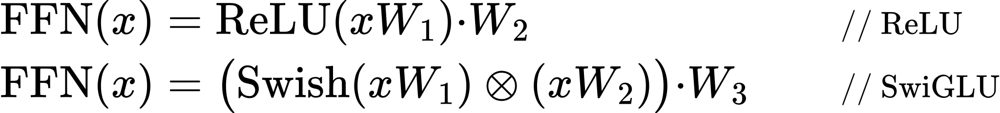
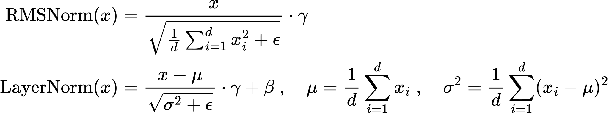

LLM 基座模型 <!-- suffix --> [✒️](#todo "TODO(1)")<sup style="color:Gray">1</sup>[📋](#qa "面试问题整理(6)")<sup style="color:Brown">6</sup><span title="Pin">✨</span> <!-- suffix -->
===
<!--START_SECTION:badge-->


<!--END_SECTION:badge-->
<!--info
date: 2025-11-04 23:51:12
toc_title: 'LLM 基座模型'
top: false
star: true
draft: false
thorough: false
hidden_in_recent: true
section_number: false
omit_in_tag_toc: false
level: 0
tags: [transformer]
algo_tags: []
-->

<!--START_SECTION:keywords-->
> ***Keywords**: LLM 基座模型*
<!--END_SECTION:keywords-->

<!--START_SECTION:paper_title-->
<!--END_SECTION:paper_title-->

<!--START_SECTION:toc-->
- [LLaMA 系列](#llama-系列)
- [DeepSeek 系列](#deepseek-系列)
    - [DeepSeek-LLM](#deepseek-llm)
- [Q\&A](#qa)
<!--END_SECTION:toc-->

---

<!--START_SECTION:keyword-->
<!--keyword_info
name: 'LLaMA'
extra_url: false
with_keywords: false
-->
## LLaMA 系列
<!--END_SECTION:keyword-->
<!-- > 将原版 Transformer 的 Post‑LN + 绝对位置 + ReLU/GeLU, 替换为 Pre‑LN + RMSNorm + RoPE + SwiGLU, 并使用 GQA 代替 MHA -->

- **优化重点**:
    - 稳定深层训练
    - 优化长序列建模, 提升外推能力
    - 降低计算成本, 提升推理效率

<!-- omit in toc -->
### LLaMA 模型结构要点 (vs Transformer)

| 组件 | 原版 Transformer (Vaswani 2017) | LLaMA 家族 (典型做法) | 目的 |
|---|---|---|---|
| 网络结构 | Encoder–Decoder | Decoder‑only | 结构更简洁 🔸 专注自回归生成 🔸 提升参数与计算效率 |
| `Attn` 位置编码 | 正弦位置编码 (绝对位置编码) | **RoPE** / **iRoPE** (旋转位置编码) | 优化长序列建模 🔸 保留相对位置信息 🔸 **提升外推能力** |
| `Attn` 注意力头映射 | MHA: Q/K/V 头数一致 | **GQA/MQA**: Q 头多, K/V 头减少 (分组共享) | 降低 KV 存储与计算成本 🔸 提升推理吞吐与显存效率 |
| `FFN` 归一化位置 | Post‑LN (残差后归一化) | **Pre‑LN** (残差前归一化) | 改善深层训练稳定性 🔸 避免梯度消失/爆炸 🔸 支持更深层堆叠 |
| `FFN` 归一化方法 | LayerNorm (层归一化) | **RMSNorm** (均方根层归一化) | 计算更轻量 🔸 数值更稳定 🔸 只做尺度归一化, 不强制均值为零, 保留更多信息 |
| `FFN` MLP 激活函数 | ReLU / GeLU | **SwiGLU** (门控激活) | 提升表示能力 🔸 改善训练稳定性 🔸 更高效的梯度流动 |

- #### **SwiGLU** vs **ReLU**
    <div align='center'><a href='_formulas/LLM_基座模型/f_001.js.tex'></a></div>

    > $\otimes$ 表示逐元素相乘, 用来实现门控机制

- #### **GQA / MQA** 核心代码
    - `H` 个 Query 头, `G` 个 K/V 头, 且 `H % G == 0`
        ```python
        # 1) 线性投影
        q = self.Wq(x)  # [B, L, H*d_k], H*d_k == d_model
        k = self.Wk(x)  # [B, L, G*d_k]
        v = self.Wv(x)  # [B, L, G*d_k]

        # 2) 重排为多头形式
        q = einops.rearrange(q, 'B L (H d) -> B H L d', H=H, d=d_k)  # [B, H, L, d_k]
        k = einops.rearrange(k, 'B L (G d) -> B G d L', G=G, d=d_k)  # [B, G, d_k, L]
        v = einops.rearrange(v, 'B L (G d) -> B G L d', G=G, d=d_k)  # [B, G, L, d_k]

        # 3) 将 K/V 按分组复制到 Q 头数量 (GQA / MQA 核心)
        group_size = H // G
        # 每个 KV 头服务 group_size 个 Q 头
        k = k.repeat_interleave(group_size, dim=1)      # [B, H, d_k, L]
        v = v.repeat_interleave(group_size, dim=1)      # [B, H, L, d_k]
        ```
        > [transformer_gqa.py](../09/_code/transformer_gqa.py)

- #### **RMSNorm** vs **LayerNorm**
    > 计算更轻量 🔸 超参数更少 🔸 减少均值偏移的影响
    <div align='center'><a href='_formulas/LLM_基座模型/f_002.js.tex'></a></div>

    - **均方根 (RMS)** : 只做尺度归一化, 保留原始均值信息;  
    - **$\gamma$** : 可学习的缩放参数, 用于恢复模型的表达能力;  
    - **$\epsilon$** : 防止分母为零的小常数;  

- #### RoPE
    > [_相关笔记_](../09/Transformer_位置编码.md#旋转位置编码-rope)

---

<!--START_SECTION:keyword-->
<!--keyword_info
name: 'DeepSeek'
extra_url: false
with_keywords: false
-->
## DeepSeek 系列
<!--END_SECTION:keyword-->
> ##### TODO

### DeepSeek-LLM

- **优化目标**
    - 提升中文与多语言任务的表现, 降低推理成本
- **具体改进**

    | 改进方向 | 具体措施 | 目标效果 |
    |----------|----------|----------|
    | **位置编码 (RoPE 改进)** | 在标准 RoPE 基础上优化; 支持更长上下文窗口 | 提升长文本建模能力; 减少长序列退化 |
    | **KV Cache 优化** | 引入 KV Cache 压缩与高效存储策略 | 降低显存占用; 提升多轮对话与长文本推理速度 |
    | **训练数据构建** | 大规模中文语料清洗与去重; 多语言混合 | 增强中文能力; 保持跨语言泛化 |
    | **推理加速工程优化** | 集成 FlashAttention 等高效算子; GPU/分布式优化 | 提升推理吞吐量; 降低延迟 |
    | **模型规模与架构** | 提供 7B, 67B 等多种规模; 延续 Transformer 基座; 部分引入 MoE 思路 | 适配不同应用场景; 在保证性能的同时降低成本 |

---

<!--## 相关问题-->
<!--START_SECTION:related_problems-->
<!--END_SECTION:related_problems-->

<!--START_SECTION:qa-->
<!--qa_info
subject: ''  # Transformer, RLHF, SFT, Other
subject_level: 0  # subject 间的排序信号; 对已经设置过的 subject, 取最大值
topic: ''  # 默认取文档的 toc_title, 如果有层级结构, 用 · 分隔, 如 'SFT · PEFT'
topic_level: 0  # 同一个 subject 下的排序信号
with_section_title: true  # 如果不需要 section_title
use_section_number: true
-->
## Q&A

<!--START_SECTION:qa_toc-->
- [1. 🏷️ LLaMA 相关](#1-️-llama-相关)
    - [1.1. ✅ LLaMA 属于哪类架构? 与原版 Transformer 的差异? 改进的目的/效果](#11--llama-属于哪类架构-与原版-transformer-的差异-改进的目的效果)
    - [1.2. ✅ LLaMA 系列为何偏向 Pre‑Norm 与 RMSNorm?](#12--llama-系列为何偏向-prenorm-与-rmsnorm)
    - [1.3. ✅ SwiGLU 取代 ReLU 的动机是什么, 如何做到的?](#13--swiglu-取代-relu-的动机是什么-如何做到的)
    - [1.4. ✅ LLaMA 为何采用 RoPE (旋转位置编码)? 与正弦编码相比的优势](#14--llama-为何采用-rope-旋转位置编码-与正弦编码相比的优势)
    - [1.5. ✅ GQA/MQA 的动机是什么, 如何做的?](#15--gqamqa-的动机是什么-如何做的)
- [2. 🏷️ DeepSeek 相关](#2-️-deepseek-相关)
    - [2.1. ✅ DeepSeek 对 **位置编码 (RoPE)** 做了哪些改进?](#21--deepseek-对-位置编码-rope-做了哪些改进)
<!--END_SECTION:qa_toc-->

---

<!-- omit in toc -->
### 1. 🏷️ LLaMA 相关

<!-- omit in toc -->
#### 1.1. ✅ LLaMA 属于哪类架构? 与原版 Transformer 的差异? 改进的目的/效果
> • **架构**: Decoder‑only / Causal LM <br>
> • **差异**: 归一化 (Pre‑LN + RMSNorm) 🔸 激活函数(SwiGLU) 🔸 位置编码 (RoPE) 🔸 多头形式 (GQA) <br>
> • **效果**: 稳定深层训练 🔸 优化长序列建模, 提升外推能力 🔸 降低计算成本, 提升推理效率

-   <details><summary><b> 展开详情 ⬇️ </b></summary>

    > [LLaMA 模型结构要点 (vs Transformer)](#llama-模型结构要点-vs-transformer)

    - 为什么主流开源系选择 Decoder‑only? 与 Encoder‑Decoder 相比, 训练/推理的复杂度与生态权衡

    </details>

<!-- omit in toc -->
#### 1.2. ✅ LLaMA 系列为何偏向 Pre‑Norm 与 RMSNorm?
> • **更稳定的梯度传播** 🔸 **更好的数值鲁棒性** 🔸 更低的计算开销 <br>

-   <details><summary><b> 展开详情 ⬇️ </b></summary>

    - **更稳定的梯度传播 (Pre‑Norm)**
        - Pre‑Norm 保证了输入到子层的分布始终稳定, 梯度在反向传播时可以直接穿过残差连接, 不会被归一化层过度压缩;

    - **更好的数值鲁棒性 (RMSNorm)**

        1. **对输入分布的稳定性**  
            - LayerNorm **强制零均值, 可能破坏输入的偏移信息**; 当输入分布有轻微变化时, 模型输出波动较大;  
            - RMSNorm 保留均值, 只控制尺度, 使得模型在不同输入分布下仍能保持稳定. 

        2. **对梯度传播的稳定性**  
            - 在深层网络中, 梯度容易消失或爆炸; 归一化的作用是控制梯度大小;  
            - 梯度爆炸/消失主要与 **向量范数** 有关, 而不是均值偏移;
            - RMSNorm 通过控制向量范数, 确保梯度在反传时不会过度衰减或放大. 

        3. **对数值误差的稳定性**  
            - 大模型训练涉及极大 batch size 和长序列, 浮点运算误差不可避免;  
            - RMSNorm 计算更简单 (只算 RMS), 减少了均值/方差计算带来的数值波动. 

    - **更低的计算开销 (RMSNorm)**
        - 去掉均值计算可减少一次 reduce 操作, FLOPs 降低约 7%–15%

    --- 

    **相关问题** 📝
    - **为什么 RMSNorm 只做尺度归一化, 不再强制均值为零?** 

    </details>


<!-- omit in toc -->
#### 1.3. ✅ SwiGLU 取代 ReLU 的动机是什么, 如何做到的?
> • **动机**: 提升模型的表达能力与训练稳定性 <br>
> • **ReLU 的局限性**: **稀疏性过强**, 导致梯度流动受限和信息丢失 <br>
> • **做法**: 通过 **门控机制 (GLU)** 引入额外的非线性与特征选择能力, 使前馈层更灵活, 避免 ReLU 的 **"死区"** 问题


<!-- omit in toc -->
#### 1.4. ✅ LLaMA 为何采用 RoPE (旋转位置编码)? 与正弦编码相比的优势
> • **优势**: RoPE 可以同时编码绝对与相对位置, 在 **长上下文外推** 与 **远程依赖建模** 上显著优于正弦编码/绝对位置编码. <br>


<!-- omit in toc -->
#### 1.5. ✅ GQA/MQA 的动机是什么, 如何做的?
> • **动机**: 减少 KV Cache 的显存占用, 提高推理吞吐 🔸 在原始 MHA 中, $h$ 个头需要存储 $h$ 份 K/V, 显存和带宽的开销巨大; <br>
> • **GQA**: 将多个 Q 头分为若干组, 每组共享一份 K/V 🔸 特别的, **MQA** 中所有 Query 头共享同一组 K/V;

-   <details><summary><b> 展开详情 ⬇️ </b></summary>

    > [GQA/MQA 核心代码](#gqa--mqa-核心代码)

    </details>

---

<!-- omit in toc -->
### 2. 🏷️ DeepSeek 相关

<!-- omit in toc -->
#### 2.1. ✅ DeepSeek 对 **位置编码 (RoPE)** 做了哪些改进?
> • 解耦 RoPE 🔸 长上下文扩展 🔸 与 MLA 结合 🔸 推理阶段简化 <br>

-   <details><summary><b> 展开详情 ⬇️ </b></summary>


    </details>
<!--END_SECTION:qa-->